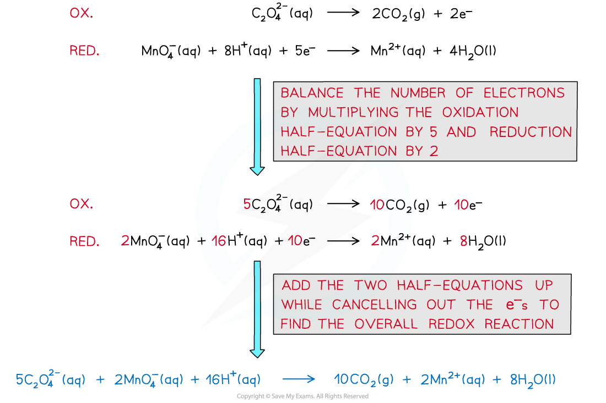

# Autocatalysis

## Manganese(II) ions as an Autocatalyst

> **Spec point** — `spcpt_xcGwv2zpMh6QRTWd`

## Manganese(II) ions as an Autocatalyst

- Autocatalysis the term used to describe a reaction which is sped up by a product which acts as a catalyst for the reaction
- If you plot a rate graph of concentration versus time it has an usual shape

***Concentration versus time for an autocatalytic reaction***

- The gradient becomes steeper during the course of the reaction which tells you the rate is speeding up, not slowing down over time as the reactants become used up
- An example of an autocatalysed reaction takes place between **manganate(VII)** ions and **oxalate** (ethandioate) ions
- The overall equation can be deduced from the half equations

- You can see that one of the products is manganese(II) ions - this is the catalyst
- As more manganese(II) is formed the reaction speeds up
- Like to the role of iron(II) in the previous section, manganese(II) ions take part in a redox cycle between two different oxidation states (+2 **→  **+3 **→ **+2)

**4Mn****2+ ****(aq) **** ****+  MnO****4****–**** (aq) + 8H****+ ****(aq)   →   5Mn****3+ ****(aq)  + 4H****2****O (aq)**

**2Mn****3+ ****(aq) **** ****+  C****2****O****4****2-**** (aq)  →  2CO****2**** (g) +  2Mn****2+ ****(aq)**

- The manganese(II) is not present in the beginning of the reaction, but as it is formed is speeds up the reaction and is re-generated during the redox cycle
- This reaction is easily followed on a colorimeter as the rate at which the purple manganate(VII) ion is consumed accelerates with time
