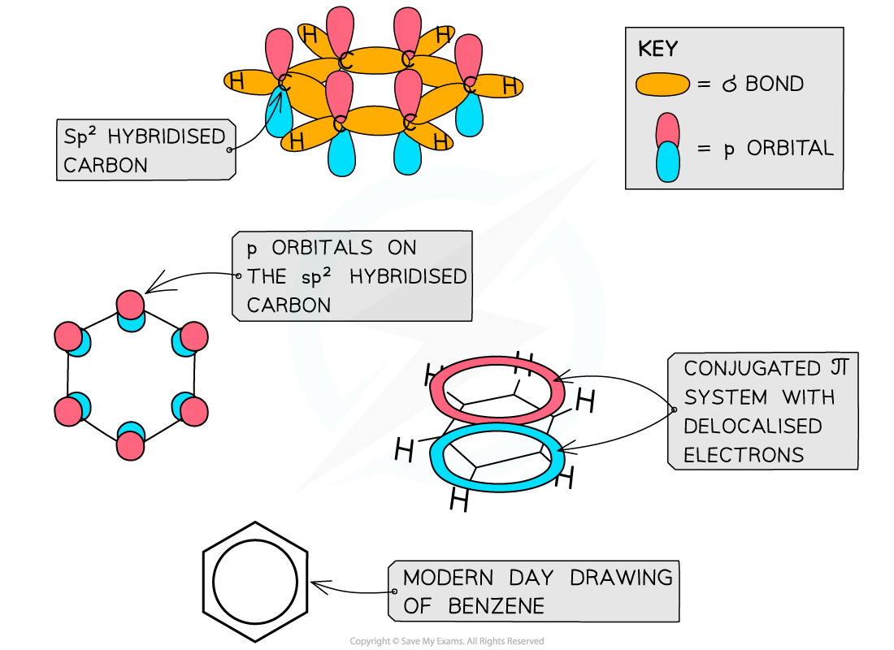
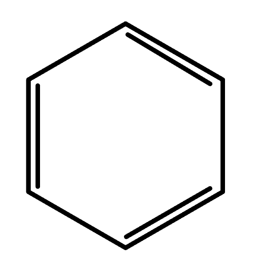
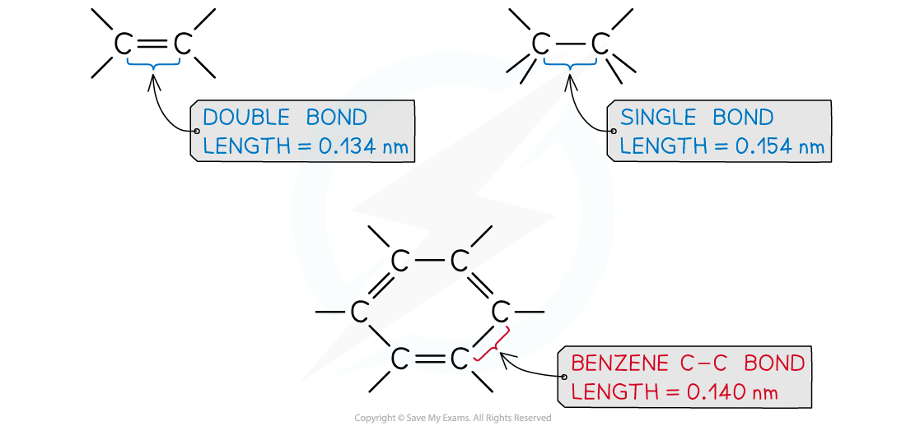

# Benzene - Structure & Stability

## Benzene - Structure & Stability

> **Spec point** — `spcpt_dyhk4Ygt92vKSVbW`

## Benzene - Structure & Stability

#### Structure of Benzene

- The structure of benzene was determined many years ago, by a chemist called Kekule
- The structure consists of 6 carbon atoms in a hexagonal ring, with alternating single and double carbon-carbon bonds

  - This suggests that benzene should react in the same way that an unsaturated alkene does
  - However, this is not the case

***Like other aromatic compounds, benzene has a planar structure due to the sp*****2***** hybridisation of carbon atoms and the conjugated π system in the ring***

- Each carbon atom in the ring forms three σ bonds using the sp2 orbitals
- The remaining **p orbitals **overlap laterally with p orbitals of neighbouring carbon atoms to form a π system
- This extensive sideways overlap of p orbitals results in the electrons being delocalised and able to freely spread over the entire ring causing a π system

  - The π system is made up of two ring-shaped clouds of electron density - one above the plane and one below it
- Benzene and other aromatic compounds are **regular **and **planar** compounds with bond angles of 120 o
- The delocalisation of electrons means that all of the carbon-carbon bonds in these compounds are identical and have both **single **and **double bond **character
- The bonds all being the same length is evidence for the delocalised ring structure of benzene

#### Evidence for delocalisation

- This evidence of the bonding in benzene is provided by data from:

  - Enthalpy changes of hydrogenation
  - Carbon-carbon bond lengths from X-ray diffraction
  - Saturation tests
  - Infrared spectroscopy

#### Enthalpy changes of hydrogenation

- Hydrogenation of cyclohexene

  - Each molecule has one C=C double bond
  - The enthalpy change for the reaction of cyclohexene is -120 kJ mol-1

**C****6****H****10**** + H****2**** → C****6****H****12   ****Δ*****H*****ꝋ**** = -120 kJ mol****-1**

- Hydrogenation of benzene

  - The Kekulé structure of benzene as cyclohexa-1,3,5-triene has three double C=C bonds:

- It would be expected that the enthalpy change for the hydrogenation of this structure would be three times the enthalpy change for the one C=C bond in cyclohexene

**C****6****H****6**** + 3H****2**** → C****6****H****12   ****Δ*****H*****ꝋ**** = 3 x -120 kJ mol****-1 ****= -360 kJ mol****-1**

- When benzene is reacted with hydrogen, the enthalpy change obtained is actually far less exothermic, **Δ*****H*****ꝋ**** = -208 kJ mol****-1**

#### Carbon-carbon bond lengths

- Cyclohexene contains two different carbon-carbon bonds

  - The single carbon-carbon bond (C-C) has a bond length of 154 pm
  - The double carbon-carbon bond (C=C) has a bond length of 134 pm
- The Kekulé structure of benzene as cyclohexa-1,3,5-triene has three single C-C and three double C=C bonds

  - It would be expected that benzene would have an equal mixture of bonds with lengths of 134pm and 154 pm

- All of the carbon-carbon bond lengths are 140 pm suggesting that they are all the same and also intermediate of the single C-C and double C=C bonds

#### Saturation tests

- Cyclohexene will decolourise bromine water as an electrophilic addition reaction takes place
- The Kekulé structure of benzene as cyclohexa-1,3,5-triene has three double C=C bonds

  - It would, therefore, be expected that benzene would easily decolourise bromine water
- Benzene does not decolourise bromine water suggesting that there are no double C=C bonds

#### Infrared spectroscopy

- Cyclohexene shows a peak at around 1650 cm-1 for the double C=C bond within its structure
- The Kekulé structure of benzene as cyclohexa-1,3,5-triene has three double C=C bonds

  - It would, therefore, be expected to also show a peak at around 1650 cm-1 for the double C=C bonds
- Benzene does not show a peak at around 1650 cm-1 for the double C=C bonds, instead, peaks are seen at around 1450, 1500 and 1580 cm-1 which are characteristic of double C=C bonds in arenes

## Bromination Resistance

> **Spec point** — `spcpt_f4TjkwMvKRSKNfng`

## Bromination Resistance

- Alkenes tend to undergo bromination easily which can be observed in cyclohexene

**C****6****H****10**** + Br****2**** → C****6****H****10****Br****2**** **

- As the π bond contains localised electrons, it produces an area of high electron density allowing it to repel the electron in the bromine molecule
- Therefore a dipole is introduced making one bromine atom δ+ and one δ- bromine atom
- The δ+ bromine is attracted to the π bond in the cyclohexene
- This then leaves a carbocation in the intermediate molecule which the negative bromide ion is attracted to, hence forming 1,2-dibromocyclohexane by electrophilic addition
- In benzene, there are no localised areas of high electron density, preventing it from being able to polarise the bromine moelcule
- In order for benzene to undergo electrophilic substitution with bromine, a halogen carrier must be present in the reaction e.g. AlBr3
