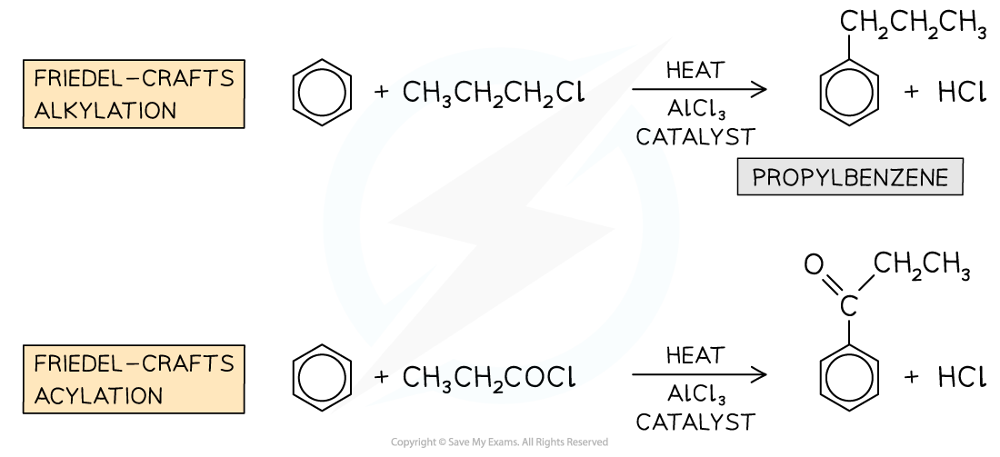

# Benzene Reactions

## Benzene - Reactions 

> **Spec point** — `spcpt_PRddyMHVjyrgh4M8`

## Benzene - Reactions

#### Reaction with oxygen

- Hydrocarbons will burn in air or oxygen to produce carbon dioxide and water providing sufficient oxygen is available
- Benzene will also follow this pattern

**2C****6****H****6**** (l) + 15O****2**** (g) → 12CO****2**** (g) + 6H****2****O (g)**

- Given that a large volume of oxygen is required for this reaction, incomplete combustion could occur

  - Therefore unreacted benzene may remain
- This would lead to a smokey yellow flame as there would be insufficient oxygen available

#### Halogenation

- The nature of benzene is different to other unsaturated compounds such as alkenes and halogenation via electrophilic addition is not possible
- Therefore aromatic compounds will react with halogens in the presence of a **metal halide carrier**

  - iron(III) bromide
  - aluminium chloride
- The reaction of the metal halide carrier acts as a catalyst and creates the electrophile, X+(where X represents a halogen atom)
- At the end of the reaction it is regenerated

**AlCl****3**** + Cl****2**** → AlCl****4****-**** + Cl****+**

**FeBr****3**** + Br****2 ****→ FeBr****4****-**** + Br****+**

- The overall equation for halogenation is

**C****6****H****6 ****+ X****2**** → C****6****H****5****X + HX**

**Or with Br****2**** in the presence of a AlBr****3**

**C****6****H****6 ****+ Br****2**** → C****6****H****5****Br + HBr**

***Bromination of benzene***

- Remember that one hydrogen atom on the benzene ring has been substituted for one halogen atom, therefore HX will be a product

#### Nitration

- Another example of a substitution reaction is the **nitration **of arenes
- In these reactions, a nitro (-NO2) group replaces a hydrogen atom on the arene
- The benzene is reacted with a mixture of concentrated nitric acid (HNO3) and concentrated sulfuric acid (H2SO4) at a temperature between 25 and 60 oC

***Nitration of benzene***

#### Friedel-Crafts Reactions

- Friedel-Crafts reactions are also** **substitution** **reactions
- Due to the aromatic stabilisation in arenes, they are often **unreactive**
- To use arenes as **starting materials **for the synthesis of other organic compounds, their structure, therefore, needs to be changed to turn them into more reactive compounds
- Friedel-Crafts reactions can be used to substitute a hydrogen atom in the benzene ring for an **alkyl group **(Friedel-Crafts alkylation) or an **acyl group **(Friedel-Crafts acylation)
- Like any other electrophilic substitution reaction, the Friedel-Crafts reactions consist of three steps:

  - Generating the electrophile
  - Electrophilic attack on the benzene ring
  - Regenerating aromaticity of the benzene ring

***Examples of Friedel-Crafts alkylation and acylation reactions***

#### Sulfonation

- Another example of a substitution reaction is the **sulfonation **of arenes
- In these reactions, a sulfonyl group (-SO3H) replaces a hydrogen atom on the arene
- The benzene is warmed with a fuming sulfuric acid at a temperature of 40 oC for around 30 minutes

  - The fuming sulfuric acid is made by dissolving sulfur trioxide in concentrated sulfuric acid

