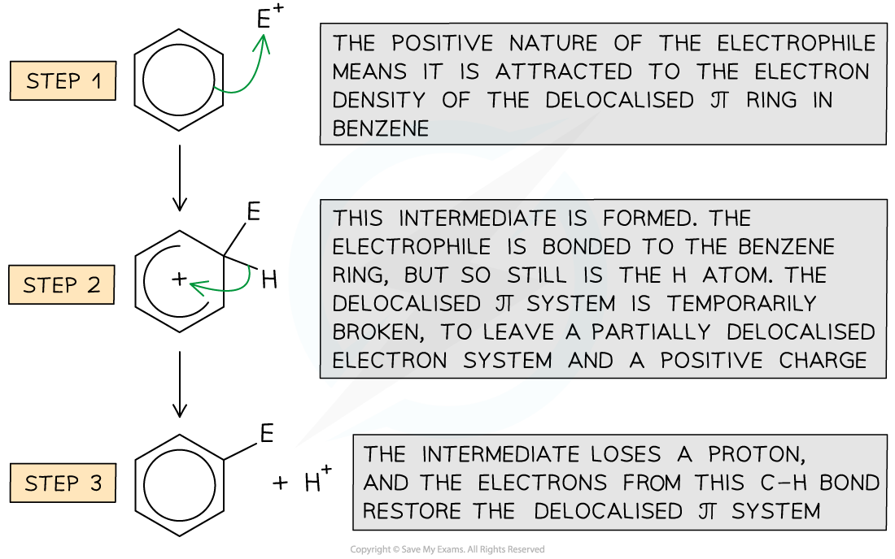
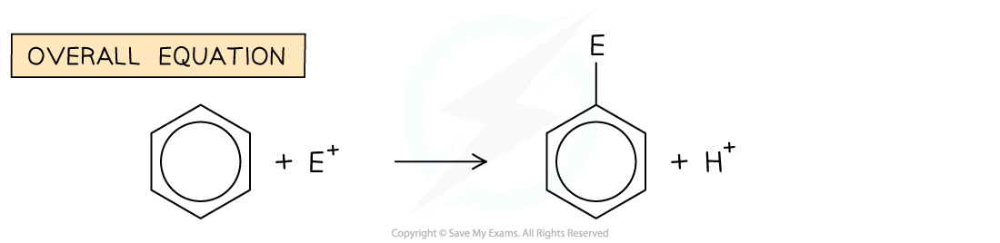
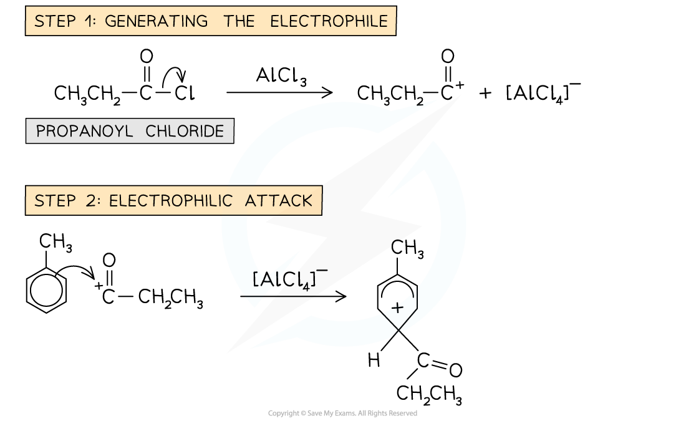
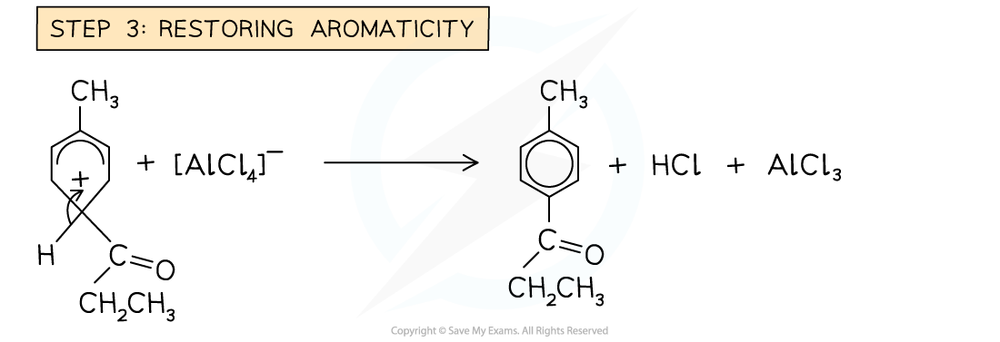

# Benzene - Electrophilic Substitution

## Benzene - Electrophilic Substitution

> **Spec point** — `spcpt_z7VZsHPg9rkRzr4k`

## Benzene - Electrophilic Substitution

- The main reactions which benzene will undergo include the replacement of one of the 6 hydrogen atoms from the benzene ring

  - This is different to the reactions of unsaturated alkenes, which involve the double bond breaking and the electrophile atoms 'adding on' to the carbon atoms
- These reactions are called electrophilic substitution reactions

  - This is where at least one of the H atoms of benzene are substituted by the electrophile
- You must be able to provide the mechanisms for specific examples of the electrophilic substitution of benzene

#### General Electrophilic Substitution Mechanism:

- The delocalised π system is extremely stable and is a region of high electron density
- Electrophilic substitution reactions involve an electrophile, which is either a positive ion or the positive end of a polar molecule
- There are numerous electrophiles which can react with benzene

  - However, they usually cannot simply be added to the reaction mixture to then react with benzene
  - The electrophile has to be produced in situ, by adding appropriate reagents to the reaction mixture

- The **electrophilic substitution **reaction in arenes consists of **steps**:

  - Generation of an **electrophile**
  - **Electrophilic attack**
  - Regenerating **aromaticity**

### Nitration of benzene mechanism

- One hydrogen atom is substituted by a nitro group - NO2
- The overall reaction is:

C6H6 + HNO3 → C6H5NO2 + H2O

- The reaction is conducted under reflux at 55 °C or 60 °C

#### Step 1: Electrophile generation

- The electrophile **NO****2****+ **ion is generated by reacting **concentrated** nitric acid (HNO3) and **concentrated** sulfuric acid (H2SO4)
- The equation  for the generation of the electrophile is:

> **Exam Hint**
> There are 2 accepted equations for the formation of the eletrophile:
> 
> HNO3 + H2SO4 → NO2+ + HSO4− + H2O
> 
> **OR**
> 
> HNO3 + 2H2SO4 → NO2+ + 2HSO4- + H3O+

#### Step 2: Electrophilic attack

- A pair of electrons from the benzene ring is donated to the electrophile to form a **covalent bond**

  - This disrupts the aromaticity in the ring as there are now only four π electrons and there is a **positive charge **spread over the five carbon atoms

*A pair of electrons from the benzene ring is donated to the nitronium ion electrophile forming a covalent bond and a loss in aromaticity*

> **Exam Hint**
> Examiners are looking for very specific points in an electrophilic substitution mechanism:
> 
> 1. The initial arrow:
> 
>   - The curly arrow must start from on or within the circle/hexagon of the benzene ring and point to the NO2+ electrophile.
>   - Do not forget to draw the + charge on the electrophile.
> 2. The horseshoe shape:
> 
>   - The intermediate must be drawn with a 'horseshoe' (an incomplete circle) that faces the tetrahedral carbon, which is the carbon atom attached to the H and NO2 group.
> 3. Horseshoe size:
> 
>   - The horseshoe must be large enough to cover at least 3 carbon atoms.
>   - Ideally it should cover the 5 carbon atoms that have not been substituted.
> 4. The charge:
> 
>   - The positive charge (+) must be drawn inside the horseshoe

#### Step 3: Regenerating / restoring aromaticity

- Aromaticity is restored by **heterolytic cleavage** of the C-H bond

  - This means that the bonding pair of electrons goes into the benzene π bonding system

> **Exam Hint**
> The curly arrow must start from the C–H bond and point to anywhere within the ring to show the reforming of the delocalised structure

#### Step 4: Regenerating the catalyst

- The H+ ion (released in Step 3) reacts to reform the original catalyst:

H+ + HSO4− → H2SO4

### Halogenation of benzene mechanism

- One hydrogen atom is substituted by a halogen atom
- For bromine, the overall reaction is:

C6H6 + Br2 → C6H5Br + HBr

- The reaction is conducted using a halogen carrier catalyst and requires heat / heating under reflux

#### Step 1: Electrophile generation

- The electrophile **X****+ **ion is generated by reacting the halogen with a **halogen carrier**
- The common halogen carriers are:

  - AlBr3
  - AlCl3
  - FeCl3 (or iron and bromine, which react to form FeBr3)
- The halogen molecules form a **dative bond** with the halogen carrier by donating a lone pair of electrons from one of its halogen atoms into an empty 3p orbital of the halogen carrier

![Mechanism step showing Br₂ reacting with AlBr₃ via a dative covalent bond to form Br⁺ electrophile and [AlBr₄]⁻ in electrophilic substitution](../../../assets/2045f154afab-7-2-hydrocarbons-step-1-halogenation.png)

> **Exam Hint**
> The halogen carrier used must correspond to the halogen that is involved in the substitution reaction:
> 
> Br-Br + AlBr3 → Br+ + [AlBr4]-
> 
> Cl-Cl + FeCl3 → Cl+ + [FeCl4]-

#### Step 2: Electrophilic attack

- A pair of electrons from the benzene ring is donated to the electrophile to form a **covalent bond**

  - This disrupts the aromaticity in the ring as there are now only four π electrons and there is a **positive charge **spread over the five carbon atoms

*A pair of electrons from the benzene ring is donated to the bromine ion electrophile forming a covalent bond and a loss in aromaticity*

> **Exam Hint**
> Examiners are looking for similar specific points to the nitration mechanism:
> 
> 1. The initial arrow:
> 
>   - The curly arrow must start from on or within the circle/hexagon of the benzene ring and point to the Br+ or Cl+ electrophile.
>   - Do not forget to draw the + charge on the electrophile.
> 2. The horseshoe shape:
> 
>   - The intermediate must be drawn with a 'horseshoe' (an incomplete circle) that faces the tetrahedral carbon, which is the carbon atom attached to the H and halogen atom.
> 3. Horseshoe size:
> 
>   - The horseshoe must be large enough to cover at least 3 carbon atoms.
>   - Ideally it should cover the 5 carbon atoms that have not been substituted.
> 4. The charge:
> 
>   - The positive charge (+) must be drawn inside the horseshoe

#### Step 3: Regenerating / restoring aromaticity

- Aromaticity is restored by **heterolytic cleavage** of the C-H bond

  - This means that the bonding pair of electrons goes into the benzene π bonding system

![Diagram of step 3 electrophilic substitution: [AlBr4]– removes H from bromobenzene sigma complex, restoring benzene aromaticity and forming HBr and AlBr3](../../../assets/e969aacdf842-benzene-bromination-step-3-restoring-aromaticity.png)

#### Step 4: Regenerating the catalyst

- The H+ ion (released in Step 3) reacts to reform the original catalyst:

H+ + [AlBr4]- → HBr + AlBr3

### Friedel-Crafts acylation of benzene mechanism

- One hydrogen atom on the benzene ring is substituted by an acyl group (e.g., an ethanoyl group, −COCH3).
- For the reaction with ethanoyl chloride, the overall reaction is:

C6H6 + CH3COCl → C6H5COCH3 + HCl

- The reaction is conducted using an anhydrous aluminium chloride (AlCl3) catalyst and requires heating under reflux

#### Step 1: Electrophile generation

The electrophile is an acylium ion (e.g., CH3CO+).

It is generated by reacting the acyl chloride with the halogen carrier catalyst, which accepts a lone pair of electrons from the chlorine atom.

The equation for the generation of the electrophile is:

CH3COCl + AlCl3 → CH3CO+ + [AlCl4]−

- In the Friedel-Crafts acylation reaction, an **acyl group **is substituted into the benzene ring

  - An acyl group is an alkyl group containing a carbonyl, C=O group

#### Step 2: Electrophilic attack

- A pair of electrons from the benzene ring is donated to the electrophile to form a covalent bond.

  - This disrupts the aromaticity in the ring as there are now only four π electrons and there is a positive charge spread over the five carbon atoms.

> **Exam Hint**
> Examiners are looking for similar specific points to the nitration mechanism:
> 
> 1. The initial arrow:
> 
>   - The curly arrow must start from on or within the circle/hexagon of the benzene ring and point to the positively charged carbon atom of the CH3CO+ electrophile.
>   - Do not forget to draw the + charge on the electrophile.
> 2. The horseshoe shape:
> 
>   - The intermediate must be drawn with a 'horseshoe' (an incomplete circle) that faces the tetrahedral carbon, which is the carbon atom attached to the H and acyl group.
> 3. Horseshoe size:
> 
>   - The horseshoe must be large enough to cover at least 3 carbon atoms.
>   - Ideally it should cover the 5 carbon atoms that have not been substituted.
> 4. The charge:
> 
>   - The positive charge (+) must be drawn inside the horseshoe

#### Step 3: Regenerating / restoring aromaticity

- Aromaticity is restored by heterolytic cleavage of the C–H bond.

  - This means that the bonding pair of electrons goes into the benzene π bonding system.

#### Step 4: Regenerating the catalyst

- The H+ ion (released in Step 3) reacts with the complex ion to reform the original catalyst and produce hydrogen chloride gas:

H+ + [AlCl4]− → HCl + AlCl3
