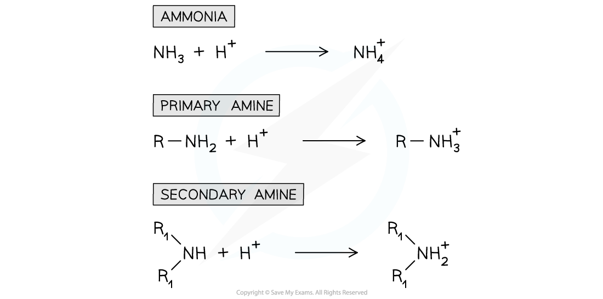
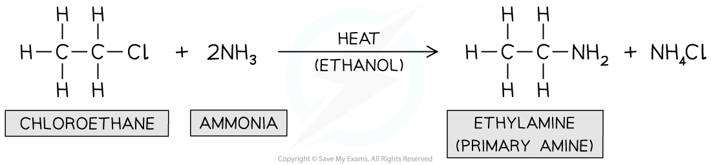
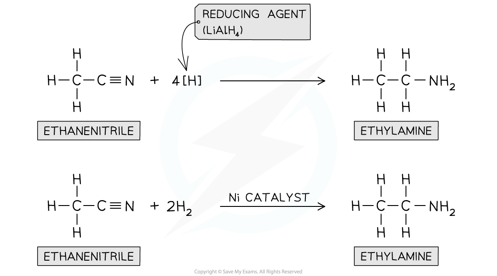

# Primary Aliphatic Amines

## Primary Aliphatic Amines - Reactions 

> **Spec point** — `spcpt_KMnNBrnVyqqHG3fk`

## Primary Aliphatic Amines - Reactions

#### Reactions with water

- The first few members of the homologous series of primary aliphatic amines are miscible with water

  - However as the hydrocarbon part of the molecule becomes longer, the solubility decreases
  - Phenylamine is only slightly soluble in water
- They dissolve in water as they are able to form hydrogen bonds with water molecules
- Amines also react slightly with water to form alkaline solutions

**CH****3****NH****2**** + H****2****O ⇌ CH****3****NH****3****+**** + OH****-**

#### Amine basicity

- The nitrogen atom in ammonia and amine molecules can **accept **a **proton **(H+ ion)
- They can therefore act as Bronsted-Lowry **bases** in aqueous solutions by **donating **its lone pair of electrons to a proton and form a **dative bond**

***The nitrogen atom in ammonia and amines can donate its lone pair of electrons to form a bond with a proton and therefore act as a base***

- The **strength** of amines depends on the **ability **of the lone pair of electrons on the nitrogen atom to accept a proton and form a dative covalent bond
- The **more readily** a proton is attracted, the **stronger the base** is
- Factors that may affect the **basicity **of amines include:

  - **Positive inductive effect** - Some groups such as **alkyl groups **donate electron density to the nitrogen atom causing the lone pair of electrons to become more available and therefore **increasing **the amine’s **basicity**
  - **Delocalisation** - The presence of aromatic rings such as the **benzene ring** causes the lone pair of electrons on the nitrogen atom to be **delocalised **into the benzene ring
  - The lone pair becomes **less available **to form a dative covalent bond with ammonia and hence **decreases **the amine’s **basicity**
- Primary aliphatic amines are stronger bases than ammonia as the alkyl groups are electron releasing and push electrons towards the nitrogen atom and so make it a stronger base
- Secondary amines are stronger bases than primary amines because they have more alkyl groups that are substituted onto the nitrogen atom in place of hydrogen atoms

  - Therefore more electron density is pushed onto the nitrogen atom (as the inductive effect of alkyl groups is greater than that of hydrogen atoms) 

***Base strength of aromatic amines***

- Primary aromatic amines such as phenylamine do not form basic solutions because the lone pair of electrons on the nitrogen delocalise with the ring of electrons in the benzene ring
- This means the nitrogen is less able to accept protons
- Ethylamine (which has an electron-donating ethyl group) is **more basic** than **phenylamine **(which has an electron-withdrawing benzene ring)

***Ethylamine is more basic than phenylamine due to electron donating ethyl group which increases electron density on the nitrogen and makes it more attractive to protons***

#### Reactions with acids

- Amines react with strong acids to form ionic ammonium salts

**CH****3****NH****2**** (aq) + HCl (aq) → CH****3****NH****3****+****Cl****- ****(aq)**         Methylamine           methylammonium chloride

- Addition of NaOH to an ammonium salt will convert it back to the amine
- These ionic salts will be solid crystals, if the water is evaporated, because of the strong ionic interactions
- The ionic salts formed in this reaction means that the compounds are soluble in the acid

  - e.g. Phenylamine is not very soluble in water but phenylammonium chloride is soluble

#### Reactions with ethanoyl chloride

- This reaction type is addition-elimination reaction meaning two molecules join together, and then a small molecule is eliminated - in these examples, hydrogen chloride

  - You do not need to know the mechanism of these reactions
- The organic product contains a new functional group - amide - in which a carbonyl group is next to an NH group
- The equation for the reaction of butylamine with ethanoyl chloride is

**CH****3****COCl + CH****3****CH****2****CH****2****CH****2****NH****2**** → CH****3****CONHCH****2****CH****2****CH****2****CH****3**** + HCl**

#### Reaction with halogenoalkanes

- Again you do not need to know the mechanism for these reactions
- The electron-deficient carbon atom in the halogenoalkane and the electron-rich atom nitrogen atom in the amine causes these two species to react together
- The general formula for this reaction would be

**R'NH****2**** + R"X → R'NHR" + HX**

- Where R' is the alkyl group in the amine and R" is the alkyl group in the halogenoalkane
- This reaction is an example of a substitution reaction
- The organic product is a secondary amine and the inorganic product is a hydrogen halide, often hydrogen chloride
- As an example, the equation for the reaction of butylamine and chloroethane is

**CH****3****CH****2****CH****2****CH****2****NH****2**** +  CH****3****CH****2****Cl → CH****3****CH****2****CH****2****CH****2****NHCH****2****CH****3 ****+ HCl**

- The organic product contains an electron-rich nitrogen atom, so can also react with chloroethane

**CH****3****CH****2****CH****2****CH****2****NHCH****2****CH****3**** +  CH****3****CH****2****Cl →  CH****3****CH****2****CH****2****CH****2****N(CH****2****CH****3****)****2 ****+ HCl**

- The organic product of this reaction is a tertiary amine
- The organic product also contains an electron-rich nitrogen atom, so can also react with chloroethane

**CH****3****CH****2****CH****2****CH****2****N(CH****2****CH****3****)****2**** +  CH****3****CH****2****Cl → CH****3****CH****2****CH****2****CH****2****N****+****(CH****2****CH****3****)****3****Cl****-**

- In this reaction HCl is not formed because this would require the loss of H from the nitrogen from the organic reactant, which the tertiary amine doesn't have
- The product is an ionic compound related to ammonium chloride except that all the hydrogens in the ammonium ion have been replaced by alkyl groups

  - This is known as a quaternary ammonium salt

#### Reactions with copper(II) ions

- Ammonia can act as a lone pair donor in its reactions with transition metal ions
- For example the overall equation for the reaction of ammonia with hexaaquacopper(II) ions is

**[Cu(H****2****O)****6****]****2+**** + 4NH****3****→ [Cu(NH****3****)****4****(H****2****O)****2****]****2+**** + 4H****2****0**

- Amines also have a lone pair of electrons on the nitrogen, so can take part in similar reactions
- The observations are the same as with ammonia

  - A blue precipitate forms
  - With excess butylamine the precipitate dissolves to give a blue solution
- Formation of the pale blue precipitate

**[Cu(H****2****O)****6****]****2+**** + 2CH****3****CH****2****CH****2****CH****2****NH****2 ****→ [Cu(H****2****O)****4****(OH)****2****] + 2CH****3****CH****2****CH****2****CH****2****NH****3****+**

- Formation of the deep blue solution

**[Cu(H****2****O)****4****(OH)****2****] + 4CH****3****CH****2****CH****2****CH****2****NH****2 ****→ [Cu(CH****3****CH****2****CH****2****CH****2****NH****2****)****4****(H****2****O)****2****]****2+**** + 2H****2****O +2OH****-**

## Primary Aliphatic Amines - Preparation 

> **Spec point** — `spcpt_zdMx28YDYPjJBSmy`

## Primary Aliphatic Amines - Preparation

#### Preparing Amines

- Primary amines can be prepared from different reactions including:

  - The reaction of halogenoalkanes with ammonia
  - The reduction of nitriles

#### Reaction of halogenoalkanes with ammonia

- This is a **nucleophilic substitution **reaction in which the nitrogen lone pair in ammonia acts as a **nucleophile **and **replaces **the halogen in the halogenoalkane
- When a halogenoalkane is reacted with **excess, hot ethanolic ammonia under pressure **a **primary amine **is formed

***Formation of primary amine***

#### Reduction of nitriles

- Nitriles contain a -CN functional group which can be **reduced** to an -NH2 group
- The nitrile vapour and **hydrogen gas **are passed over a **nickel catalyst **or **LiAlH****4**** **in **dry ether** can be used to form a **primary amine**

***Nitriles can be reduced with LiAlH******4****** or H******2****** and Ni catalyst***
