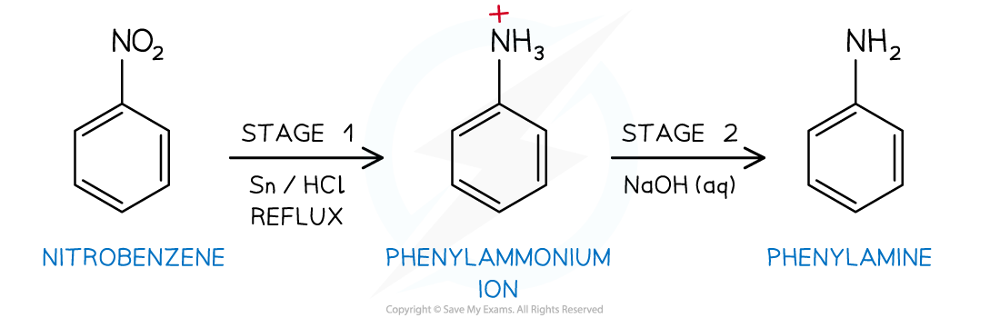
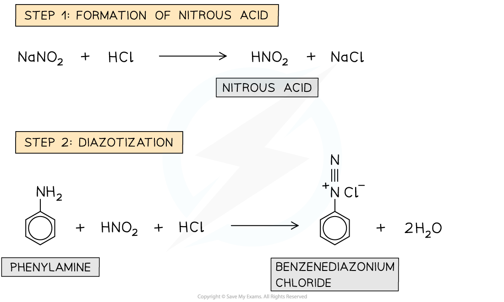
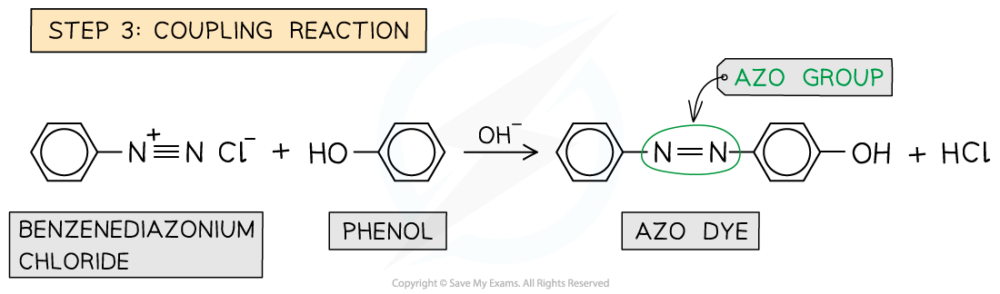

# Aromatic Amines

## Aromatic Amine - Formation

> **Spec point** — `spcpt_PYfT5yGny5JD7scS`

## Aromatic Amine - Formation

- **Phenylamine **is an organic compound consisting of a benzene ring and an **amine** (NH2) functional group

  - Phenylamine is sometimes known as aminobenzene or aniline
- Nitrobenzene, C6H5NO2, can be reduced to phenylamine, C6H5NH2, according to the following two-stage reaction:

***The two-stage reduction reaction of nitrobenzene to phenylamine***

**Stage 1 - Reduction of nitrobenzene**

- Nitrobenzene, C6H5NO2, is reacted with tin, Sn, and concentrated hydrochloric acid, HCl

  - The combination of tin and hydrochloric acid acts as a reducing agent
- The reaction mixture is heated under reflux in a boiling water bath
- The nitrobenzene has been reduced, in the presence of acid, by gaining electrons from tin

  - The tin is oxidised to a mixture of tin(II), Sn2+, and tin(IV), Sn4+
- The reduction reaction of nitrobenzene does not form phenylamine directly
- Due to the acidic conditions, the reduction reaction forms the phenylammonium ion, C6H5NH3+

**Stage 2 - Formation of phenylamine**

- Excess sodium hydroxide solution, NaOH (aq), is added to the phenylammonium ions, C6H5NH3+

  - This causes them to deprotonate and form the desired phenylamine product
  - A mixture of tin compounds, including tin(II) hydroxide and tin(IV) hydroxide is also formed from reactions between the sodium hydroxide solution and the tin ions in stage 1

**Stage 3 - Purification of phenylamine**

- The crude phenylamine product undergoes steam distillation to produce a cloudy distillate
- Sodium chloride is added to the distillate before the mixture is added to a separating funnel
- Ether is added to the separating funnel resulting in an aqueous layer at the bottom and an organic layer, containing the phenylamine, on the top

  - The sodium chloride aids separation by increasing the polarity of the aqueous layer causing the phenylamine to "salt out" into the organic layer
- The aqueous layer is discarded and the organic layer is distilled

  - The ether will boil off easily and is discarded
  - The phenylamine fraction that boils off at 180 - 185 oC is retained and can have its boiling point tested to check the purity of the product

## Aromatic Amine - Reactions

> **Spec point** — `spcpt_pQCT7xFtfSXxfkHM`

## Aromatic Amine - Reactions

- **Azo **(or **diazonium**) **compounds **are organic compounds that have an R1-N=N-R2 group
- They are often used as **dyes** and are formed in a **coupling reaction **between the **diazonium ion **and an **alkaline solution **of** phenol**

***Azo compounds are characterized by the presence of an *****R****1*****-N=N-*****R****2***** group***

#### Coupling of benzenediazonium chloride with phenol in NaOH

- Azo compounds can be formed from the coupling reaction of a **benzenediazonium chloride salt **with **alkaline phenol**
- Making an azo dye is a **multi-step process**

#### Formation of Azo Compounds Table

| **Step ** | **Description** | **Reaction Conditions** |
|---|---|---|
| 1. Formation of nitrous acid | Nitrous acid is very unstable so has to be made in a test tube using sodium nitride (NaNO2) and hydrochloric acid | N/A |
| 2. Diazotization | The reaction between nitrous acid and phenylamine to form the diazonium ion is called diazotization | The reaction mixture must be kept below 10oC using ice as otherwise the diazonium ion will thermally decompose to benzene and nitrogen (N2)  Dilute acid (such as HCl) |
| 3. Coupling reaction | The diazonium ion acts as an electrophile and substitutes into the benzene ring of the phenol at the 4th position | Alkaline conditions are required to deprotonate the organic product and form the azo compound |

***Reaction mechanism of the formation of azo compounds***

- The **delocalised** electrons in the π bonding systems of the two benzene rings are **extended **through the -N=N- which acts as a **bridge **between the two rings
- As a result of the delocalisation of electrons throughout the compound, azo compounds are **very stable**
