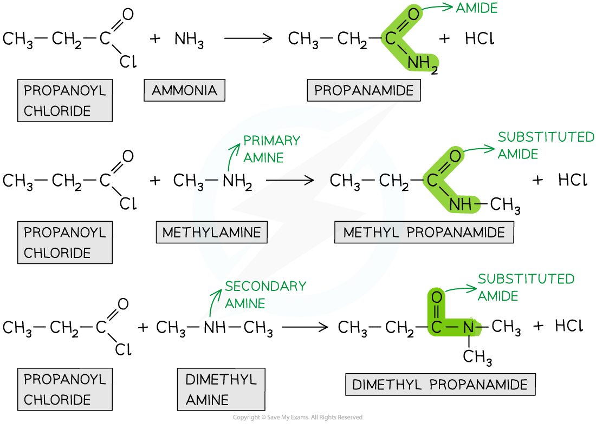

# Amides

## Amide Formation

> **Spec point** — `spcpt_N9WmDYvbMkKDKgr2`

## Amide Formation

- **Amides **are organic compounds with an -CONR2 functional group
- They can be prepared from the **condensation reaction **between an **acyl chloride **and **ammonia **or **amine**
- In a **condensation **reaction, two organic molecules **join together **and in the process **eliminate **a small molecule
- In this case, the acyl chlorides and ammonia or amine **join together **to form an **amide **and **eliminate **an HCl molecule

#### Condensation reaction

- The chlorine atom in acyl chlorides is **electronegative **and draws electron density from the carbonyl carbon
- The carbonyl carbon is therefore **electron-deficient **and can be attacked by **nucleophiles**
- The nitrogen atom in ammonia and amines has a lone pair of electrons which can act as a **nucleophile **and attack the carbonyl carbon
- As a result, the C-Cl bond is **broken **and an **amide **is formed
- Whether the product is a **substituted **amide or not, depends on the nature of the **nucleophile**

  - Primary and secondary amines will give a **substituted amide**
  - The reaction of acyl chlorides with ammonia will produce a **non-substituted amide**

***Acyl chlorides undergo condensation reactions with ammonia and amines to form amides***

- Note that ammonia is basic and the inorganic product is acidic, so there will be a reaction between the two molecules

**NH****3**** + HCl → NH****4****Cl**

- We can therefore write the overall equation for the reaction of propanoyl chloride and ammonia as

**CH****3****CH****2****COCl + 2NH****3**** → CH****3****CH****2****CONH****2**** + NH****4****Cl**
