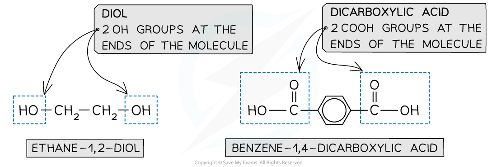
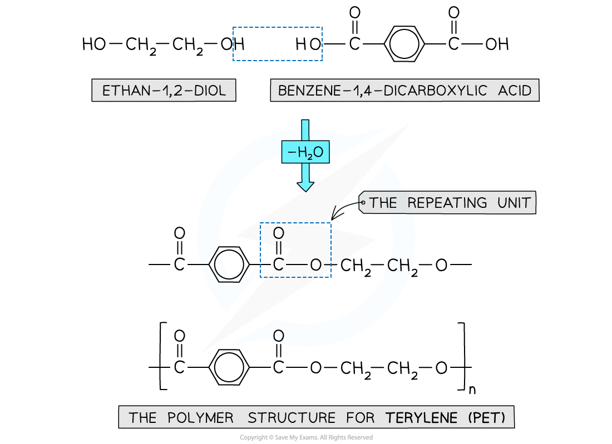
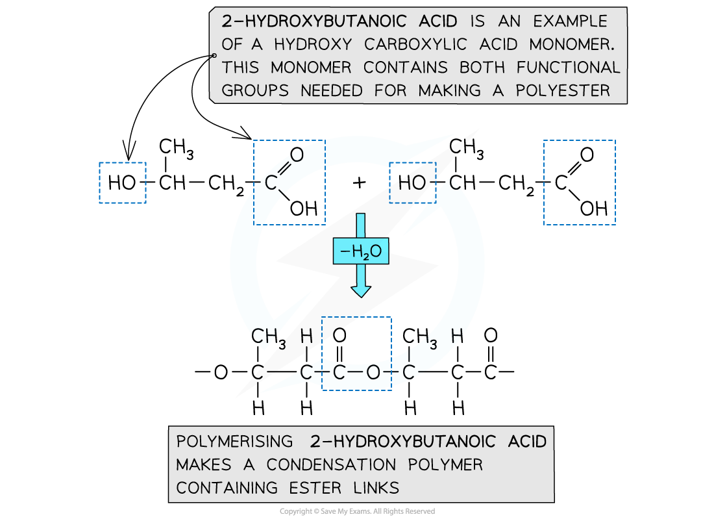
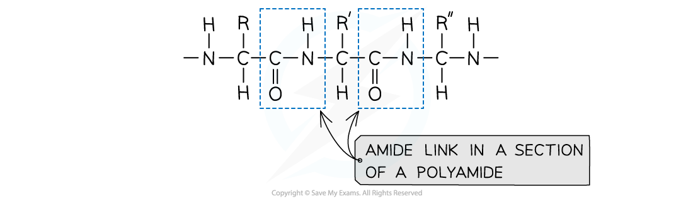
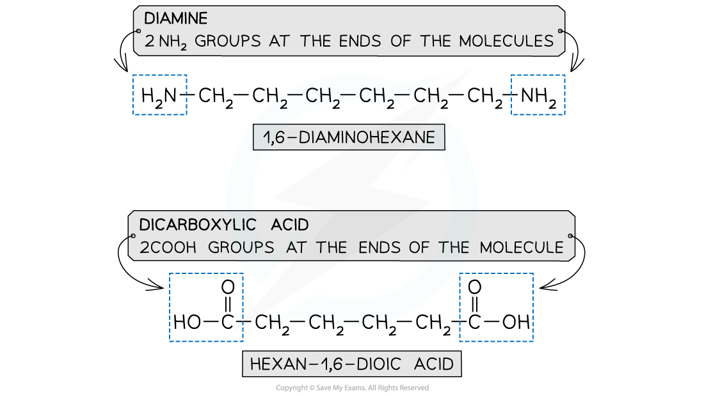
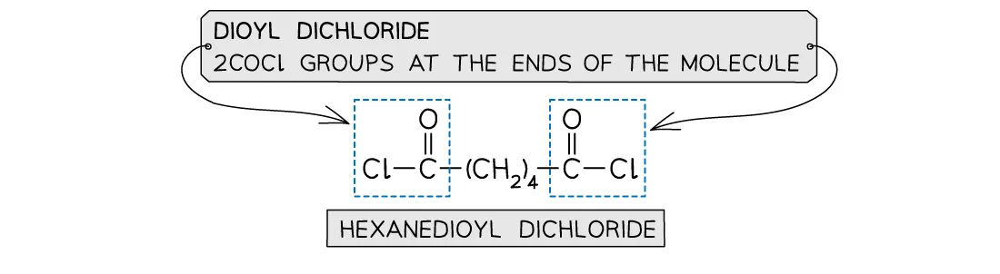
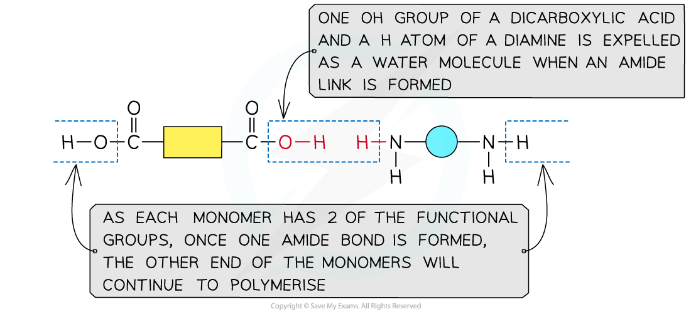
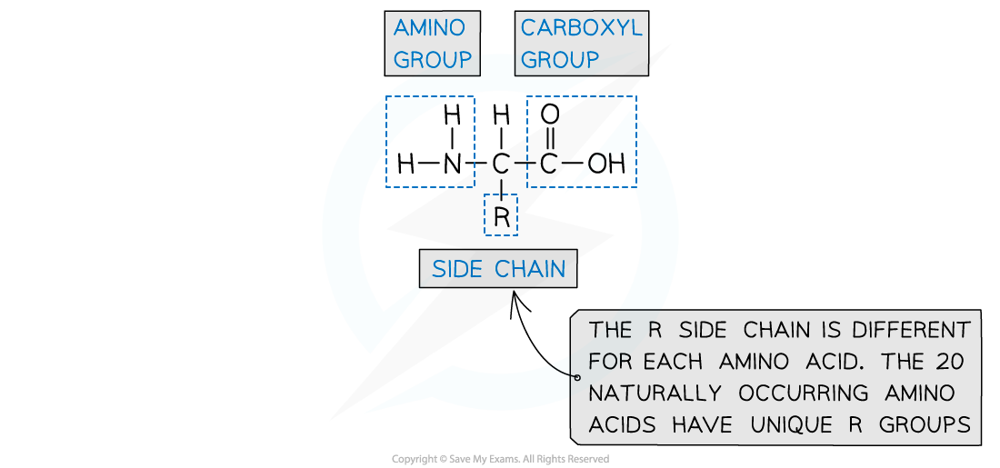
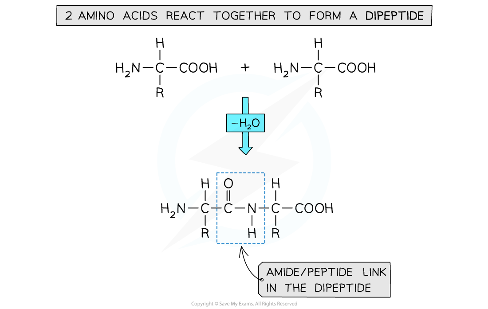

# Polymerisation

## Condensation & Addition Polymerisation

> **Spec point** — `spcpt_wB7hTkkDPJkZwzDx`

## Condensation & Addition Polymerisation

- Addition polymerisation has been covered in reactions of alkenes

  - They are made using monomers that have C=C double bonds joined together to form polymers such as polyethene
- Condensation polymerisation is another type of reaction whereby a polymer is produced by repeated condensation reactions between monomers
- Natural condensation polymers are all formed by **elimination of water**

  - Although the process of **condensation** polymerisation involves the **elimination of a small molecule**
- **Condensation polymers** can be identified because the monomers are linked by **ester** or **amide bonds**
- Condensation polymers can be formed by:

  - dicarboxylic acids and diols
  - dicarboxylic acids and diamines
  - amino acids

#### Polyester

- Is formed by the reaction between **dicarboxylic acid monomers** and **diol monomers**
- Polyester is produced by linking these monomers with **ester bonds / links**

***This polymer structure shows an ester functional group linking monomers together***

#### Formation of polyesters

- A diol and a dicarboxylic acid are required to form a polyester

  - A diol contains 2 -OH groups
  - A dicarboxylic acid contains 2 -COOH groups

***The position of the functional groups on both of these molecules allows condensation polymerisation to take place effectively***

- When the polyester is formed, one hydrogen atom from the diol and one of the -OH group from the -COOH are expelled as a water molecule (H2O)
- The resulting polymer is a polyester

  - In this example, the polyester is **poly(ethylene terephthalate)** or PET, which is sometimes known by its brand names of Terylene or Dacron

***Expulsion of a water molecule in this condensation polymerisation forms the polyester called (ethylene terephthalate) (PET)***

#### Formation of polyesters - hydroxycarboxylic acids

- So far the examples of making polyesters have focused on using 2 separate monomers for the polymerisation
- There is another route to making polyesters
- A single monomer containing both of the key functional groups can also be used
- These monomers are called hydroxycarboxylic acids

  - They contain an alcohol group (-OH) at one end of the molecule while the other end is capped by a carboxylic acid group (-COOH)

***Both functional groups that are needed to make the polyester come from the same monomer***

#### Polyamides

- Polyamides are polymers where repeating units are bonded together by amide links
- The formula of an amide group is -CONH

***An amide link - also known as a peptide link - is the key functional group in a polyamide***

#### Polyamide monomers

- A diamine and a dicarboxylic acid are required to form a polyamide

  - A diamine contains 2 -NH2 groups
  - A dicarboxylic acid contains 2 -COOH groups
- Dioyl dichlorides can also used to react with the diamine instead of the acid

  - A dioyl chloride contains 2 -COCl groups
  - This is a more reactive monomer but more expensive than dicarboxylic acid

***The monomers for making polyamides***

#### Formation of polyamides

***This shows the expulsion of a small molecule as the amide link forms***

#### Amino acids - formation of proteins

- Proteins are vital biological molecules with varying functions within the body
- They are essentially polymers made up of amino acid monomers
- Amino acids have an aminocarboxylic acid structure
- Their properties are governed by a branching side group - the R group

***Amino acids contain an amine group, an acid group and a unique R group***

- Different amino acids are identified by their unique R group
- The names of each amino acid is given using 3 letters
- For example Glutamine is known as ‘Gln’
- Dipeptides can be produced by polymerising 2 amino acids together

  - The amine group (-NH2) and acid group (-COOH) of each amino acid is used to polymerise with another amino acid
- Polypeptides are made through polymerising more than 2 amino acids together

***Dipeptides and polypeptides are formed by polymerising amino acid molecules together***

> **Exam Hint**
> Become familiar with the structures of the different monomers that can be used to make condensation polymers.
> 
> Also, remember that exam questions will require you to identify the monomers and also draw the repeating units

## Repeating Units

> **Spec point** — `spcpt_Cp9QyxvXCn685mBD`

## Repeating Units

#### Deducing repeat units

- A **repeat unit **is the smallest group of atoms that when connected one after the other make up the polymer chain

  - It is represented by **square brackets **in the displayed and general formula
- In **poly(alkenes) **(such as poly(ethene)) and **substituted poly(alkenes) **(such as PVC) made of **one type of monomer **the repeating unit is the same as the monomer except that the C-C double bond is changed to a C-C single bond

***The repeating units of poly(ethene) and poly(chloroethene) are similar to their monomer except that the C=C bond has changed into a C-C bond***

> **Worked Example**
> Draw the repeating unit and identify the monomers used to make the following polymers
> 
> 
> 
> **Answer:**
> 
> 

> **Worked Example**
> #### Identifying monomers
> 
> - Identify the monomers present in the given sections of addition polymer molecules
> 
> 
> 
> **Answer 1:**
> 
> - When ethenol (CH(OH)=CH2) is polymerised, the C-C double bond opens to produce a repeating unit of CH(OH)-CH2. This gives the polymer poly(ethenol)
> 
> 
> 
> **Answer 2:**
> 
> - To find the monomer, first the repeating unit should be deduced. Repeating units have only 2 carbons in the polymer main chain
> 
> 
> 
> - Since the repeating unit is now found, it can be concluded that the monomer is prop-2-enoic acid
> 
> 
> 
> **   Answer 3: **
> 
> - Again, the repeating unit only has 2 carbons in the polymer chain which in this case are two carbon atoms that each contain one OH group
> 
>   - Thus, when ethene-1,2-diol (CH(OH)=CH(OH)) is polymerised, the C-C double bond opens to produce a repeating unit of CH(OH)-CH(OH) which gives the polymer poly(ethene-1,2-diol)
> 
> 
