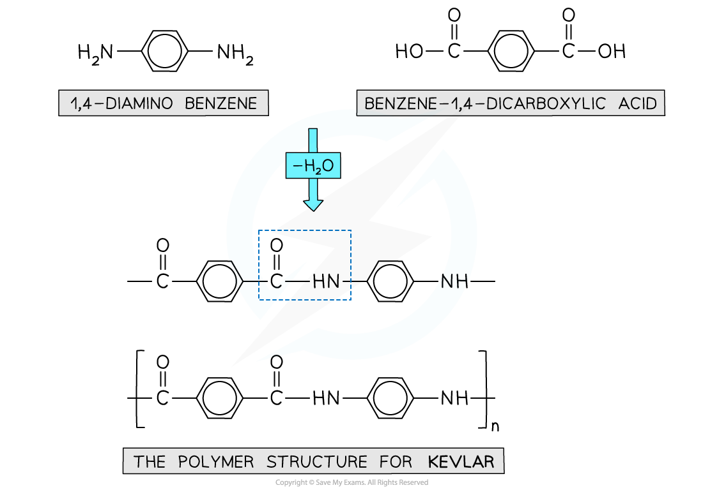
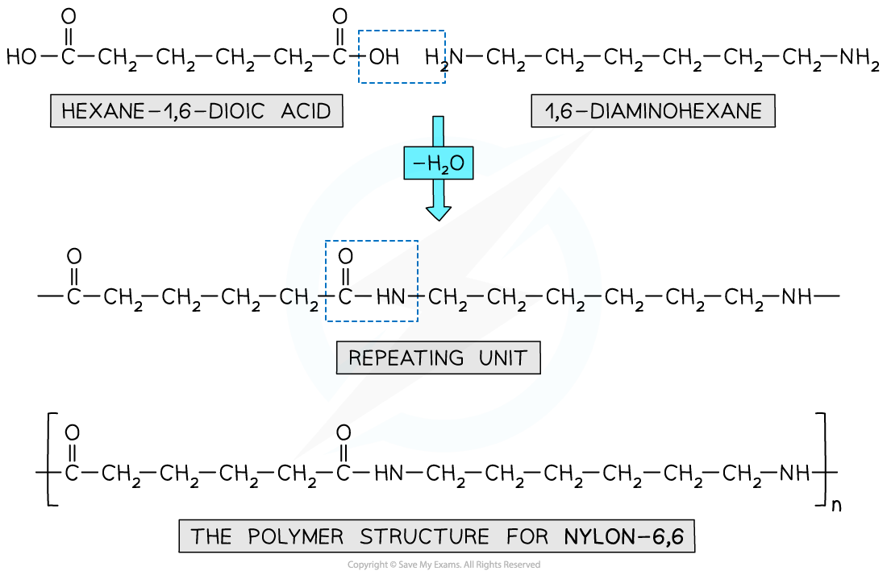
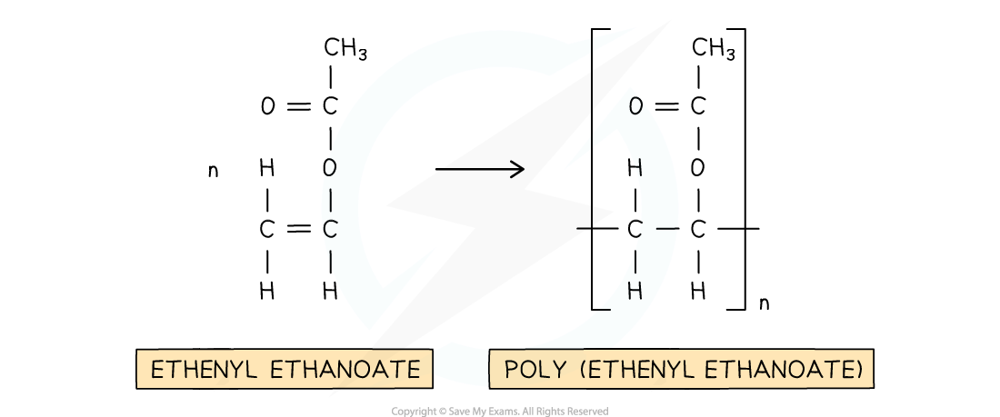
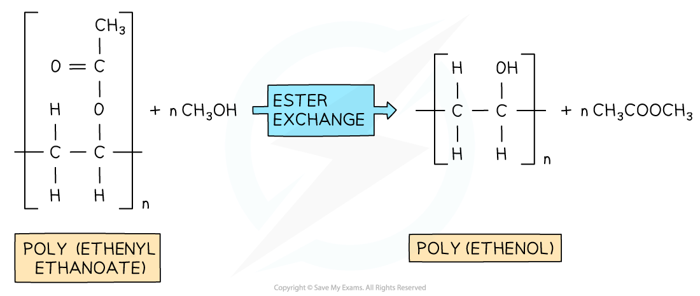

# Polyamides & Poly(ethenol)

## Polyamides - Physical Properties

> **Spec point** — `spcpt_MCCsVRBrWXBKJ8f7`

## Polyamides - Physical Properties

#### Examples of polyamides

#### Kevlar

- Kevlar is an example of a polymer formed through condensation polymerisation
- The polymer chains are neatly arranged with many hydrogen bonds between them
- This results in a strong and flexible polymer material with fire resistance properties
- These properties also lend Kevlar to a vital application in bullet-proof vests
- The monomers used to make Kevlar are:

  - 1,4-diaminobenzene
  - Benzene-1,4-dicarboxylic acid
- As seen with Nylon, a dioyl dichloride can be used instead of the acid as well (benzene-1,4-dioyl chloride)

***Kevlar is made using a diamine and dicarboxylic acid monomers***

#### Nylon 6-6

- Nylon 6,6 is a synthetic polyamide
- Its monomers are 1,6-diaminohexane and hexane-1,6-dioic acid

  - The ‘6,6’ part of its name arises from the 6 carbon atoms in each of Nylon 6,6 monomers

***Nylon 6,6 is a synthetic polyamide made using diamine and dicarboxylic acid monomers***

#### Properties of polyamides

- Most polyamides (nylons) tend to be semi-crystalline
- They are generally very tough with good thermal and chemical resistance
- Polyamides tend to absorb moisture from their surroundings

  - This absorption increases until equilibrium is reached
- The impact resistance and flexibility of polyamides increases with water content whilst strength and stiffness decrease
- The strong bonds in polyamides make the polyamide chains strong allowing them to be made into strong fibres for clothing

  - E.g. Kevlar shown above
- Polyamide film (cling film) is used in food packaging due to its toughness and the fact it prevents gas molecules from passing through
- Polyamide film is also used for 'Boil in the bag' foods due to its high-temperature resistance

#### Poly(ethenol)

- Poly(ethenol) is another addition polymer, sometimes called poly(vinyl alcohol)
- It is not made in the usual way by directly polymerising a monomer
- Instead, it is made in two stages:

***Stage 1: polymerisation of ethenyl ethanoate***

***Stage 2: poly(ethenyl ethanoate) reacts with methanol forming poly(ethenol) and methyl ethanoate (this process is known as ester exchange)***

- The amount of ester exchange is controlled by varying the temperature

**Solubility**

- Poly(ethenol) contains many OH groups
- These groups can form hydrogen bonds with water making poly(ethenol) soluble in water
- The degree of solubility depends on how many ester groups have been replaced with OH groups

  - Solubility ranges from insoluble, to soluble in warm/hot water, to soluble in cold water

**Uses**

- Poly(ethenol) is used to make disposable laundry bags for use in hospitals

  - These laundry bags are soluble in water
- Dirty bedding and clothing, which may be covered in microorganisms from patients, are put in the laundry bags
- The bag is then placed in the washing machine without hospital workers having to touch the dirty fabrics
- During washing the bag dissolves and the fabrics are washed clean

- Poly(ethenol) is also used to make liquid-detergent capsules that contain measured quantities of detergent for use in washing machine and dishwashers

  - The capsule dissolves during use
