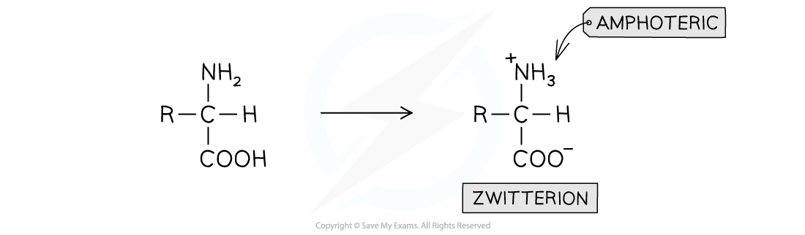
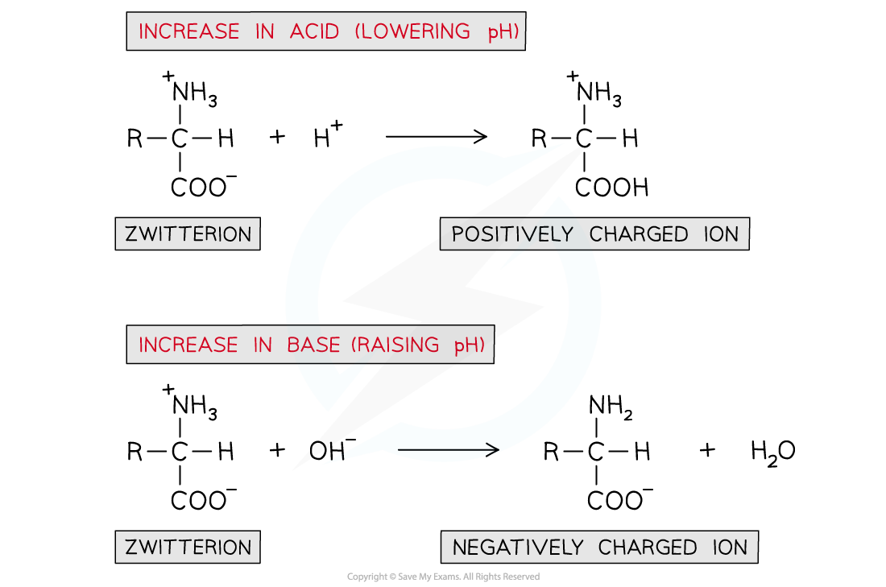
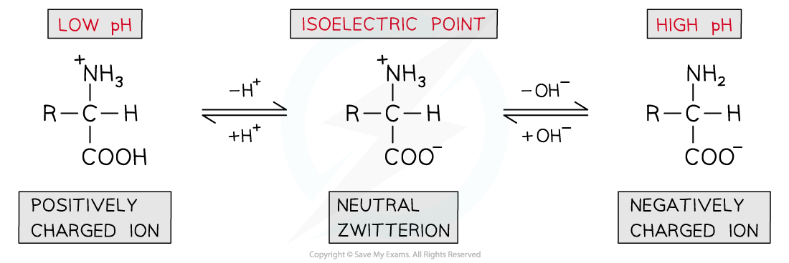
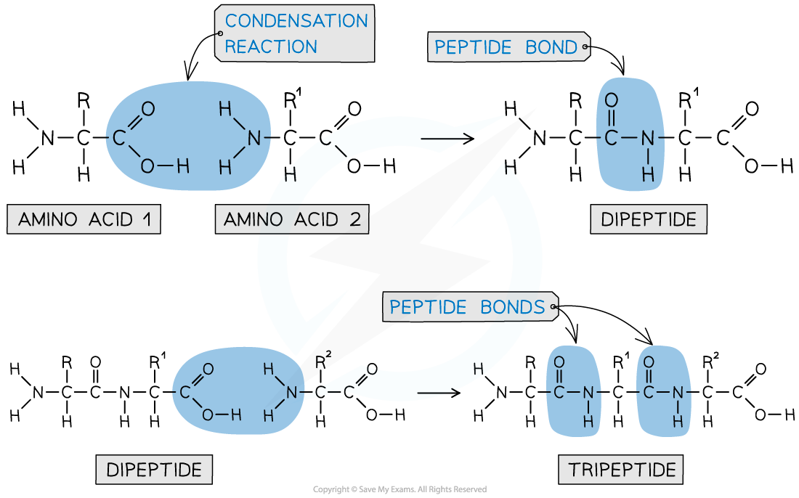

# Characteristic Behaviour of Amino Acids

## Characteristic Behaviour of Amino Acids

> **Spec point** — `spcpt_njp43Pw2fjKzNBnG`

## Characteristic Behaviour of Amino Acids

#### Acid / base properties of amino acids

- Amino acids will undergo most reactions of amines and carboxylic acids including acid-base reactions of:

  - Amines with acids
  - Carboxylic acids with bases
- However, they can also interact **intramolecularly** (within themselves) to form a **zwitterion**
- A zwitterion is an ion with both a **positive **(-NH3+) and a **negative **(-COO-) charge
- Because of these charges in a zwitterion, there are **strong intermolecular forces of attraction** between amino acids

  - Amino acids are therefore **soluble crystalline solids**

***An amino acid molecule can interact within itself to form a zwitterion***

#### Isoelectric point

- A solution of amino acids in water will exist as **zwitterions **with both **acidic **and **basic **properties
- They act as **buffer solutions** as they resist any changes in pH when **small **amounts of acids or alkali are added
- If an acid is added (and thus the pH is **lowered**):

  - The -COO- part of the zwitterion will **accept** an H+ ion to reform the -COOH group
  - This causes the zwitterion to become a **positively charged ion**
- If a base is added (and thus the pH is **raised**):

  - The -NH3+ part of the zwitterion will **donate **an H+ ion to reform the -NH2 group
  - This causes the zwitterion to become a **negatively charged ion**

***A solution of amino acids can act as a buffer solution by resisting any small changes in pH***

- The pH can be slightly adjusted to reach a point at which neither the **negatively charged **or **positively charged **ions dominate and the amino acid exists as a **neutral zwitterion**

  - This is called the **isoelectric point **of the amino acid

***The isoelectric point of amino acids is the pH at which the amino acid exists as a neutral zwitterion***

#### Reactions of the amine group

- The amine group is basic and reacts with acids to make salts
- For example, a general amino acid reacts with hydrochloric acid to form the ammonium salt:

**H****2****NCHRCOOH + HCl ⇌ H****3****N****+****CHRCOOH + Cl****-**** **

#### Reactions of the carboxylic acid group

**Reaction with aqueous alkalis**

- An amino acid reacts with aqueous alkali such as sodium or potassium hydroxide to form a salt and water
- For example, a general amino acid reacts with sodium hydroxide to form a sodium salt:

**H****2****NCHRCOOH + NaOH ⇌ H****2****NCHRCOO****-**** Na****+**** + H****2****O**

**Esterification with alcohols**

- Amino acids, like carboxylic acids, can be esterified by heating with alcohol in the presence of concentrated sulfuric acid
- The carboxylic acid group is esterified whilst the basic amine group is protonated due to the acidic conditions:

**H****2****NCHRCOOH + C****2****H****5****OH + H****+**** ⇌ H****3****N****+****CHRCOOC****2****H****5****  + H****2****O**

#### Optical activity

- Almost all 2-amino acids contain a chiral centre (the C of the CH group), and so are optically active

  - The only exception is glycine, which has a CH2 group instead
- Aqueous solutions of the enantiomers rotate the plane of polarisation of plane-polarised light

  - Dextrorotatory (+)
  - Laevorotatory (-)
- If an amino acid is synthesised in the lab, a racemic mixture is formed

#### Peptide bonds

- Each amino acid contains an amine (-NH2) and carboxylic acid (-COOH) group
- The new **amide bond **between two amino acids is also called a **peptide link **or **peptide bond**
- The -NH2 group of **one amino acid **can react with the -COOH group of **another amino acid **in a **condensation reaction** to form a **dipeptide**
- Since this is a condensation reaction, a small molecule (in this case H2O) is **eliminated**
- The **dipeptide **still contains an -NH2 and -COOH group at each end of the molecule which can again participate in a condensation reaction to form a **tripeptide**

***A peptide bond is an amide bond between two amino acids***

- A **polypeptide **is formed when **many **amino acids join together to form a long chain of molecules
