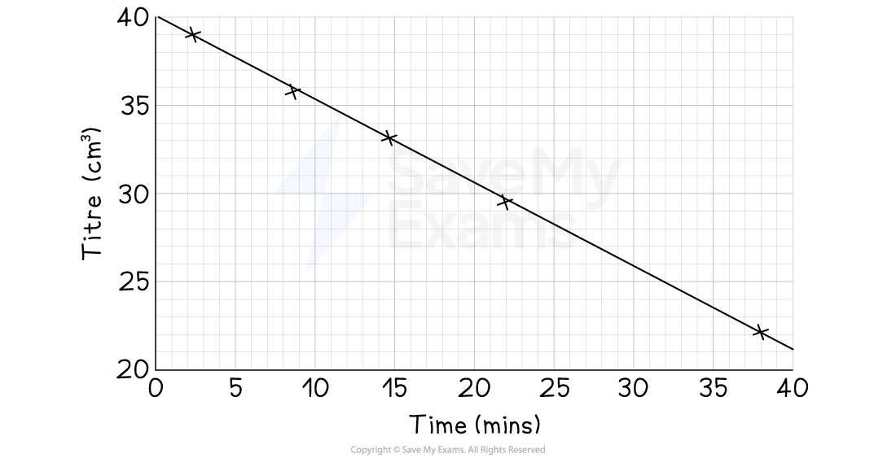
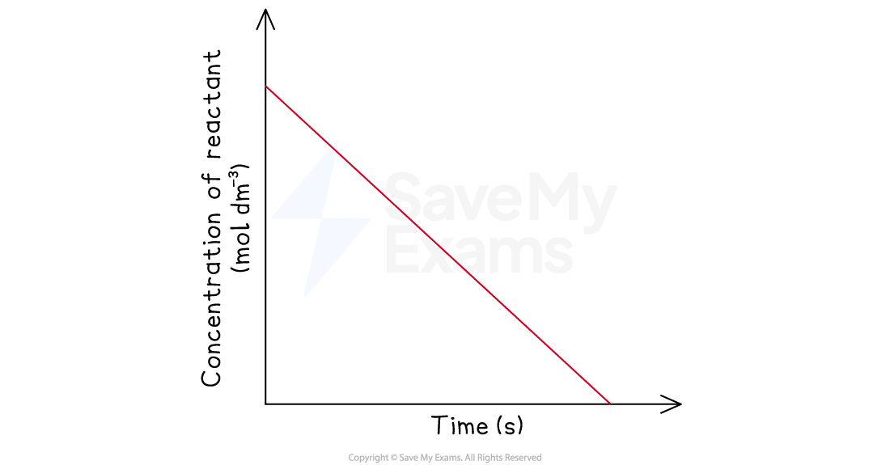

# Rates of Reaction - Titrimetric Method

## Core Practical 9a: Titrimetric Methods

> **Spec point** — `spcpt_pJTyjF2FXRh5mxqp`

## Core Practical 9a: Titrimetric Methods

- This practical uses a titrimetric method (a technique involving titration) to determine the **order of reaction with respect to iodine** in its acid-catalysed reaction with propanone
- Propanone reacts with iodine in the presence of an acid catalyst:

**CH****3****COCH****3 ****(aq) + I****2**** (aq) → CH****3****COCH****2****I (aq) + H****+**** (aq) + I****- ****(aq) **

### Aim

- To determine how the concentration of iodine, [I2], affects the rate of the reaction

### Experimental design

- The concentrations of the other reactants, propanone and H+, do not change
- A **large excess** of both propanone and the acid catalyst is used

  - This means that their concentrations will remain effectively constant throughout the experiment

### Method (sampling and quenching)

- We need to find the concentration of iodine at various points in time, so we use a sampling and titration method

1. Mix 25 cm3 of 1.0 mol dm-3 aqueous propanone with 25 cm3 of 1.0 mol dm-3 sulfuric acid in a beaker
2. Add 50 cm3 of 0.02 mol dm-3 iodine solution

  - **Start the timer as soon this is added to the beaker**
3. At regular intervals, use a pipette to withdraw 10 cm3 portion of the reaction mixture and transfer this to a conical flask
4. **Quench **/ stop the sample reacting further by adding a spatula of sodium hydrogen carbonate
5. Titrate the sample against 0.01 mol dm-3 sodium thiosulfate(VI) solution using starch as an indicator

  - Starch is used as an indicator is used to determine the concentration of iodine

**2S****2****O****3****2-**** (aq) + I****2**** (aq) → 2I****-**** (aq) + S****4****O****6****2- ****(aq) **

6. Record the result for each titration in a suitable table

| Time (mins) | Titre (cm3) |
|---|---|
| 0 |   |
| 5 |   |
| 10 |   |

#### Practical tips

- Have everything ready and set up before beginning the procedure
- Keep the timer running throughout the practical rather than stopping the clock
- Record the time when the sodium hydrogencarbonate is added to the samples of reaction mixture

  - This is when the reaction actually stopped
  - This means that the concentration of iodine can be calculated accurately

### Results

- Here is an example set of results

| Time (mins) | Titre (cm3) |
|---|---|
| 2.3 | 39.10 |
| 8.6 | 35.80 |
| 14.7 | 33.15 |
| 21.9 | 29.55 |
| 38.0 | 22.10 |

### Analysis and conclusion

- Plot a graph of **titre (y-axis)** against **time (x-axis)**

- For this reaction, the graph is a **straight line with a negative gradient**

  - A straight, descending line on a concentration-time graph means the rate of reaction is **constant**.
  - This shows that the rate is **independent** of the concentration of iodine.
  - Therefore, the reaction is **zero order** with respect to iodine

*Concentration-time graphs of a zero-order reaction*

- The reaction is first order with respect to propanone and H+
- This experiment determines that the reactions is zero order with respect to iodine
- So, the overall rate equation is:

**Rate = k[CH****3****COCH****3 ****(aq)] [H****+ ****(aq)]**

- [I2] does not appear in the rate equation because its order is zero
