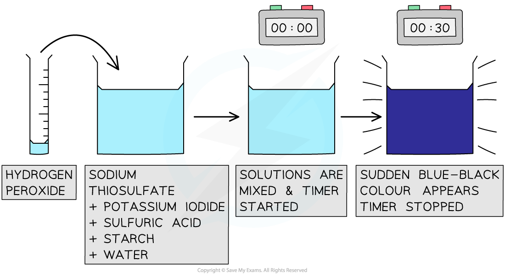
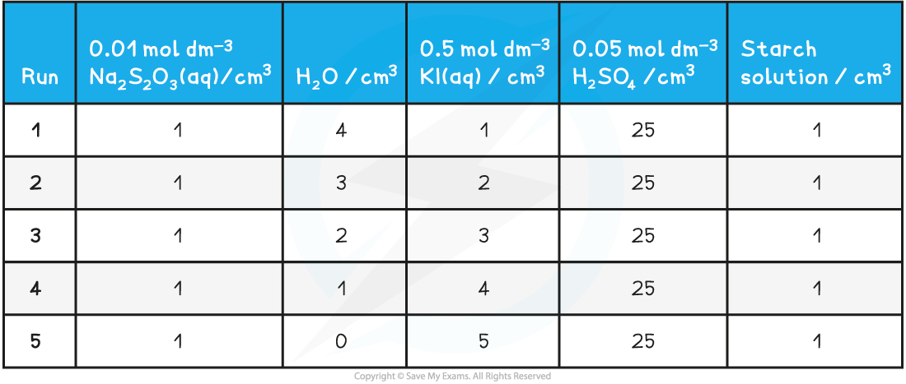
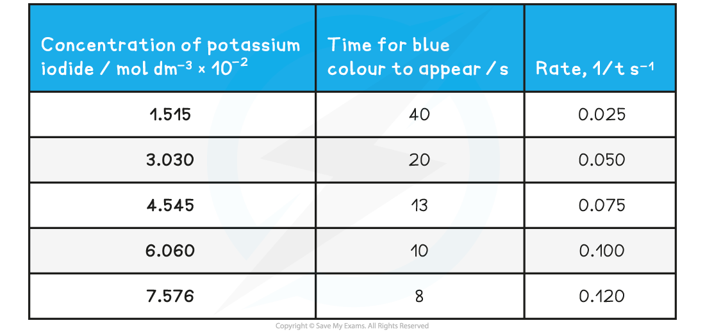

# Rates of Reaction - Clock Reaction

## Core Practical 9b: Investigating a Clock Reaction

> **Spec point** — `spcpt_km9vHckYZMBPq4fS`

## Core Practical 9b: Investigating a Clock Reaction

- Clock reactions are so called because they show a sharp dramatic colour change after a period of time has elapsed
- They make ideal reactions for studying kinetics
- Iodine clock reactions come in a number of variations, but they generally all use starch to show a sudden purple-black colour at the end of the reaction
- A common iodine clock reaction uses the reaction between hydrogen peroxide and iodine

**H****2****O****2**** (aq) + 2I****-**** (aq) + 2H****+****(aq) → I****2**** (aq) + 2H****2****O (l)**

- Adding sodium thiosulfate to the reaction mixture uses up the iodine and acts as the reaction timer

**2S****2****O****3****2- ****(aq) + I****2**** (aq) → 2I****-**** (aq) + S****4****O****6****2- ****(aq)**

- The amounts chosen are such that the iodine produced is in **excess** compared to the other reagents

  - Therefore, as soon as the iodine is in excess the blue-black colour of iodine in starch is seen

***The iodine clock reaction provides a good way to study reaction kinetics***

**Steps in the procedure**

- The solutions are measured in burettes and placed in a small beaker
- The sulfuric acid is in excess so can be measured in a measuring cylinder rather than burette
- The reaction is started by adding 1cm3 of 0.25 mol dm-3 hydrogen peroxide and starting a timer
- The timer is stopped when the blue black colour appears
- Suitable volume compositions to use could be as follows:

**Iodine Clock Volume Compositions Table**

**Practical tips**

- Hydrogen peroxide is typically found in 'volume' concentrations, based on the volume of oxygen given of when it decomposes:

**2H****2****O****2**** (aq)  → O****2**** (g) +  2H****2****O (l)**

- For example in school laboratories, a suitable concentration of hydrogen peroxide may be listed as 3% or '10 vol'

  - '10 vol' means that when 1cm3 of hydrogen peroxide decomposes it generates 10 cm3 of oxygen
  - '10 vol' or 3% hydrogen peroxide has a concentration of 0.979 mol dm3

**Specimen Results**

- Here is a set of typical results for the iodine clock reaction

**Specimen Results for the Iodine Clock Reaction Table**

**Analysis**

- The time of reaction is converted to rate of reaction by calculating the reciprocal value
- A graph is plotted of rate versus concentration

***A rate- concentration graph for the iodine clock reaction***

- From this graph we can see that the rate of reaction is directly proportional to the concentration of potassium iodide:

  - As concentration doubles; the rate of reaction also doubles
- This tells us that the reaction is first order with respect to potassium iodide
