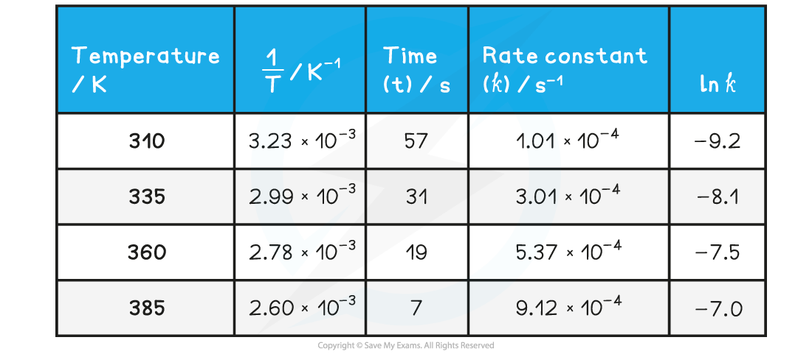
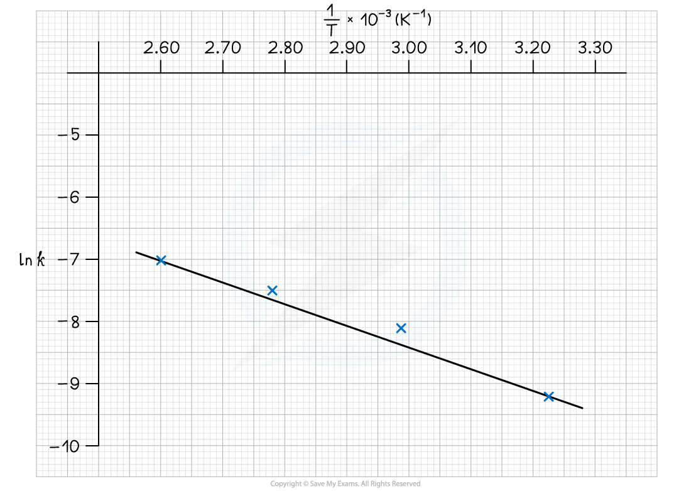
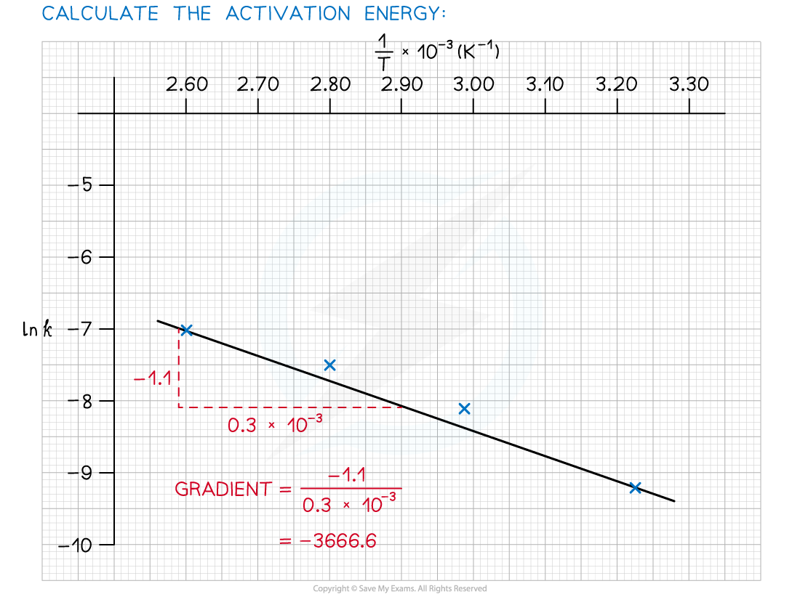
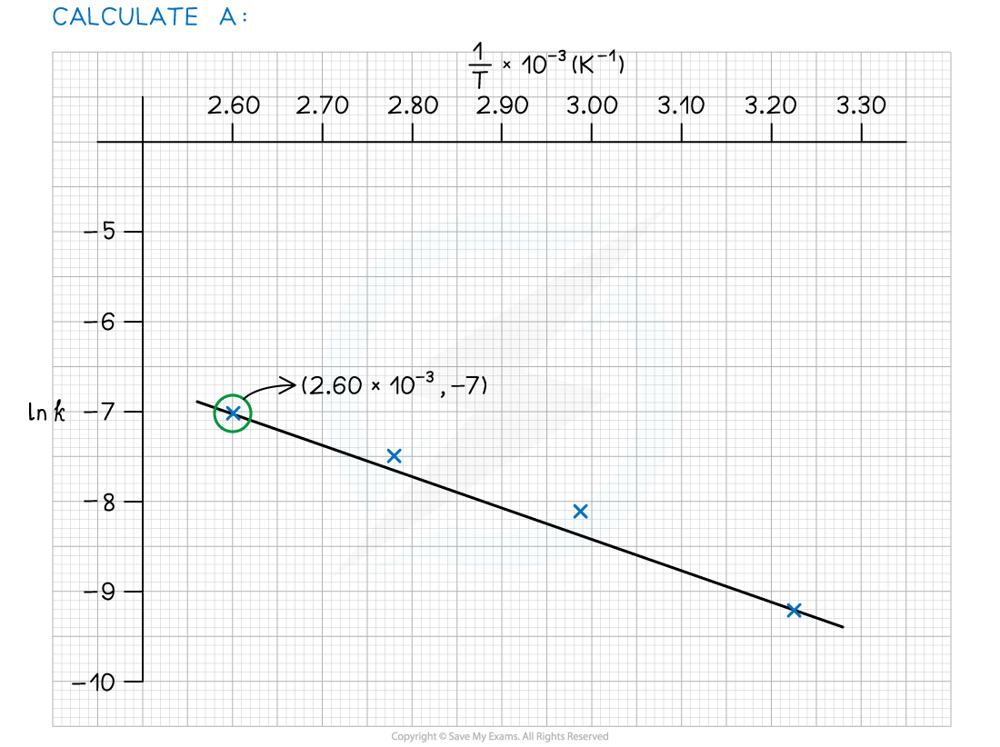
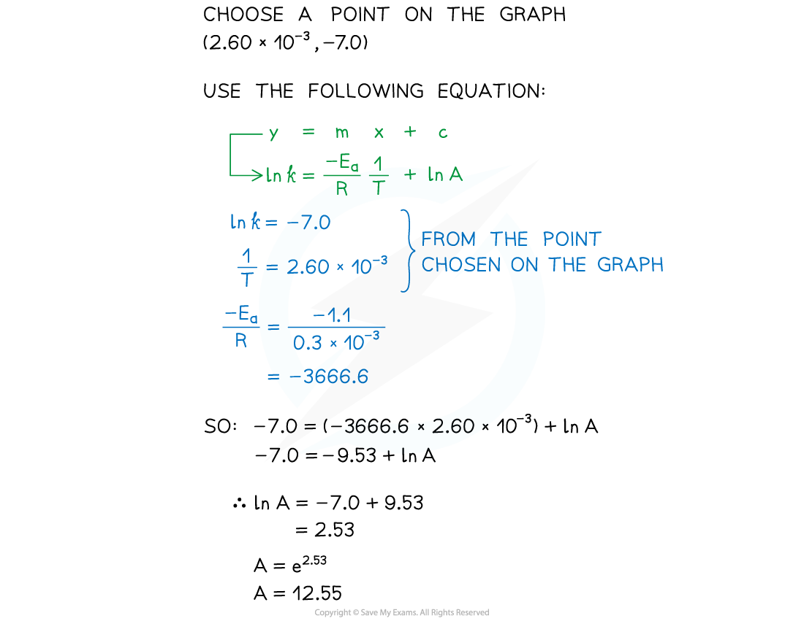

# Activation Energy

## Core Practical 10: Finding the Activation Energy of a Reaction

> **Spec point** — `spcpt_dKGNjs5TpkvDW7H3`

## Core Practical 10: Finding the Activation Energy of a Reaction

- In this practical the activation energy for the reaction between bromide ions and bromate(V) ions will be determined

**BrO****3****-**** + 5Br****-**** + 6H****+ ****→ 3Br****2 ****+ 3H****2****O**

**C****6****H****5****OH + 3Br****2**** → C****6****H****2****Br****3****OH + 3HBr**

- The bromine produced in the first reaction reacts with the phenol
- When the phenol is ‘used up’, the bromine is no longer removed
- The bromine then bleaches the indicator at the ‘end of the reaction’

  - Common indicators for this reaction are methyl red and methyl orange

**Steps in procedure**

- Pipette 10.0 cm3 of phenol solution and 10.0 cm3 of a bromide / bromate solution into one boiling tube
- Add four drops of methyl red indicator to the mixture
- Pipette 5.0 cm3 of sulfuric acid solution into a separate boiling tube
- Use a kettle and a beaker to prepare a water bath with a temperature of 37 °C (±1 °C) and stand the two boiling tubes in the water bath
- When the contents of the boiling tubes have reached the water temperature, mix the contents of the two tubes by pouring rapidly from one tube into the other and then pouring the mixture back into the empty test tube
- Start the stop clock at the same time
- Leave the boiling tube containing the reaction mixture in the water and time until the methyl red indicator disappears
- Record the results
- Repeat the whole experiment at different temperatures

  - Use ice to achieve the lowest temperature if required

**Sample Data **

***Graph plotted from data***

