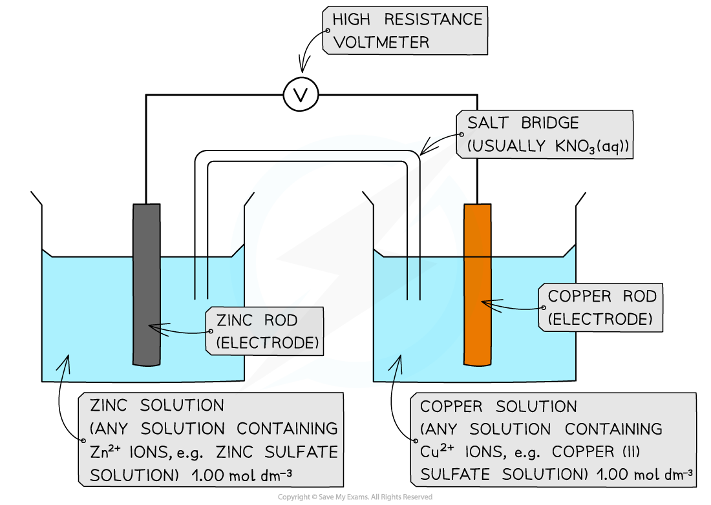

# Electrochemical Cells

## Core Practical 12: Investigating Electrochemical Cells

> **Spec point** — `spcpt_XWkXqg663kjHznVy`

## Core Practical 12: Investigating Electrochemical Cells

#### Measuring the EMF of a cell

- To measure a cell EMF you will need

  - Two small beakers, around 75 cm3 capacity
  - Strips of suitable metals such as copper, zinc, iron and silver
  - 1.0 mol dm-3 solutions of the metal ions (nitrates, chlorides or sulfates depending on their solubility)
  - A high resistance voltmeter (usually a digital multimeter has this)
  - Two sets of wires with crocodile clips
  - A salt bridge consisting of a strip of filter paper soaked in saturated potassium nitrate

***The experimental set up for measuring the EMF of a cell made of two metal / metal ion half cells***

### The procedure

- The strips of metals need to be freshly cleaned to remove any oxide coatings

  - This can be done with a piece of sandpaper
- To support the metals, it is easiest to have long strips that can be folded over the side of the beaker and held in place with the crocodile clips
- Fill up the beakers to about two thirds of the way with the metal ion solutions
- Using tongs, dip a strip of filter paper into a beaker of saturated potassium nitrate solution and then place it between the two beakers making sure the ends of the strip are well immersed in the solutions
- Connect the crocodile clips to the voltmeter, wait for a steady reading and record the measurement

#### Practical tips

- If you don't get a positive reading on the voltmeter swap the terminals around
- Voltmeters will have marked positive and negative terminals (usually in red and black, respectively), so when you get a positive reading this tells you the relative polarity of the metals in the cell
- Change the salt bridge each time, to prevent cross contamination of ions between half cells

### Calculating the Theoretical EMF of a Cell

- The voltage you measure in your experiment can be compared to a theoretical value calculated using **standard electrode potentials (E°)**

  - These values are found in the electrochemical series in your data book.
- The EMF of a cell is the difference between the E° values of the two half-cells
- The formula is:

**E°(cell) = E°(positive electrode) - E°(negative electrode)**

- A simple way to remember this is "most positive E° value minus most negative E° value

> **Worked Example**
> Calculate the theoretical EMF for a cell made of zinc and iron.
> 
> 1. **Find the E° values from a data book:**
> 
>   - Fe²⁺(aq) + 2e⁻ ⇌ Fe(s) has an E° = **-0.44 V**
>   - Zn²⁺(aq) + 2e⁻ ⇌ Zn(s) has an E° = **-0.76 V**
> 2. **Identify the positive and negative electrodes:**
> 
>   - The half-cell with the **more positive** (less negative) E° value will be the **positive electrode**
>   
>     - In this case, that is the **Fe²⁺/Fe** half-cell.
>   - The half-cell with the **more negative** E° value will be the **negative electrode**
>   
>     - This is the **Zn²⁺/Zn** half-cell.
> 3. **Apply the formula:**
> 
>   - E°(cell) = E°(positive) - E°(negative)
>   - E°(cell) = (-0.44) - (-0.76)
>   - E°(cell) = **+0.32 V**

This calculation is how the theoretical values in the specimen results table are determined.

### Specimen Results

- Here is a set of typical results for this experiment:

| Negative electrode | Positive electrode | EMF / V |
|---|---|---|
| Zn (s) / Zn2+ (aq) | Cu2+ (aq) / Cu (s) | 1.10 |
| Zn (s) / Zn2+ (aq) | Fe2+ (aq) / Fe (s) | 0.32 |
| Fe (s) / Fe2+ (aq) | Cu2+ (aq) / Cu (s) | 0.78 |
| Zn (s) / Zn2+ (aq) | Ag+ (aq) / Ag (s) | 1.56 |
| Cu (s) / Cu2+ (aq) | Ag+ (aq) / Ag (s) | 0.46 |

### Analysis

- It is unlikely you will get very close to the theoretical results as these would be obtained under **standard conditions **(1.0 mol dm-3 concentration, 298 K temperature)

  - This is because these conditions are hard to achieve in a school laboratory
- However, the **relative** EMF of cells you construct should match the theoretical values
- The higher the EMF, the larger the difference in reactivity ('electron pushing power') between the metals
