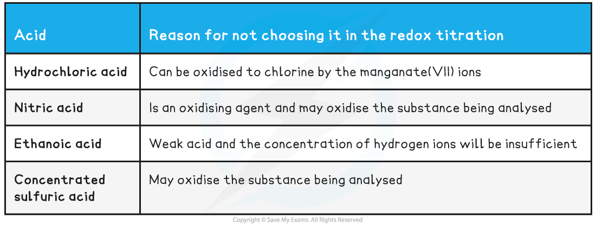
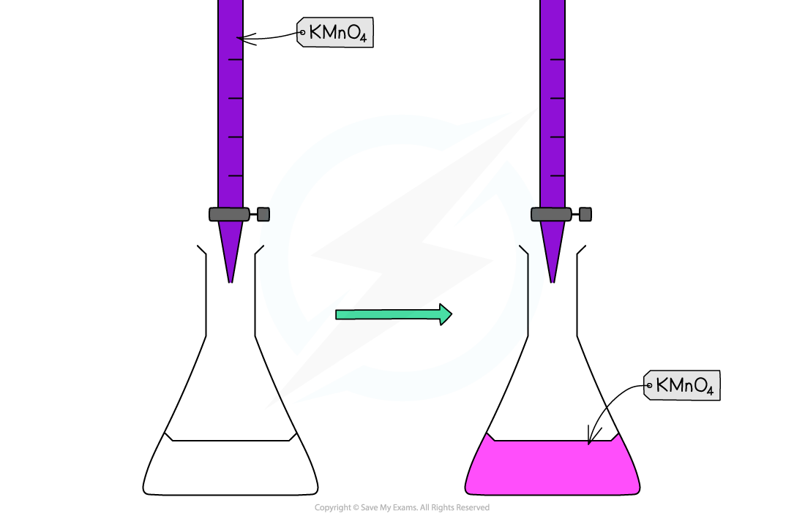

# Redox Titration - Iron(II) & Manganate(VII)

## Core Practical 13a: Iron(II) & Manganate(VII) Titration

> **Spec point** — `spcpt_ZYRNsQtgSSWd3ZgS`

## Core Practical 13a: Iron(II) & Manganate(VII) Titration

#### Redox Titrations

- In a** titration**, the concentration of a solution is determined by titrating with a solution of known concentration.
- In redox titrations, an **oxidising agent** is titrated against a **reducing agent**
- Electrons are transferred from one species to the other
- **Indicators** are sometimes used to show the endpoint of the** titration**
- However, most **transition metal ions** naturally change colour when changing** oxidation state**
- There are two common **redox titrations** you should know about **manganate(VII) titrations** and** iodine-thiosulfate titrations**

#### Potassium manganate(VII) titrations

- In these redox titrations the manganate(VII) is the oxidising agent and is reduced to Mn2+(aq)
- The iron is the reducing agent and is oxidised to Fe3+(aq) and the reaction mixture must be acidified

  - So, excess acid is added to the iron(II) ions before the reaction begins
- The choice of acid is important, as it must not react with the manganate(VII) ions, so the acid normally used is dilute sulfuric acid

  - As it does not oxidise under these conditions and does not react with the manganate(VII) ions
- You could be asked why other acids are not suitable for this redox titration in the exam so make sure you understand the suitability of dilute sulfuric acid

**Table Explaining why Other Acids are not Suitable for the Redox Titration**

#### Indicator and end point

- Potassium permanganate acts as its own indicator, as the purple potassium permanganate solution is added to the titration flask from the burette and reacts rapidly with the Fe2+(aq)

  - The burette used in this practical should be one with white numbering not black, as you would struggle to read the values for your titres against the purple colour of the potassium permanganate if black numbering was used
- The manganese(II) ions, Mn2+(aq), have a very pale pink colour but they are present in such a low concentration that the solution looks colourless
- As soon as all of the iron(II), Fe2+(aq), ions have reacted with the added manganate(VII) ions, Mn7+(aq), a pale pink tinge appears in the flask due to an excess of manganate(VII) ions, Mn7+(aq)

***Redox titration colour change for potassium permanganate and iron(II) ions***

> **Worked Example**
> **   Equations**
> 
> Find the stoichiometry for the reaction and complete the two half equations:
> 
> MnO4- (aq) + 5e- + 8H+ (aq) → Mn2+ (aq) + 4H2O (l)
> 
> Fe2+ (aq) → Fe3+ (aq) + e-
> 
> **   Answers:**
> 
> Balance the electrons:
> 
> MnO4- (aq) + 5e- + 8H+ (aq) → Mn2+ (aq) + 4H2O (l)
> 
> 5Fe2+ (aq) → 5Fe3+ (aq) + 5e-
> 
> Add the two half equations:
> 
> MnO4- (aq) + 8H+ (aq) + 5Fe2+ (aq) → Mn2+ (aq) + 4H2O (l) + 5Fe3+ (aq)
> 
> - Manganate(VII) titrations can be used to determine:
> 
>   - The percentage purity of iron supplements
> - Percentage purity = $\frac{\mathrm{mass} \mathrm{of} \mathrm{sample}}{\mathrm{mass} \mathrm{of} \mathrm{impure} \mathrm{sample}}\times100$
> 
>   - The formula of a sample of hydrated ethanedioic acid

> **Worked Example**
> **Analysis of iron tablets**
> 
> An iron tablet, weighing 0.960 g was dissolved in dilute sulfuric acid. An average titre of 28.50 cm3 of 0.0180 mol dm-3 potassium manganate(VII) solution was needed to reach the endpoint.
> 
> What is the percentage by mass of iron in the tablet?
> 
> ** Answer:**
> 
> - MnO4- (aq) + 8H+ (aq) + 5Fe2+ → Mn2+ (aq) + 5Fe3+ (aq) + 4H2O (l)
> 
>   - 1 : 5 ratio of MnO4- : Fe2+
>   - Number of moles of MnO4- (aq)$=\frac{0.0180\times25.0}{1000}=$5.13 x 10-4 moles
>   - Moles of iron(II) = 5 x 5.13 x 10-4 = 2.565 x 10-3 moles
>   - Mass of iron(II) = 56.0 x 2.565 x 10-3 = 0.14364 g
>   - Percentage by mass = $=\frac{0.14364}{0.960}\times100=$15.0%
