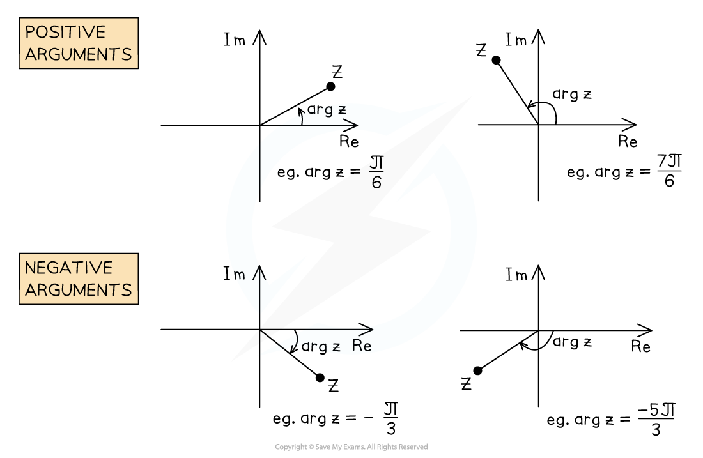
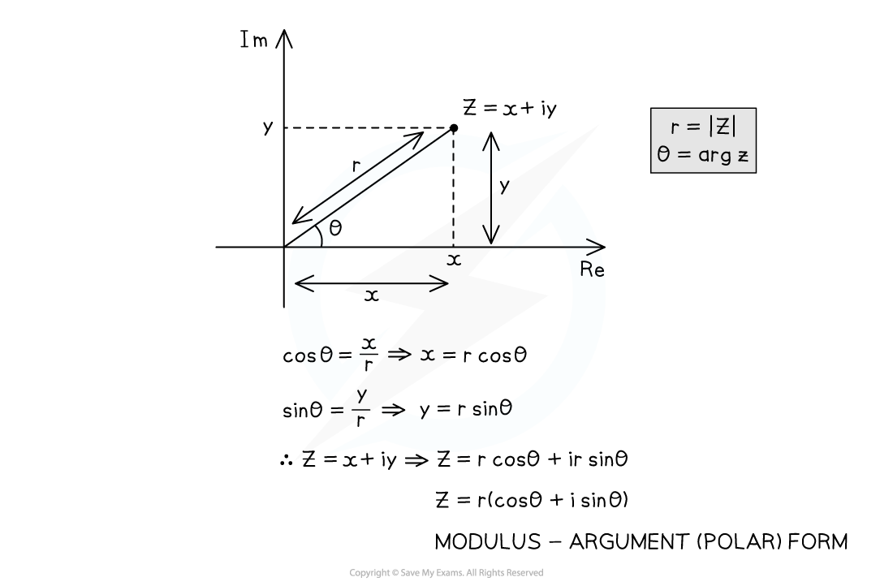

# Modulus & Argument

## Argand Diagrams

> **Spec point** — `spcpt_JHZkQZRBZM76WjSK`

## Argand Diagrams

### What is an Argand diagram?

- An **Argand diagram** is a **2D Cartesian grid** used to** visualise** complex numbers
- The complex number $x+yi$ is represented by the **point** with **coordinates **$(x,y)$

  - The **real** part is measured along the ***x***** -axis**
  
    - called  the **real axis**, written "**Re**"
  - The **imaginary** part is measured along the ***y***** -axis**
  
    - called the **imaginary axis**,** **written "**Im**"
- Complex numbers can be thought of as **points**, or as **vectors** from the origin

> **Exam Hint**
> If asked to sketch an Argand diagram, it does not need to be to scale (plotted), but should roughly show the correct positions.

> **Worked Example**
> Sketch, on the same Argand diagram, the complex numbers $5+7i$ and $-4-2i$.
> 
> 

## Modulus & Argument

> **Spec point** — `spcpt_FKPjqDV43mRmSbdk`

## Modulus & Argument

#### How do I find the modulus of a complex number?

- The **modulus** of a complex number is its **distance **from the** origin** on an **Argand diagram**

  - It is written `open vertical bar z close vertical bar`
  - If $z=x+iy$, then by **Pythagoras' theorem**
  
    - `open vertical bar z close vertical bar equals square root of x squared plus y squared end root`
- A modulus is always **positive** or **zero**

  - It cannot be negative
- For example

  - `vertical line 3 plus 4 straight i vertical line equals square root of 3 squared plus 4 squared end root equals 5`
  - `vertical line 1 minus straight i vertical line equals square root of 1 squared plus open parentheses negative 1 close parentheses squared end root equals square root of 2`
  - `vertical line minus 5 vertical line equals 5`
  - `vertical line 8 straight i vertical line equals 8`
  - `vertical line 0 plus 0 straight i vertical line equals 0`

### What rules does the modulus follow?

- Helpful** modulus rules **are:

  - `vertical line z subscript 1 z subscript 2 vertical line equals vertical line z subscript 1 vertical line vertical line z subscript 2 vertical line`
  - `open vertical bar z subscript 1 over z subscript 2 close vertical bar equals fraction numerator open vertical bar z subscript 1 close vertical bar over denominator open vertical bar z subscript 2 close vertical bar end fraction`
  - `vertical line z vertical line equals vertical line z asterisk times vertical line`
  - `z z asterisk times equals z asterisk times z equals vertical line z vertical line squared`
  
    - Proved using $z=x+yi$ and $z\ast=x-yi$
- Be careful:`open vertical bar z subscript 1 plus z subscript 2 close vertical bar not equal to open vertical bar z subscript 1 close vertical bar plus vertical line z subscript 2 vertical line`

  - For example, $z_{1}=3+4i$ and $z_{2}=-3+4i$
  
    - `open vertical bar z subscript 1 close vertical bar equals square root of 3 squared plus 4 squared end root equals 5` and `vertical line z subscript 2 vertical line equals square root of open parentheses negative 3 close parentheses squared plus 4 squared end root equals 5`
    - so `vertical line z subscript 1 vertical line plus vertical line z subscript 2 vertical line equals 10`
    - but $z_{1}+z_{2}=8i$ so `open vertical bar z subscript 1 plus z subscript 2 close vertical bar equals 8`

#### How do I find the argument of a complex number?

- The **argument **of a complex number is the **angle** in **radians** that it makes to the **positive real **axis

  - It is written as $\mathrm{arg}z$
  - The positive direction is **anticlockwise**
- The range normally used is $-π<\mathrm{arg}z\leqπ$

  - This is called the **principal range**
  - The sign of the angle depends on the **quadrant**:
  
    - The **1****st** quadrant is **positive acute**
    - The **2****nd** quadrant is **positive obtuse**
    - The **3****rd** quadrant is **negative obtuse**
    - The **4****th** quadrant is **negative acute**
- Arguments are found by

  - drawing a **sketch**
  - forming a **right-angled** triangle
  - using **trigonometry **
- The argument of the **origin**, `arg space open parentheses 0 plus 0 straight i close parentheses`, is **undefined**

  - No angle can be drawn

> **Exam Hint**
> Always draw a sketch to see which quadrant the complex number is in.

> **Worked Example**
> (a)  Find the modulus and argument of $z=2+3i$, giving your answers correct to 3 significant figures.
> 
> > *Sketch this on an Argand diagram*
> *Form a right-angled triangle*
> 
> 
> 
> > *Use *`open vertical bar z close vertical bar equals square root of x squared plus y squared end root`* (or Pythagoras) to find the modulus*
> 
> `table row cell vertical line z vertical line end cell equals cell square root of 2 squared plus 3 squared end root end cell row blank equals cell square root of 13 end cell row blank equals cell 3.60555127... end cell end table`
> 
> > $z$* is in the first quadrant so the argument is positive and acute*
> *Use trigonometry to find the argument *$θ$* in radians*
> 
> `table row cell tan space theta end cell equals cell 3 over 2 end cell row theta equals cell tan to the power of negative 1 end exponent open parentheses 3 over 2 close parentheses end cell row theta equals cell 0.98279372... end cell end table`
> 
> > *Round the answers to 3 significant figures*
> 
> **Final answer:** `vertical line z vertical line equals 3.61`** and **$\mathrm{arg}z=0.983$** to 3 significant figures**
> 
> (b)  Find the modulus and argument of $w=-1-\sqrt{3}i$, leaving your answers as exact values.
> 
> > *Sketch this on an Argand diagram*
> *Form a right-angled triangle*
> 
> 
> 
> > *Use *`open vertical bar z close vertical bar equals square root of x squared plus y squared end root`* (or Pythagoras) to find the modulus*
> 
> `table row cell vertical line z vertical line end cell equals cell square root of open parentheses negative 1 close parentheses squared plus open parentheses negative square root of 3 close parentheses squared end root end cell row blank equals cell square root of 4 end cell row blank equals 2 end table`
> 
> > $z$* is in the third quadrant so the argument is negative and obtuse*
> *Use trigonometry to first find *$α$* in radians*
> 
> `table row cell tan space alpha end cell equals cell fraction numerator square root of 3 over denominator 1 end fraction end cell row alpha equals cell tan to the power of negative 1 end exponent open parentheses square root of 3 close parentheses end cell row alpha equals cell pi over 3 end cell end table`
> 
> > *Then find *$θ$* by subtracting *$α$* from 180° (*$π$* radians)*
> 
> `table row theta equals cell pi minus alpha end cell row blank equals cell pi minus pi over 3 end cell row blank equals cell fraction numerator 2 pi over denominator 3 end fraction end cell end table`
> 
> > *Remember that the argument here must be a negative angle*
> 
> **Final answer:** `vertical line z vertical line equals 2`** and **$\mathrm{arg}z=-\frac{2π}{3}$
> 
> **These answers must be exact**

## Modulus-Argument Form

> **Spec point** — `spcpt_M75m468rddysY3Wn`

## Modulus-Argument Form

### What is modulus-argument form?

- All complex numbers can be written in the form:

  - `z equals r open parentheses cos space theta plus isin space theta close parentheses`
  - where `r equals vertical line z vertical line` and $θ=\mathrm{arg}z$
  
    - This is called the **modulus-argument **(or polar)** **form
- **Negative arguments** should be shown clearly** without simplifying**

  - `z equals 2 open parentheses cos space open parentheses negative pi over 3 close parentheses plus isin space open parentheses negative pi over 3 close parentheses close parentheses`
  
    - Simplifying them gives the **Cartesian form**
    - `z equals 2 open parentheses 1 half plus straight i open parentheses negative fraction numerator square root of 3 over denominator 2 end fraction close parentheses close parentheses equals 1 minus square root of 3 blank straight i`
- Be careful: `z equals r open parentheses cos space theta minus isin space theta close parentheses` is** not** in modulus-argument form (due to the** minus sign**)

  - Rewrite it  as `z equals r open parentheses cos invisible function application open parentheses negative theta close parentheses plus isin invisible function application open parentheses negative theta close parentheses close parentheses`
  
    - This uses the **symmetries **`cos open parentheses negative theta close parentheses identical to cos open parentheses theta close parentheses` and `sin open parentheses negative theta close parentheses identical to negative sin space theta`
  - The argument is $-θ$

> **Worked Example**
> Write $z=-4+4i$ in the exact form $r(\mathrm{cos}θ+i\mathrm{sin}θ)$ where $r>0$ and $-π<θ\leqπ$.
> 
> > *Draw a sketch to find the modulus, *$r$*, and argument, *$θ$*, of *$z$
> *Form a right-angled triangle*
> 
> 
> 
> > *Use *`open vertical bar z close vertical bar equals square root of x squared plus y squared end root`* (or Pythagoras) to find the modulus*
> 
> `table row cell vertical line z vertical line end cell equals cell square root of open parentheses negative 4 close parentheses squared plus open parentheses 4 close parentheses squared end root end cell row blank equals cell square root of 32 end cell row blank equals cell 4 square root of 2 end cell end table`
> 
> > $z$* is in the second quadrant so the argument is positive and obtuse*
> *Use trigonometry to first find *$α$* in radians*
> 
> `table row cell tan space alpha end cell equals cell 4 over 4 end cell row alpha equals cell tan to the power of negative 1 end exponent open parentheses 1 close parentheses end cell row alpha equals cell pi over 4 end cell end table`
> 
> > *Then find *$θ$* by subtracting *$α$* from 180° (*$π$* radians)*
> 
> `table row theta equals cell pi minus alpha end cell row blank equals cell pi minus pi over 4 end cell row blank equals cell fraction numerator 3 pi over denominator 4 end fraction end cell end table`
> 
> > *Write the final answer in the form *$r(\mathrm{cos}θ+i\mathrm{sin}θ)$
> 
> `z equals 4 square root of 2 open parentheses cos open parentheses fraction numerator 3 pi over denominator 4 end fraction close parentheses plus straight i italic space sin space open parentheses fraction numerator 3 pi over denominator 4 end fraction close parentheses close parentheses`
> 
> **Leave the modulus and argument exact**
