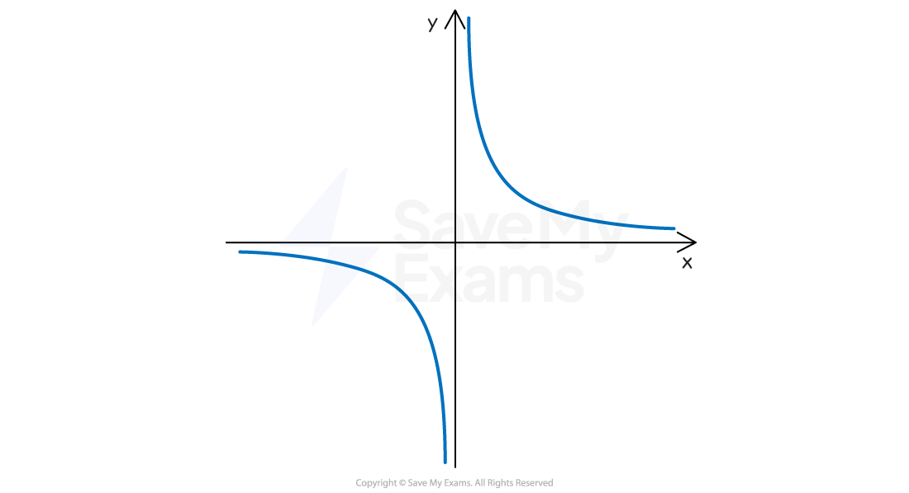

# The Rectangular Hyperbola

## Equation of a Rectangular Hyperbola

> **Spec point** — `spcpt_2F78GfSS8pMd4M7S`

## The Equation of a Rectangular Hyperbola

### What is a rectangular hyperbola?

- A** rectangular** **hyperbola **is a** reciprocal** **curve** with two **L-shaped** branches and **asymptotes** along the axes

  - $y=\frac{1}{x}$ is a rectangular hyperbola
- A rectangular hyperbola is part of a family of curves called the **conics** (or **conic sections**)

  - Conics are parabolae, hyperbolae and ellipses

### What is the general equation of a rectangular hyperbola?

*The rectangular hyperbola*

- The **general equation** for a **rectangular hyperbola** is

  - $xy=c^{2}$ in **Cartesian form**
  - $x=ct,y=\frac{c}{t}$ in **Parametric form**
  
    - $t\neq0$
  - where *c* is a positive constant
- The **asymptotes** are the lines $y=0$ and $x=0$

  - These are **rectangular** (horizontal and vertical)
  
    - Non-rectangular hyperbola have asymptotes at angles
- The general equation can be **rearranged**

  - $y=\frac{c^{2}}{x}$
  
    - This is a more familiar reciprocal form

> **Exam Hint**
> You are given the Cartesian and parametric equations of a rectangular hyperbola in the Formulae Booklet.

> **Worked Example**
> A rectangular hyperbola has the parametric equations $x=ct$* *and $y=\frac{c}{t}$ where $t\neq0$ and $c>0$.
> 
> Show that its Cartesian equation is $xy=c^{2}$*.*
> 
> > *To find the Cartesian equation, eliminate** *$t$* from the parametric equations*
> *A quick way here is to first make *$t$* the subject of both*
> 
> $t=\frac{x}{c}$*  and  *$t=\frac{c}{y}$* *
> 
> > *Then set them equal to each other and cross-multiply*
> 
> * *`table row cell x over c end cell equals cell c over y end cell row cell x y end cell equals cell c squared end cell end table`* *
> 
> $xy=c^{2}$
> 
> **Other correct ways to eliminate **$t$** are also accepted**
