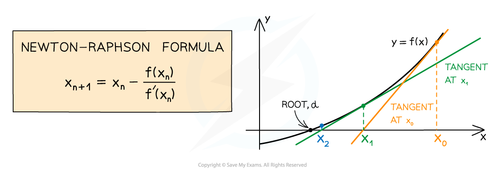
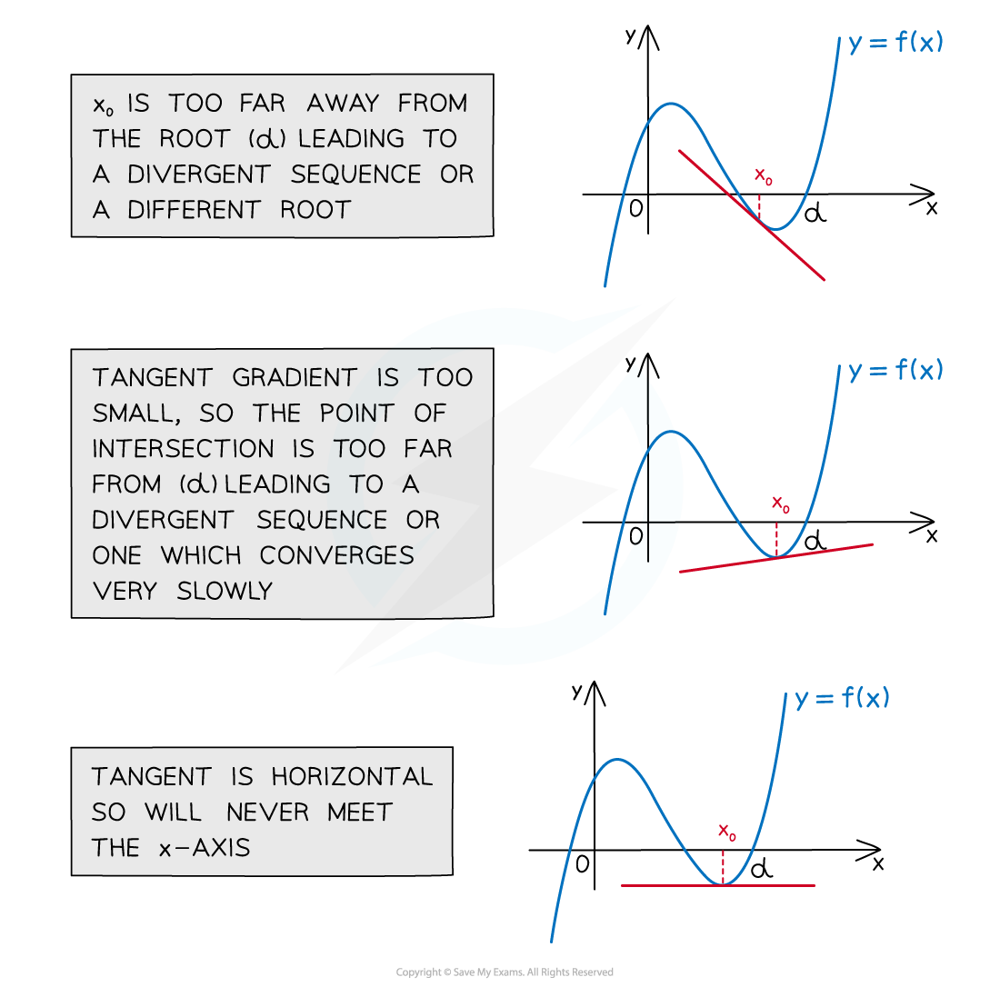

# Newton-Raphson Method

## Newton-Raphson Method

> **Spec point** — `spcpt_fm8GnX9jBsbsyZFJ`

## Newton-Raphson Method

### How do I apply the Newton-Raphson method?

- The **Newton-Raphson** **method **is a process for finding **roots **of equations

  - Equations must be **rearranged **into the form `straight f open parentheses x close parentheses equals 0`
- If $x=α$ is a** root** of the equation `straight f open parentheses x close parentheses equals 0`, then you need to** choose**  $x_{0}$, the **initial** (first) **approximation**

  - This is usual **given **in the question (and is a value** near **to the root)
- You can then find successive **approximations**  $x_{1}$, $x_{2}$, $x_{3}$, ...  using the **Newton-Raphson formula**:

  - `x subscript n plus 1 end subscript equals x subscript n minus fraction numerator straight f open parentheses x subscript n close parentheses over denominator straight f apostrophe open parentheses x subscript n close parentheses end fraction`
  - This is an *iterative formula*
  - `straight f apostrophe open parentheses x close parentheses` is the derivative of `straight f open parentheses x close parentheses`
  
    - Work this out beforehand
- **Increasing **the **number **of approximations improves the **accuracy**

  - The Newton-Raphson method usually *converges* quickly to the root compared to other methods

> **Exam Hint**
> The formula for the Newton-Raphson method is given in the Formulae Booklet.

### How do I apply the Newton-Raphson method on my calculator?

- If your calculator has a** recursion** function

  - Input the **formula**, **start value** and **number of steps**
  - The output is a **table** showing all the approximations
- Alternatively:

  - Type in the value of $x_{0}$ and press =
  
    - This **stores **it in the "Ans" (answer) button
  - Type  `Ans minus fraction numerator straight f open parentheses Ans close parentheses over denominator straight f apostrophe open parentheses Ans close parentheses end fraction` into your calculator and press =
  
    - This finds $x_{1}$
  - Without pressing any other button, press = again
  
    - This finds $x_{2}$
  - Repeatedly pressing = gives further approximations
  
    - The more you press it, the closer to the root it becomes

### How does the Newton-Raphson method work geometrically?

- The method works by drawing a **tangent** to the curve `y equals straight f open parentheses x close parentheses` at $x=x_{0}$

  - then finding where the tangent **cuts the *****x*****-axis**
  - This *x*-intercept is the **new **approximation, $x_{1}$
- This process is then **repeated**

  - Draw the tangent to `y equals straight f open parentheses x close parentheses` at $x=x_{1}$
  - Find its  *x*-intercept and call it $x_{2}$
- The approximations get closer and closer to the** root**

### How do I know if the Newton-Raphson method will fail?

- The Newton-Raphson method** fails** if the **initial value**, $x_{0}$, satisfies `straight f apostrophe open parentheses x subscript 0 close parentheses equals 0`

  - Algebraically, this is because the formula `x subscript n plus 1 end subscript equals x subscript n minus fraction numerator straight f open parentheses x subscript n close parentheses over denominator straight f apostrophe open parentheses x subscript n close parentheses end fraction` cannot **divide by zero**
  - Geometrically, this is because $x_{0}$ is at a stationary point on the curve `y equals straight f open parentheses x close parentheses`
  
    - A** tangent** drawn at a **stationary point** is** horizontal **
    - This will **never intersect** the *x*-axis
- The Newton-Raphson method also fails if the sequence $x_{1}$, $x_{2}$, $x_{3}$, ... *diverges*

  - This can happen if $x_{0}$ is chosen:
  
    - **too far away** from the root
    - or at a point where the **gradient **is **very small**
- The Newton-Raphson method is sometimes avoided when `straight f open parentheses x close parentheses` is too tricky to differentiate

> **Worked Example**
> The equation $2x^{4}-4x^{3}=-1$ has a solution in the interval `open square brackets 1 comma space 2 close square brackets`.
> 
> (a)  Using $x_{0}=2$ as the first approximation to the  solution, apply the Newton-Raphson method to find a second approximation.
> 
> > *Rearrange the formula into the form *`straight f open parentheses x close parentheses equals 0`
> 
> $2x^{4}-4x^{3}+1=0$*  so  *`straight f open parentheses x close parentheses equals 2 x to the power of 4 minus 4 x cubed plus 1`
> 
> > *(You could also use *$-1+4x^{3}-2x^{4}$*)*
> *Find *`straight f apostrophe open parentheses x close parentheses`* using differentiation*
> 
> `straight f apostrophe open parentheses x close parentheses equals 8 x cubed minus 12 x squared`
> 
> > *Substitute *`straight f open parentheses x close parentheses`* and *`straight f apostrophe open parentheses x close parentheses`* into the Newton-Raphson formula *`x subscript n plus 1 end subscript equals x subscript n minus fraction numerator straight f open parentheses x subscript n close parentheses over denominator straight f apostrophe open parentheses x subscript n close parentheses end fraction`
> 
> `x subscript n plus 1 end subscript equals x subscript n minus fraction numerator open parentheses 2 x subscript n to the power of 4 minus 4 x subscript n cubed plus 1 close parentheses over denominator open parentheses 8 x subscript n cubed minus 12 x subscript n squared close parentheses end fraction`
> 
> > *Substitute *$x_{0}=2$* into the formula to get *$x_{1}$
> 
> `x subscript 1 equals 2 minus fraction numerator open parentheses 2 cross times 2 to the power of 4 minus 4 cross times 2 cubed plus 1 close parentheses over denominator open parentheses 8 cross times 2 cubed minus 12 cross times 2 squared close parentheses end fraction
> equals 2 minus 1 over 16
> equals 1.9375`
> 
> > *Check this solution lies in the interval *`open square brackets 1 comma space 2 close square brackets`
> 
> $x_{1}=1.9375$
> 
> $\frac{31}{16}$** is also accepted**
> 
> (b)  Explain why the midpoint of the interval `open parentheses 1 comma space 2 close parentheses` cannot be used as the first approximation when applying the Newton-Raphson method.
> 
> > *The Newton-Raphson method fails if *$x_{0}$* satisfies *`straight f apostrophe open parentheses x subscript 0 close parentheses equals 0`
> *Find the midpoint of the interval*
> 
> $x_{0}=\frac{1+2}{2}=1.5$
> 
> > *Check if *`straight f apostrophe open parentheses 1.5 close parentheses equals 0`
> 
> `straight f apostrophe open parentheses 1.5 close parentheses equals 8 cross times 1.5 cubed minus 12 cross times 1.5 squared equals 0`
> 
> > *Write a conclusion either about dividing by zero, or about having a horizontal tangent*
> 
> **Final answer:** `straight f apostrophe open parentheses 1.5 close parentheses equals 0`**, but you cannot divide by zero in the formula **`x subscript n plus 1 end subscript equals x subscript n minus fraction numerator straight f open parentheses x subscript n close parentheses over denominator straight f apostrophe open parentheses x subscript n close parentheses end fraction`
> **So 1.5 cannot be used as the first approximation**
> 
> **You could also say that **$x=1.5$** is at a stationary point where the tangent is horizontal, meaning it cannot intersect the ****x****-axis to make **$x_{1}$
