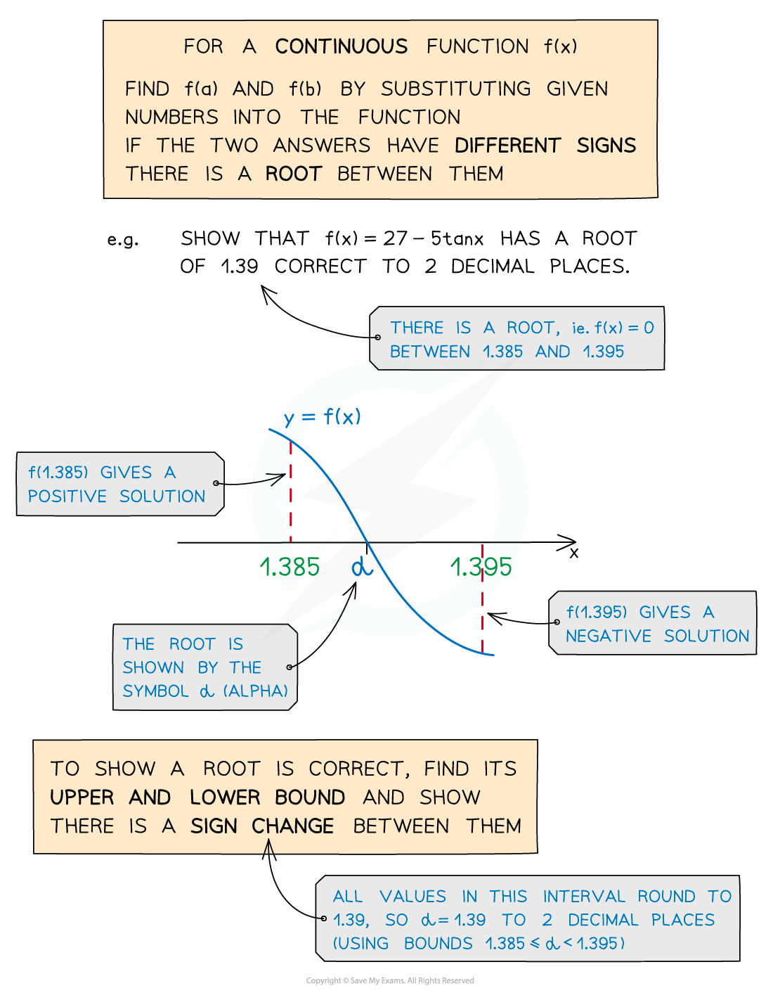
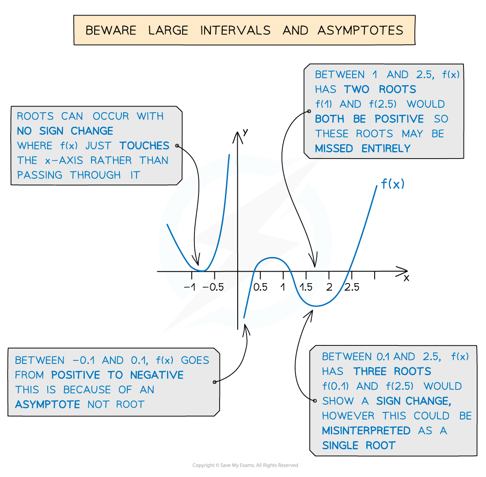

# Roots in Intervals

## Roots in Intervals

> **Spec point** — `spcpt_cB4gPQXjPVyXhqv2`

## Roots in Intervals

### What is a root of an equation?

- A **root** of the **equation** `straight f open parentheses x close parentheses equals 0` is a **solution**

  - If $x=α$ is a root of `straight f open parentheses x close parentheses equals 0` then `straight f open parentheses alpha close parentheses equals 0`
  
    - The Greek letter **alpha** is often used
- To find $α$ **exactly**, you need to solve the equation **algebraically** (analytically)
- Some equations **cannot **be solved algebraically

  - In which case you can **approximate** a root to a given **accuracy**
  
    - For example, to 3 decimal places
  - This is called solving equations **numerically**

### What is an interval?

- If you don't know the root but know that it lies between $x=a$ and $x=b$, where $a<b$, then

  - $a<x<b$ is an** interval** containing the root
- Intervals can be written using **bracket notation**

  - `open parentheses a comma space b close parentheses` is $a<x<b$
  - `open square brackets a comma space b close square brackets` is $a\leqx\leqb$

### How do I show that an interval contains a root?

- Use the **sign-change and continuity** **test** to show that the** interval **$a<x<b$ contains a **root **to the equation `straight f open parentheses x close parentheses equals 0`
- **Show** that `straight f open parentheses a close parentheses` and `straight f open parentheses b close parentheses` have** different signs** and **check** that `straight f open parentheses x close parentheses` is **continuous** across $a<x<b$

  - Then the interval ** **$a<x<b$ **must** contains a **root**
  - **Continuous **means **no jumps or asymptotes **in the interval
  
    - Check the equation does not **divide by zero** within the interval
    - (Jumps or asymptotes outside of the interval are fine)
  - You must write a **conclusion** to the test in words, for example:
  
    - "`straight f open parentheses x close parentheses` has a sign change in the interval $a<x<b$ and `straight f open parentheses x close parentheses` is continuous in the interval, so a** **root must lie in the interval $a<x<b$"

> **Exam Hint**
> When writing your conclusion in the exam, don't forget to mention `straight f open parentheses x close parentheses` being continuous in the interval!

### How do I show that an equation has a root to a given accuracy?

- If asked to show that $x=1.39$ is the root of an equation to **2 decimal places**

  - write an** interval **using the** lower **and **upper bound **of the root
  
    - $1.385<x<1.395$
  - use the** sign-change and continuity test** on this interval

- A suitable conclusion would be

  - `straight f open parentheses x close parentheses` has a **sign change** in the interval $1.385<x<1.395$
  - and `straight f open parentheses x close parentheses` is **continuous** in the interval
  - so a** **root** must** lie in the interval $1.385<x<1.395$
  - All values in the interval **round **to $1.39$
  - so the root is $1.39$ to **2 decimal places**

### How do I know when the sign-change test fails?

- You need to know the **three **cases when the sign-change and continuity test** fails** to work properly:

  - If the curve `y equals straight f open parentheses x close parentheses` only **touches** the $x$-axis at the root, you will **not** see a sign change (even though there **is** a root)
  - If the curve `y equals straight f open parentheses x close parentheses` has an **asymptote** in the interval, then you may see a sign change (but there is **no **root)
  
    - The asymptote means `straight f open parentheses x close parentheses` is **not** continuous
  - If the interval is **too large**, there may be **more than one** root in it
  
    - You may see a sign change (an **odd** number of roots)
    - Or you may **not **see a sign change (an **even** number of roots)

> **Worked Example**
> The equation `straight f open parentheses x close parentheses equals 0` where `straight f open parentheses x close parentheses equals x minus x to the power of 4 plus fraction numerator 1 over denominator 2 x minus 1 end fraction` has exactly one positive root.
> 
> (a)  Show that the intervals `open square brackets 0 comma space 1 close square brackets` and `open square brackets 1 comma space 2 close square brackets` both have a change of sign in `straight f open parentheses x close parentheses`.
> 
> > *Substitute *$x=0$*, *$x=1$* and *$x=2$* into *`straight f open parentheses x close parentheses`
> 
> `table row cell straight f open parentheses 0 close parentheses end cell equals cell 0 minus 0 to the power of 4 plus fraction numerator 1 over denominator 2 cross times 0 minus 1 end fraction equals negative 1 end cell row cell straight f open parentheses 1 close parentheses end cell equals cell 1 minus 1 to the power of 4 plus fraction numerator 1 over denominator 2 cross times 1 minus 1 end fraction equals 1 end cell row cell straight f open parentheses 2 close parentheses end cell equals cell 2 minus 2 to the power of 4 plus fraction numerator 1 over denominator 2 cross times 2 minus 1 end fraction equals negative 41 over 3 end cell end table`
> 
> > *Comment that the signs are different for each interval*
> 
> **Final answer:** `straight f open parentheses 0 close parentheses equals negative 1 less than 0`** and **`straight f open parentheses 1 close parentheses equals 1 greater than 0`** so there is a sign change in **`open square brackets 0 comma space 1 close square brackets`
> `straight f open parentheses 1 close parentheses equals 1 greater than 0`** and **`straight f open parentheses 2 close parentheses equals negative 41 over 3 less than 0`** so there is a sign change in **`open square brackets 1 comma space 2 close square brackets`
> 
> (b)  Determine, with a reason, which of the intervals contains the root.
> 
> > *An interval contains a root if *`straight f open parentheses x close parentheses`* has a sign change and is continuous in that interval*
> *Check to see if *`straight f open parentheses x close parentheses`* is continuous in *`open square brackets 0 comma space 1 close square brackets`
> *You need to look for any asymptotes*
> 
> $\frac{1}{2x-1}$* is undefined when *$x=\frac{1}{2}$
> 
> > *The asymptote  *$x=\frac{1}{2}$* lies in the interval  *`open square brackets 0 comma space 1 close square brackets`* *
> *There are no other asymptotes and only one root*
> 
> **Final answer:** **The interval **`open square brackets 1 comma space 2 close square brackets`** contains the root as there is a sign change and **`straight f open parentheses x close parentheses`** is continuous**
> **The interval  **`open square brackets 0 comma space 1 close square brackets`** contains the asymptote  **$x=\frac{1}{2}$**  so **`straight f open parentheses x close parentheses`** is not continuous**
