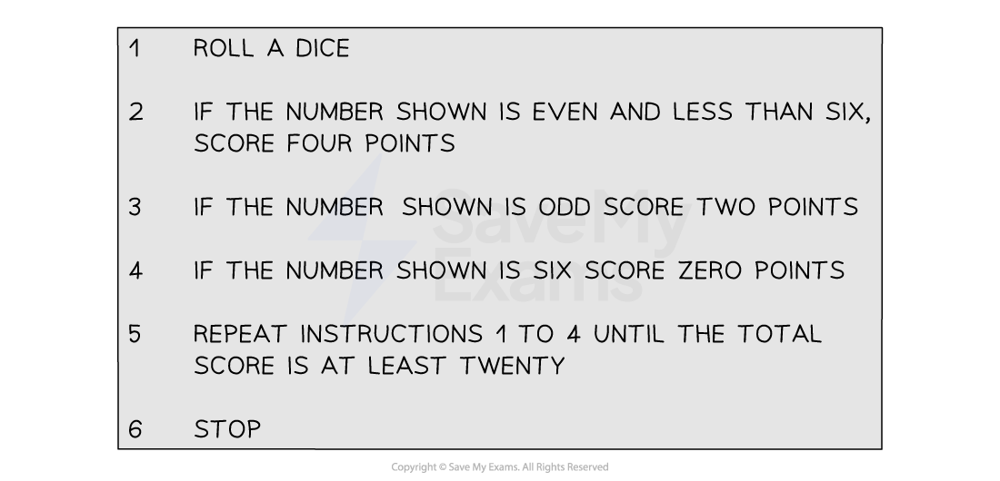

# General Algorithms

## Introduction to Algorithms

> **Spec point** — `spcpt_8gBcbKsMFqBsThd6`

## Introduction to Algorithms

### What is an algorithm?

- An **algorithm** is a set of **precise** instructions that, if strictly followed, will result in the **solution** to a problem

  - Algorithms are particularly useful for programming computers
  
    - Computers can process huge amounts of data and perform millions of calculations in very short time frames
  - Robots can be programmed to follow an algorithm in order to complete a task
  
    - E.g.  A robot vacuum cleaner or lawn mower
  - Algorithms can be performed by human beings too!
  
    - E.g.  The recipe and cooking instructions for a cake

### What does an algorithm look like?

- Algorithms may be presented in a variety of ways

  - A list of **instructions**, in order, written in **words**
  - **Flow charts **are a visual way of presenting the steps of an algorithm
  
    - These clearly show the order of instructions and any parts of an algorithm that may need repetition

### What else do I need to know about algorithms?

- Some algorithms do not always provide an **optimal** (best) solution

  - However, they will give a solution that is **sufficient** for the purpose
- Modern real-life situations can be **complex** to analyse

  - A compromise between the** efficiency** of an algorithm and its **accuracy** is often required
  - E.g. An algorithm may produce a 'shortest route' result that is inaccurate by 200 miles
  
    - For a very long journey, the time saved using this algorithm may be more important than this inaccuracy
- When using an algorithm with a **small** amount of data in an exam you must **follow the algorithm precisely and accurately**

  - This demonstrates understanding of the algorithm
  - Using common sense or intuition to 'see' the solution will not gain full marks

> **Exam Hint**
> - You must show that you have followed an algorithm **precisely**
> 
>   - Use checks built into the algorithm to know that an algorithm is complete
>   - State (or 'print') any 'output' at the end if that is what an algorithm instruction requires
>   
>     - Do not assume the output is the last number in your working

## Flow Charts

> **Spec point** — `spcpt_gRHgyFgW2bf6vQrK`

## Flow Charts

### What is a flow chart?

- A **flow chart** is a **diagrammatic** way of listing the **instructions** to an algorithm
- Flow charts lend themselves to algorithms that have

  - **conditional** instructions
  
    - E.g.  Is $a>b$?
    - If the answer is yes, the flow chart directs the user to one instruction
    - If the answer is no, the flow chart directs the user to a different instruction
  - **repetitive parts** or stages

### What do the different shaped boxes in a flow chart mean?

- Each command in a flow chart is written inside a **shape**

  - The shape will depend on the type of command
  
    - **Ovals** are used to represent the **start** and the **end**
    - **Rectangles** are used to represent **instructions**
    - **Diamonds** are used to represent **questions**

### How do I work with a flow chart?

- Following a flow chart is generally straightforward but make sure you **follow the instructions** carefully
- **Commands** given in a flow chart are intuitive to follow

  - Examples include
  
    - '**Input** ...' - The value(s)/data that the algorithm needs to be told
    - '**Let** ...' - Assign or update a value for a variable
    - '**If** ...' - A conditional statement, the outcome of which will lead to different parts of the algorithm
    - '**Output **...' or '**Print** ...' -  Write down the answer
- **Write down** any values when instructed to

  - This will often involve completing a** table of values**
  - Sometimes there is a specific instruction to 'output' the final answer
  
    - Make sure the answer is **separate** to the table
- Some questions may ask for a **description** of what the **flow chart/algorithm** produces

> **Exam Hint**
> - If a question provides a table that is to be filled in with values that change, bear in mind that some values may *not* change
> 
>   - In such instances, only the first entry for a value may end up being entered
>   
>     - Not every cell in every row/column will necessarily need completing
>     - Follow the instructions from the flow chart ('robot mode'!)

> **Worked Example**
> An algorithm is presented as a flow chart, shown below.
> 
> 
> 
> a) Describe what the algorithm achieves.
> 
> **Answer:**
> 
> > *The final instructions often give an idea of the purpose of an algorithm*
> 
> **The algorithm works out if the input value **$n$** is a square number or not**
> 
> b) For the input $n=23$, use the flow chart to perform the algorithm.
> Complete the table.
> 
> | $n$ | $k$ | $p$ | Is $p=n$? | Is $p>n$? |
> |---|---|---|---|---|
> |   |   |   |   |   |
> |   |   |   |   |   |
> |   |   |   |   |   |
> |   |   |   |   |   |
> |   |   |   |   |   |
> |   |   |   |   |   |
> |   |   |   |   |   |
> |   |   |   |   |   |
> | Output: |   |   |   |   |
> 
> > *The first instruction is to input *$n$*, so fill 23 under *$n$* in the first row of the table*
> *The next two instructions are to let *$k=1$* and to let *$p=k^{2}$*, so also in the first row we can fill in 1 and 1 for *$k$* and *$p$* *
> 
> | $n$ | $k$ | $p$ | Is $p=n$? | Is $p>n$? |
> |---|---|---|---|---|
> | *23* | *1* | *1* |   |   |
> |   |   |   |   |   |
> |   |   |   |   |   |
> 
> > *The next instruction is the first question, is *$p=n$*; the answer is no*
> *For the answer no, the flow chart directs us to another question, is *$p>n$*; the answer is no and so we can complete the top row of the table*
> 
> | $n$ | $k$ | $p$ | Is $p=n$? | Is $p>n$? |
> |---|---|---|---|---|
> | *23* | *1* | *1* | *NO* | *NO* |
> |   |   |   |   |   |
> |   |   |   |   |   |
> 
> > *The flow chart now updates the value of *$k$*; indicate this on the second row of the table*
> *The flow chart then takes us back round the loop of finding and testing the value of *$p$
> $n$* does not get updated so only appears in the first row of the table*
> 
> | $n$ | $k$ | $p$ | Is $p=n$? | Is $p>n$? |
> |---|---|---|---|---|
> | *23* | *1* | *1* | *NO* | *NO* |
> |   | *2* | *4* | *NO* | *NO* |
> |   |   |   |   |   |
> 
> > *The table can be completed by continuing to precisely follow the flow chart*
> *The output needs stating at the end as per the flow chart instructions*
> *In the *$k=5$* row "is *$p=n$*?" still has a 'no' answer, but the 'yes' answer to the question "is *$p>n$*?" means that the algorithm gives its output and stops*
> 
> | $n$ | $k$ | $p$ | Is $p=n$? | Is $p>n$? |
> |---|---|---|---|---|
> | *23* | *1* | *1* | *NO* | *NO* |
> |   | *2* | *4* | *NO* | *NO* |
> |   | *3* | *9* | *NO* | *NO* |
> |   | *4* | *16* | *NO* | *NO* |
> |   | *5* | *25* | *NO* | *YES* |
> |   |   |   |   |   |
> |   |   |   |   |   |
> |   |   |   |   |   |
> | Output: | **Final answer:** **23 is not a square number** |   |   |   |

## Text-Based Algorithms

> **Spec point** — `spcpt_zhGH23vdhhw5pDX2`

## Text-Based Algorithms

### What are text-based algorithms?

- **Text-based algorithms** refer to instructions that are given in sentences

  - Each instruction may be labelled with 1, 2, 3, and so on
- The following text-based algorithm is for a very basic single player dice game

  - The aim of the game is to minimise the number of rolls of the dice needed to reach 'Stop'

