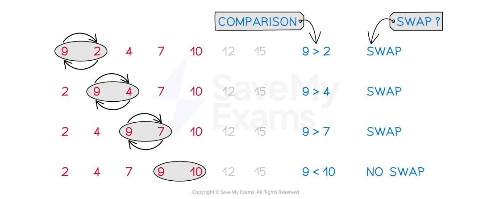

# Sorting Algorithms

## Introduction to Sorting Algorithms

> **Spec point** — `spcpt_GhSjBXgQRgBb843c`

## Introduction to Sorting Algorithms

- **Sorting algorithms** arrange items into **ascending** or **descending** order

  - Items that are usually sorted include **values, letters **or **words**
- As a list of items becomes **larger**, it becomes **increasingly difficult** for a human to sort

  - A computer can be programmed with a sorting algorithm
  
    - This makes the process both **accurate** and **efficient**
- With sorting algorithms in particular, it is important to stay in **'robot mode'**

  - Follow each step of the **algorithm** **precisely,** in **order,** exactly as a robot would
  - Do **not** be tempted to take shortcuts or miss parts of the algorithm out because the answer can be 'seen'

## Bubble Sort

> **Spec point** — `spcpt_Vcg4PHTNDThnKgZ2`

## Bubble Sort

### What is the bubble sort algorithm?

- The **bubble sort** algorithm arranges items into either **ascending** or **descending** order

  - Items are usually **values**
  
    - They could also be letters or words or similar
    - For questions given in context, **values** will be measures such as **weights**,** lengths**,** scores** or **times**

### How does the bubble sort algorithm work?

- **Bubble sort** works by **comparing** pairs of items on the **working list**

  - Comparisons are made working from **left to right**
  - The first item is **compared** to the second, the second to the third, and so on
  - A **swap** occurs if a pair of items are not in order
  
    - A pair of **equal** items does **not count** as a swap

- This comparison of pairs and swaps continues until the **end of the working list **is reached

  - This is called a **pass**
  - Several **passes** are usually required to order a list of items
- At the **end** of each **pass,** the item at the end of the **working list** is in the **correct** place

  - For **ascending** order, the **highest value** 'bubbles' to the **end**
- Bubble sort, for $n$ items, is **complete** when **either**

  - a **pass** involves **no swaps**, or
  - after the `open parentheses n minus 1 close parentheses to the power of th` pass
  
    - I.e.  when only **one item** would remain on the **working list **

### What is the working list?

- The **working list** is the list of **unordered** items that a pass of the bubble sort algorithm will apply to

  - For the **first pass every item** on the list is in the **working list**
- After the **first pass,** the **final item** is in the correct place

  - This item is **removed** from the working list
  - You may 'see' that other items are in the correct places
  
    - However, the algorithm **ensures** the **highest** (or **smallest**) item is at the **end** of the list
- The working list is** reduced by one** after each pass

  - This keeps the bubble sort as **efficient** as possible by not requiring unnecessary comparisons

- For a list of $n$ **items**

  - The first pass will have $n$ items on the working list
  - The second pass will have $n-1$ items on the working list
  - (If required) the `open parentheses n minus 1 close parentheses to the power of th` pass will have 2 items on the working list
- The **ordered items** may be described as the **sorted list**
- The image below shows a list at the end of the **second pass** of an **ascending bubble sort**

  - **Two** items are on the sorted list (12 and 15)
  - The 10 being in the correct position is irrelevant at this stage
  - The **third **pass will confirm the position of the 10 and it will become part of the sorted list

### How do I work out the (maximum) number of passes in the bubble sort algorithm?

- For a list of $n$ items

  - The **maximum number** of **passes** will be $n-1$
  - After the `open parentheses n minus 1 close parentheses to the power of th` pass, $n-1$ items will be in order
  
    - The last remaining item must be in order too
  - It is hard to predict how many passes the bubble sort will need
  
    - It may be possible to tell how many **more passes** are required when only a few items are out of order
  - If the item **at the end** of the list **should be at the start** then it will take $n-1$ passes
  
    - This is because this item will **only move one space closer** to the start after each pass

### How do I work out the (maximum) number of comparisons in the bubble sort algorithm?

- For a list of $n$ items

  - The **number** of **comparisons** at **each pass** will always be **one less** than the **number** of **items** on the **working list**
  
    - The first pass will have $n$ items on the working list so there will be $n-1$ comparisons
    - The second pass will have $n-2$ comparisons
    - The $k^{\mathrm{th}}$ pass will have $n-k$ comparisons
    - (If required) the `open parentheses n minus 1 close parentheses to the power of th` pass will have 1 comparison
  - The **maximum number** of **comparisons** for the entire bubble sort algorithm would be

`open parentheses n minus 1 close parentheses plus open parentheses n minus 2 close parentheses plus open parentheses n minus 3 close parentheses plus... plus 3 plus 2 plus 1`

or

`sum from r equals 1 to n minus 1 of r equals 1 half n open parentheses n minus 1 close parentheses`

- Understanding the logic for the number of comparisons is easier than trying to remember a formula

### How do I work out the (maximum) number of swaps in the bubble sort algorithm?

- For a list of $n$ items

  - The **maximum number** of **swaps** in a pass would be the same as the **number** of **comparisons** for that **pass**
  
    - I.e. if every comparison results in a swap being made
    - This would occur if the **first item** on the working list is the **largest** (or smallest for descending)
  - With a **small** working list it is possible to 'see' or count the number of swaps required for a pass
  
    - For a longer list, keep a **tally** of swaps as you perform a pass
  - The **maximum number** of swaps for the **entire algorithm** would be needed if a list started in **reverse** order

> **Exam Hint**
> - Make it** clear **when you have completed the bubble sort algorithm
> 
>   - **State how you know it is complete**
>   - E.g.  "There were no swaps in the fifth pass so the algorithm is complete and the list is in order"
> - After completing your solution, check again if the list should be in **ascending** or **descending** order
> 
>   - If you've got it the wrong way round, there's no need to redo the question but
>   
>     - Make it clear that after the algorithm is completed, you are reversing the list
>     - Make sure your **final answer** is in the **order required** by the **question**

> **Worked Example**
> The times, to the nearest second, taken by 7 participants to answer a general knowledge question are 5,  7,  4,  9,  3,  5,  6.
> The times are to be sorted into ascending order using the bubble sort algorithm.
> 
> a) Write down
> 
> i) the maximum number of passes the algorithm will require,
> 
> ii) the number of comparisons required for the third pass,
> 
> iii) the number of swaps there will be in the first pass.
> 
> **Answer:**
> 
> *i) **The maximum number of passes is *$n-1$
> 
> `table attributes columnalign right center left columnspacing 0px end attributes row n equals 7 row cell 7 minus 1 end cell equals 6 end table`
> 
> **Final answer:** **The maximum number of passes will be 6**
> 
> *ii) **The *$k^{\mathrm{th}}$* pass will have *$n-k$* comparisons*
> 
> $7-3=4$
> 
> **Final answer:** **The number of comparisons required in the third pass will be 4**
> 
> *iii) **Carefully do this by inspection (or you can carry out the first pass to be sure but that takes time)*
> 
> > *The first swap will be the 7 and 4*
> 
> > *The 9, being the highest value on the list, will then swap with each of the values that follow it (3 values)*
> 
> **Final answer:** **The number of swaps in the first pass is 4**
> 
> b) After the second pass of the bubble sort algorithm, the times are in the order  4,  5,  3,  5,  6,  7,  9.
> 
> Perform the third pass of the bubble sort algorithm and state the number of swaps made.
> 
> **Answer:**
> 
> > *As this is the third pass, the last two items on the list, 7 and 9, will already be in the correct place*
> *The working list (that we apply a pass of the bubble sort algorithm to) will be 4,  5,  3,  5,  6*
> 
> | *4* | *5* | *3* | *5* | *6* | 7 | 9 |   | *4 < 5, no swap* |
> |---|---|---|---|---|---|---|---|---|
> | *4* | *5* | *3* | *5* | *6* | 7 | 9 |   | *5 > 3, swap* |
> | *4* | *3* | *5* | *5* | *6* | 7 | 9 |   | *5 = 5, no swap* |
> | *4* | *3* | *5* | *5* | *6* | 7 | 9 |   | *5 < 6, no swap* |
> | **Final answer:** **4** | **Final answer:** **3** | **Final answer:** **5** | **Final answer:** **5** | **Final answer:** **6** | **Final answer:** **7** | **Final answer:** **9** | **Final answer:** ** ** | **Final answer:** **end of pass 3** |
> 
> **Final answer:** **Number of swaps: 1**
> 
> c) Explain why two further passes of the bubble sort algorithm are required to ensure the list is in ascending order.
> 
> **Answer:**
> 
> > *At this stage of the algorithm you should be able to deduce the answer by inspection of the current list*
> *Using the answer to part (b), the current list is 4,  3,  5,  5,  6,  7,  9*
> 
> **Final answer:** **The next pass will involve one swap - the 4 and the 3**
> **The pass after that will involve no swaps and so the algorithm will be complete and the list will be in order**
> **Thus, two further passes are required**
> 
> > *It is important to state that the algorithm is complete and the reason why*

## Quick Sort

> **Spec point** — `spcpt_4KvCvTtSnQnbmCpW`

## Quick Sort

### What is the quick sort algorithm?

- The quick sort algorithm arranges items into either **ascending** or **descending** order

  - Items are usually **values**
  
    - They could be letters or words or similar
    - For questions given in context **values** will be measures such as **weights, lengths, scores** or **times**

### How does the quick sort algorithm work?

- Each **pass** of the **quick sort algorithm **works by splitting a **sub-list** of the items into two halves around a **pivot**

  - One half will be the **sub-list** of values that are **less** than the pivot
  
    - For **ascending** order this sub-list would come **before** the pivot
  - The other half will be the **sub-list** of values that are **greater** than the pivot
  
    - For **ascending** order this sub-list would come **after** the pivot
  - Values that are **equal** to the **pivot** can be listed in either half
  
    - But for **consistency** **always** list items **equal** to the **pivot** in the half **greater** than the pivot
  - On both sides of the pivot, values should be listed in the **order** they appear in the **original** list
- The algorithm is **complete** when every item on the (original) list has been designated as a **pivot**

### Which item is the pivot in the quick sort algorithm?

- The** pivot** is the middle value in a **sub-list** of the items, **without** reordering

  - For a list containing $n$ items, the pivot will be the $\frac{n+1}{2}$th item
  
    - For **consistency** round up if necessary
- In the** first pass**, there will be **one pivot**

  - This is the middle item in the **whole** list
- In the second pass, there could be **two** (new) **pivots**

  - One pivot in the lower sub-list and one in the upper sub-list
  - The number of pivots *c*ould **double** at each **pass**
  
    - But this will **not** **always **be the case
    - If a pivot is the **lowest **or **greatest **item on a sub-list
    
      -

### How do I apply the quick sort algorithm?

- The following list of steps describes the **quick sort algorithm** for **arranging** a list of items into **ascending** order

  - Arranging into** descending** order would be the same
  
    - However, the 'ordering' in Step 2 would be **reversed**
- **STEP 1**
**Find** and **highlight** the **pivot (middle** value) for each **sub-list** of items For the **first pass** only, the sub-list will be the same as the entire list of items
- **STEP 2**
List items **lower** than the **pivot,** in the order they appear,** before** the **pivot**
Then write the **pivot** as the **next number **on the list List items **greater** than or **equal** to the **pivot,** in the order they appear,** after** the **pivot**
- **STEP 3**
Repeat steps 1 and 2 until every item on the original list has been designated a pivot
The **original** (full) list of items will now be in **ascending** order

> **Exam Hint**
> - Make it clear which items you have chosen as **pivots** at each pass of the quick sort algorithm
> 
>   - Use **different styles** to highlight the pivots such as
>   
>     - **underlining** values using solid, dotted, wavy, double lines etc.
>     - drawing **different shaped boxes** (e.g. rectangle, circle, star) around values
>   - **Do not** use different colours on the exam paper as **they may not show up ** on the examiner's scanned copy

> **Worked Example**
> The following values are to be sorted into descending order using the quick sort algorithm.
> 
> 5,  3,  7,  2,  4,  5,  9,  6
> 
> Clearly showing your choice of pivots at each pass, perform the quick sort algorithm to sort the list into descending order.
> 
> **Answer:**
> 
> - *STEP 1*
> *This is the first pass so the entire list will be the sub-list* *There are 8 values so the pivot will be the *$\frac{8+1}{2}=4.5$* rounded up to the 5**th** value on the list*
> *Pass 1 (pivot 4)*
> 
> | *5* | *3* | *7* | *2* | `circle enclose 4` | *5* | *9* | *6* |
> |---|---|---|---|---|---|---|---|
> 
> - *STEP 2*
> *As **descending** order is required, list items greater than the pivot (4) before it; items lower than the pivot after it*
> *Keep the numbers in the order they are already in*
> 
> | *5* | *7* | *5* | *9* | *6* | `circle enclose 4` | *3* | *2* |
> |---|---|---|---|---|---|---|---|
> 
> - *STEP 3*
> *There are now two sub-lists 5,  7,  5,  9,  6 and 3,  2*
> *Repeat steps 1 and 2 on these sub-lists*
> *Pass 2 (pivots 5 and 2)*
> 
> | *5* | *7* | `box enclose 5` | *9* | *6* | `circle enclose 4` | *3* | `box enclose 2` |
> |---|---|---|---|---|---|---|---|
> 
> > *The (repeated) 5 will go into the 'greater than or equal to' sub-list (before the pivot 5 as descending)*
> *There will be no new sub-lists at the next pass after the pivot 5 or pivot 2 as they are the lowest values in their current sub-lists*
> 
> | *5* | *7* | *9* | *6* | `box enclose 5` | `circle enclose 4` | *3* | `box enclose 2` |
> |---|---|---|---|---|---|---|---|
> 
> > *Continuing repeating steps 1 and 2 on each new sub-list until every item has been designated a pivot*
> *Pass 3 (pivots 9 and 3)*
> 
> | *5* | *7* | `bottom enclose 9` | *6* | `box enclose 5` | `circle enclose 4` | `bottom enclose 3` | `box enclose 2` |
> |---|---|---|---|---|---|---|---|
> 
> | `bottom enclose 9` | *5* | *7* | *6* | `box enclose 5` | `circle enclose 4` | `bottom enclose 3` | `box enclose 2` |
> |---|---|---|---|---|---|---|---|
> 
> > *Pass 4 (pivot 7)*
> 
> | `bottom enclose 9` | *5* | `rounded box enclose 7` | *6* | `box enclose 5` | `circle enclose 4` | `bottom enclose 3` | `box enclose 2` |
> |---|---|---|---|---|---|---|---|
> 
> | `bottom enclose 9` | `rounded box enclose 7` | *5* | *6* | `box enclose 5` | `circle enclose 4` | `bottom enclose 3` | `box enclose 2` |
> |---|---|---|---|---|---|---|---|
> 
> > *Pass 5 (pivot 6)*
> 
> | `bottom enclose 9` | `rounded box enclose 7` | *5* | `open double vertical bar 6 close double vertical bar` | `box enclose 5` | `circle enclose 4` | `bottom enclose 3` | `box enclose 2` |
> |---|---|---|---|---|---|---|---|
> 
> | `bottom enclose 9` | `rounded box enclose 7` | `open double vertical bar 6 close double vertical bar` | *5* | `box enclose 5` | `circle enclose 4` | `bottom enclose 3` | `box enclose 2` |
> |---|---|---|---|---|---|---|---|
> 
> > *Pass 6 (pivot 5)*
> 
> | `bottom enclose 9` | `rounded box enclose 7` | `open double vertical bar 6 close double vertical bar` | `open square brackets 5 close square brackets` | `box enclose 5` | `circle enclose 4` | `bottom enclose 3` | `box enclose 2` |
> |---|---|---|---|---|---|---|---|
> 
> > *Every value has now been designated as a pivot so the algorithm is complete and the list is in descending order*
> 
> **Final answer:** **9,  7,  6,  5,  5,  4,  3,  2**
