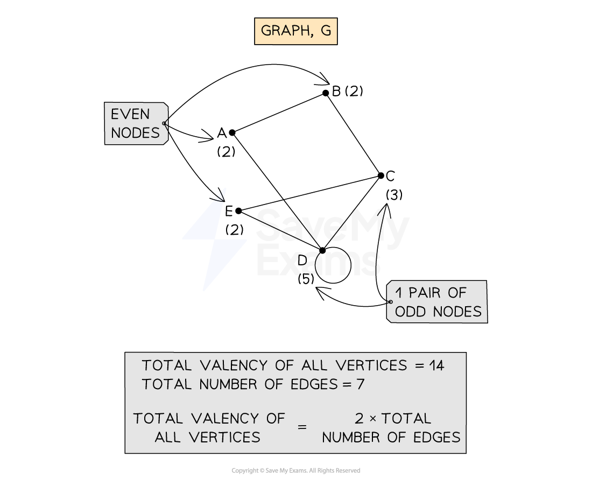

# Eulerian Graphs

## Degree (Valency) of a Vertex

> **Spec point** — `spcpt_g6QKkK28sx7kfVZp`

## Degree (Valency) of a Vertex

### What is meant by the degree (valency) of a vertex?

- The **degree** or **valency** (or order) of a vertex (node) can be defined by **how many edges** are **incident **(connected) to it

  - A **loop** at a vertex increases the valency of a vertex by **2** as both ends of the edge are connected to it
- A vertex can be described as being **odd** or **even**

  - It has **odd degree **if there are an odd number of edge connections
  - It has **even degree** if there are an even number of edge connections

### What is Euler's handshaking lemma?

- **Euler's handshaking lemma** states that for any **undirected **graph:

  - The **sum of the degrees** of the **vertices** is **equal** to **twice the number of edges**
  - The **number** of **odd vertices **must therefore be **even** (or zero)

## Eulerian & Semi-Eulerian Graphs

> **Spec point** — `spcpt_Mzny5k3hmzPrjX2J`

## Eulerian & Semi-Eulerian Graphs

### What are Eulerian cycles and trails?

- An **Eulerian cycle** starts and ends at the **same vertex** and traverses **every edge** in a graph **exactly once**

  - Unlike a true cycle it may visit a **vertex more than once**
  - An Eulerian cycle is also known as an** Eulerian circuit**
- An **Eulerian trail** traverses **every edge exactly once **but starts and ends at **different vertices **

  - Again, vertices may be visited more than once

### What are Eulerian and semi-Eulerian graphs?

- An **Eulerian graph **is a graph that contains an Eulerian cycle

  - **Every vertex** in an Eulerian graph has an **even valency**
- A **semi-Eulerian graph **is a graph that contains an** Eulerian trail**

  - **Exactly one pair** of vertices in the graph will have **odd** valencies
  
    - These odd vertices will be the **start** and **finish** points of any **Eulerian trail**
- Eulerian graphs can be used to solve many **practical problems** where the edges should not be traversed more than once

  - A common problem is the **Chinese Postman problem**

> **Exam Hint**
> - You can quickly tell if a graph is Eulerian or semi-Eulerian
> 
>   - Can you draw the graph without taking your pen off the paper and without going over any edge more than once?
>   - If yes, then you have an Eulerian or semi-Eulerian graph!

> **Worked Example**
> Let *G* be the graph shown below.
> 
> 
> 
> a) Show that *G* is a semi-Eulerian graph.
> 
> **Answer:**
> 
> > *Look at the degree of each vertex.*
> 
> *A: 2*
> 
> *B: 4*
> 
> *C: 3*
> 
> *D: 3*
> 
> * E: 4 *
> 
> **G is a semi-Eulerian graph because it has exactly one pair of odd vertices, C and D**** **
> 
> b) Write down an Eulerian trail for *G*.
> 
> **Answer:**
> 
> > *An Eulerian trail must start and end at C/D*
> 
> > *There are several possible Eulerian trails, one solution is*
> 
> **Final answer:** **DEABECDBC**
