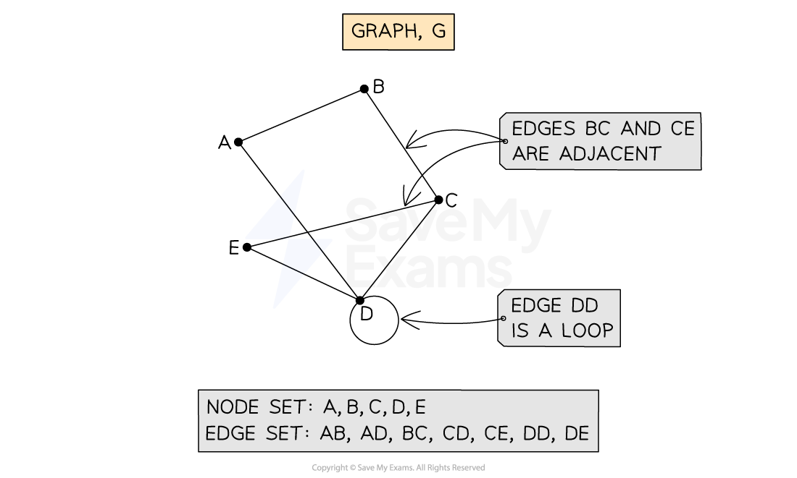
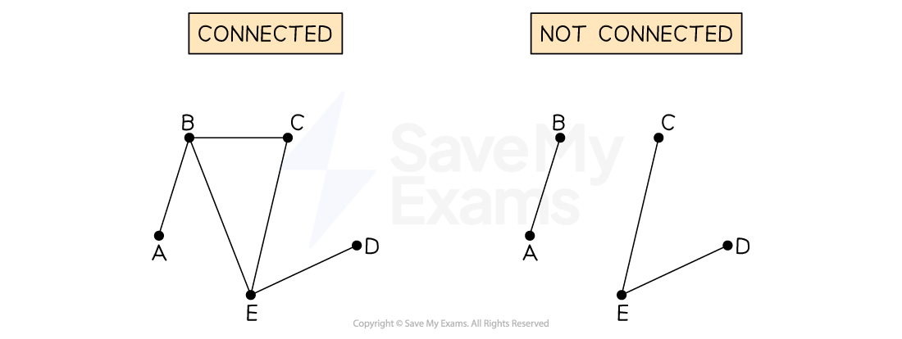
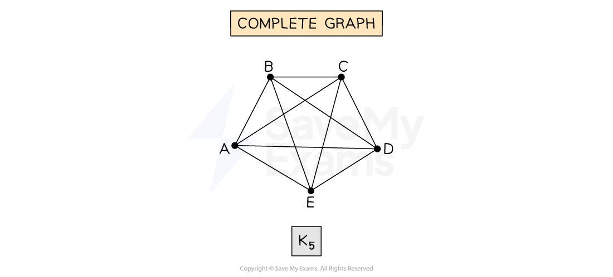
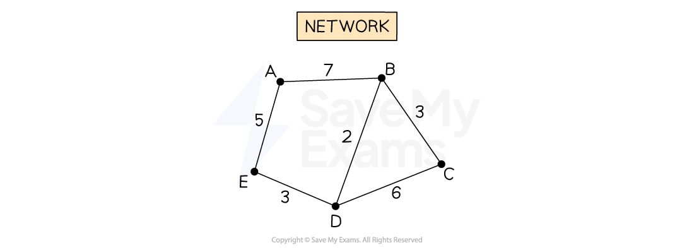
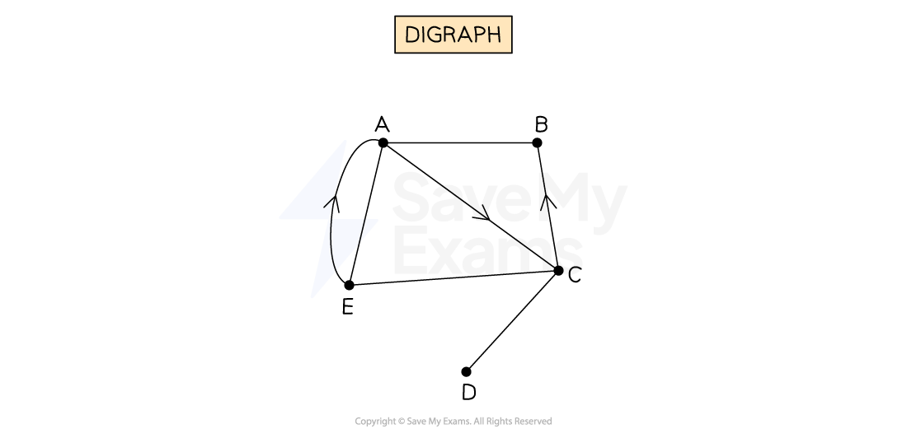
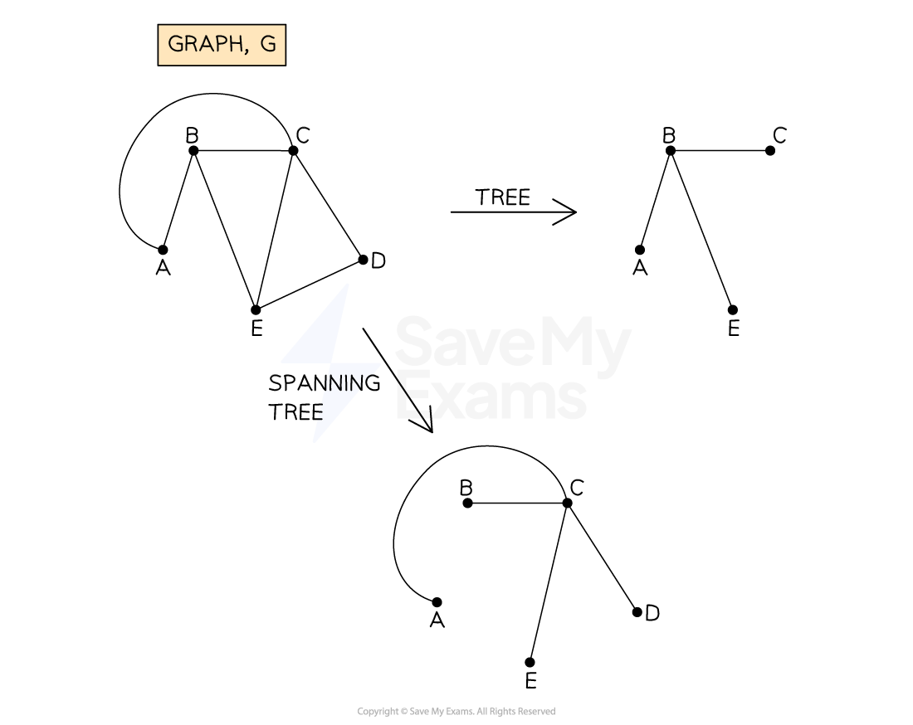
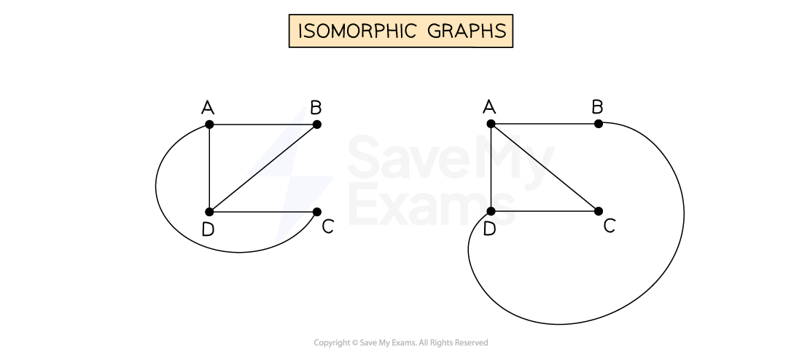

# Graph Theory

## Introduction to Graph Theory

> **Spec point** — `spcpt_hrmHmYZTVfcdzcJc`

## Introduction to Graph Theory

### What is graph theory?

- **Graph theory** is the study of **graphs**, which are mathematical structures used to represent **objects** and the **connections** between them

  - Graphs can be used in modelling many **real-life applications**, e.g. electrical circuits, flight paths, maps etc.

## Edges (Arcs) & Vertices (Nodes)

> **Spec point** — `spcpt_Sh2bfsQFf7sDZ44z`

## Edges (Arcs) & Vertices (Nodes)

### What are the different parts of a graph?

- A **graph** is made up of a number of points (**vertices **or **nodes**) that are connected by lines (**edges** or **arcs**)
- A **vertex** (**node**) can represent an object, a place or a person

  - **Adjacent** **vertices** are connected by an **edge**
  - Vertices are usually labelled with a **letter**, e.g. *A, B, C*...
  
    - The list of vertices in a graph is sometimes called the **vertex set**
- An **edge** (**arc**) forms a connection between **two vertices**

  - Edges are described by the **nodes they connec**t, e.g. *AB, AC, BE...*
  
    - The list of edges in a graph is sometimes called the **edge set**
  - **Adjacent edges** share a common vertex
  - There may be **multiple edges** connecting two vertices
  - An edge that starts and ends at the same vertex is called a **loop**
- Typically a graph will be drawn such that **edges do not overlap**

  - Note that if a graph is drawn with **overlapping edges**, the edges are** not connected **at points where they overlap
  - Edges are only connected at **vertices**

## Properties of Graphs

> **Spec point** — `spcpt_g4WGr939XD6DZyBD`

## Properties of Graphs

### What are the properties of graphs?

- The **edges** of a graph may be assigned a numerical value

  - This value is called the **weight** (of an edge)
  - Weight is often a measure such as distance, time or money

- A **walk** is a **finite series of edges **in a graph that starts at one vertex and moves from vertex to vertex

  - The (total) **weight** of a **walk** is the **sum of the weights** of the **edges** that it consists of
- A **path** is a **walk** where no **vertex** is visited more than once
- A **trail** is a **walk** where no **edge** is visited more than once

  - Every path is also a trail but not every trail is a path
- A **cycle** (or **circuit**) is a path that starts and finishes at the **same vertex**

  - It is also known as a **closed path**
- A** tour **is a **walk **that visits** every vertex **and **returns **to its** start vertex**

## Types of Graph

> **Spec point** — `spcpt_h3Gvrwv3BRwysKYT`

## Types of Graph

### What are the types of graph?

- A **connected graph** is a graph in which all of its vertices are connected to each other

  - Two vertices are connected if there is a** path** between them
  
    - There does not need to be an edge connecting the pair of vertices

- A **complete graph** is a graph in which each vertex is connected by an edge to each of the other vertices

  - A complete graph with *n* vertices is labelled ***K****n*

- If the edges of a graph have a **weight,** the graph is known as a **weighted graph** (or **network**)

  - Networks are **not** usually **drawn to scale**

- If the edges of a graph are assigned a direction, they are known as **directed edges** and the graph is known as a **digraph**

  - Directed edges of a graph can only be **traversed in the direction indicated**

- A **simple graph** is **undirected** and** unweighted** and contains **no loops** or vertices connected by **multiple edges**
- Given a graph *G*, a **subgraph** is a graph which contains only edges and vertices that appear in *G*
- A **tree** is a connected graph that does not contain any cycles
- A **spanning tree** is a subgraph (of a graph *G*) which is also a tree, and which contains all the vertices from *G*

- **Isomorphic graphs** are graphs which show the same information but which are drawn in different ways

  - The number of vertices and the number of edges connected to each vertex are the same

> **Exam Hint**
> - There are a lot of **specific terms** involved in graph theory
> 
>   - You are often asked to describe these terms in an exam, so make sure you learn the definitions
>   - Note that in many cases there are **two terms** that describe the **same thing**!
> - Make sure that any graphs you draw are big and clear so they are easy for the examiner to read

> **Worked Example**
> The graph *G* shown below is a connected, unweighted, directed graph with 5 vertices.
> 
> 
> 
> a) Write down a cycle, starting at vertex A and visiting exactly 2 other vertices.
> 
> **Answer:**
> 
> > *A cycle starts and ends at the same vertex, with no other vertex visited more than once*
> *Two other vertices (from the 4 possibilities) need to be included*
> *The directed edges mean, in this case, there is only one such cycle*
> 
> **Final answer:** ** ADCA**
> 
> b) Write down a path, consisting of more than one edge, that starts at vertex A and ends at vertex B.
> 
> **Answer:**
> 
> > *A path is a walk that does not repeat any nodes*
> 
> *You must only traverse edges in the directions indicated*** **
> 
> **Final answer:** **ADCEB**
> 
> > *A path does not have to visit every node (so ACEB or ABEB, for example, are also acceptable)*
