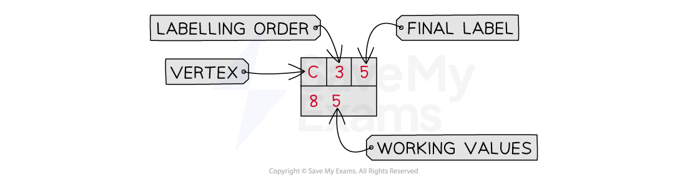

# Dijkstra's Algorithm

## Dijkstra's Algorithm

> **Spec point** — `spcpt_GzzWTsWwZ252dRpv`

## Dijkstra's Algorithm

### What is Dijkstra's algorithm?

- **Dijkstra's algorithm** is used to find the **shortest distance** between **two vertices** in a network

  - If the algorithm is applied to a whole network it will find the shortest distance between a (fixed) **start vertex** and **every other vertex**
  - If the **destination (end)** vertex is reached before the entire network has been considered, the algorithm can stop
  
    - This would be useful in a larger network as it would **reduce the time **for the algorithm to be completed
- It can be used in practical applications to **reduce time, cost or distance** between two points
- Fun fact ...

  - ... a version of Dijkstra's algorithm was used in the Pacman video game to control the movement of the ghosts that chased Pacman!

### What notation is used in Dijkstra's algorithm?

- Each vertex will be given a **labelling box**

- The value in the** 'Vertex'** box is simply the **label of the vertex**
- The value in the **'Labelling order' **box is the vertex's place in the order of being assigned a value in its **'Final label' **box
- The value in the **'Final label**' box is the **shortest distance** of the vertex from the start vertex

  - 'Final label' is sometimes referred to as 'permanent label'
- The most recently written value in the** 'Working values'** box is the **current distance** of the vertex from the start vertex

  - The final value in this box will be the same as the value in the 'Final label' box

### What are the steps of Dijkstra's algorithm?

- **STEP 1**
Draw a **labelling box** for each vertex in the network (if not already given) and complete the **'Vertex'** box for each vertex
- **STEP 2** 
Complete the labelling box for the **start vertex**:

  - Put **'1'** in the **'Order of labelling' **box
  - Put **'0'** in the** 'Final label' **box
- **STEP 3**
Inspect **all vertices** that are **connected by an edge** to the vertex that has **most recently** had its **'Final label'** box completed

  - This only applies to vertices that do **not** already have a completed 'Final label' box

Put a **working value** in the relevant box for each of these vertices

- The working value should be the** sum** of the value in the **'Final label' box of the vertex whose final label was most recently completed **and the **length of the edge connecting the vertices**
- If there is already a working value, only replace it if the **new working value is smaller**
- **STEP 4**
Look at **all** vertices with a value in the **'Working value' **box (ignoring vertices which have their 'Final label' box completed)
Identify the vertex with the **smallest working value** and complete its labelling box:

  - Put the **next sequential number** in the** 'Order of labelling' **box
  - Put the** current working value** into its **'Final label' **box
- **STEP 5**
Repeat steps 3 and 4 until the **end vertex **has its **'Final label'** box completed

  - Or until every vertex has a final label
- **STEP 6**
Move **backwards **from the** destination** (end) **vertex** towards the start vertex to identify the **shortest path**
**Two vertices** lie on the shortest path if the **difference** between the values in their **'Final label' **boxes is **equal** to the weight of the **edge** that connects them

> **Exam Hint**
> - Avoid crossing out working values that are replaced with smaller working values
> 
>   - Examiners like to be able to see all of the values in your diagram clearly!

> **Worked Example**
> A network is shown in the diagram below.
> 
> 
> 
> Using Dijkstra's algorithm, find the shortest path between vertex A and vertex D and state its length.
> 
> ** Answer:**
> 
> - *STEP 1*
> *Draw in the labelling boxes for all vertices*
> * *
> - *STEP 2*
> *Complete the labelling box for the start vertex, vertex A*
> 
> 
> 
> - *STEP 3*
> *Vertices B, C, F and G are all connected to vertex A by an edge*
> *Put the weights of the edges into the working values box at each of these vertices*
> * *
> - *STEP 4*
> *Inspect **all** vertices with a working value for the one with the lowest working value*
> *Vertex F has the lowest working value, 5, so label vertex F with '2' in the 'Order of labelling' box and '5' in the 'Final label' box*
> 
> 
> 
> - *STEP 5*
> *Repeat Steps 3 and 4 until the end vertex has its 'Final label' box completed*
> 
> - *STEP 3*
> *For all vertices connected directly to F, find the 'Working value' from F*
> *The working value of vertex G from vertex F is lower than when it comes directly from vertex A*
> *Write this new working value into the box for G*
> * *
> - *STEP 4*
> *Identify the smallest working value from all vertices with working values but no 'Final label'*
> *The smallest of these values is at vertex G*
> *Label vertex G with '3' and transfer its working value into the 'Final value' box*
> 
> 
> 
> - *STEP 3*
> *Find the 'Working value' for all vertices directly connected to vertex G*
> *There is no need to replace the working value at vertex C, as the distance travelled directly from G will be bigger*
> * *
> - *STEP 4*
> *Identify the smallest working value from vertices B, C and E, (vertex E)*
> *Label that vertex '4' and transfer its working value into the 'Final value' box*
> 
> 
> 
> - *STEP 3*
> *For all of the vertices that are connected to vertex E find the 'Working value'*
> * *
> - *STEP 4*
> *Identify the smallest working value from vertices B, C and D, (vertex B)*
> *Label that vertex '5' and transfer its working value into the 'Final value' box*
> 
> 
> 
> - *STEP 3*
> *For all of the vertices that are connected to vertex B find the 'Working value'*
> *For vertex C you would not put in a new working value as it would be bigger than the current value*
> * *
> - *STEP 4*
> *Identify the smallest working value from vertices C and D, (vertex C)*
> *Label that vertex '6' and transfer its working value into the 'Final value' box*
> 
> 
> 
> - *STEP 3*
> *Vertex D is the only unlabelled vertex, so find its 'Working value'*
> *Although vertex D is directly connected to vertex C, a new working value is not needed at D (it would be bigger than the value already there)*
> * *
> - *STEP 4*
> *Label vertex D as vertex '7' and transfer its working value into the 'Final value' box*
> 
> 
> 
> > *You do not need to show all of the stages of working as separate diagrams*
> *It is enough to show the final diagram with all vertices fully labelled*
> * *
> 
> - *STEP 6*
> *You can find the shortest length by working backwards from vertex D*
> 
> *15 - 7 = 8 (D*$\rightarrow$*E)*
> *8 - 1 = 7 (E*$\rightarrow$*G)*
> *7 - 2 = 5 (G*$\rightarrow$*F)*
> *5 - 5 = 0 (F*$\rightarrow$*A)*
> 
> **Final answer:** **Shortest route: AFGED**
