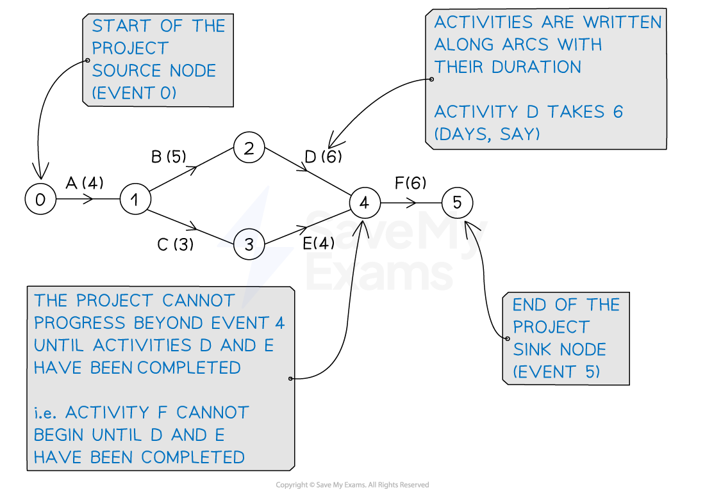
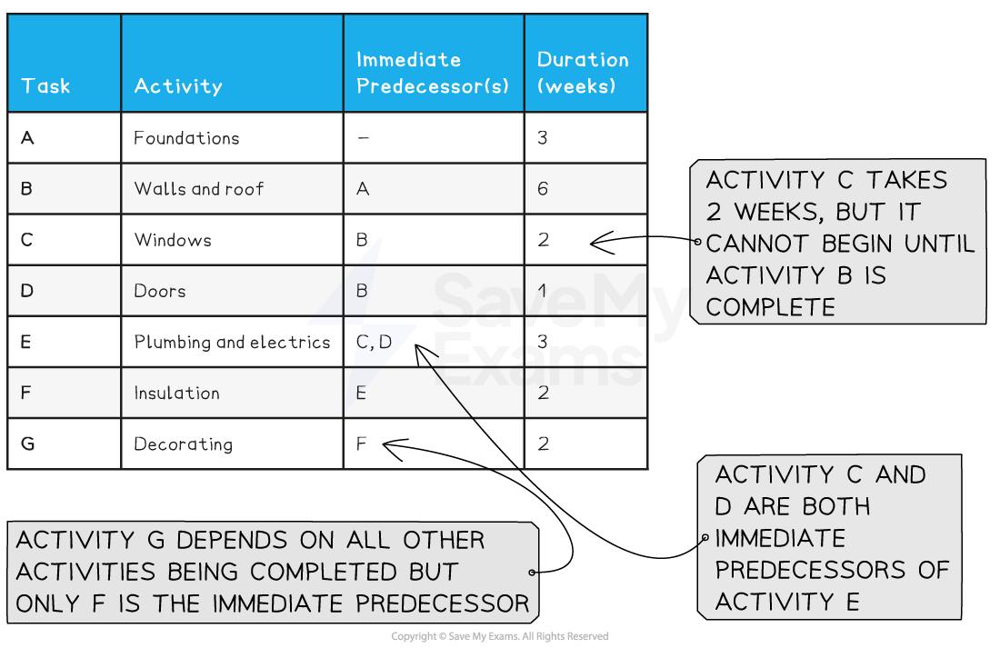

# Activity Networks & Precedence Tables

## Activity Networks & Precedence Tables

> **Spec point** — `spcpt_7bBdB5ZtfBRKrDtX`

## Activity Networks & Precedence Tables

### What is an activity network?

- An **activity network** is a graph that shows the **activities** needed to complete a **project**

  - It also specifies the order in which they should be undertaken
  - E.g.  the project could be 'building a house' with activities such as 'foundations', 'walls' and 'roof'
- Some activities will depend on others being completed first

  - E.g. the activity 'foundations' would need to be completed before the 'walls' are built
- Some activities can occur at the same time

  - E.g. 'windows' and 'doors' can be fitted at the same time
- The **arcs** (edges) of the graph represent the **activities**

  - This may be referred to as an **activity-on-arc** network
- The **nodes** (vertices) of the graph represent **events **within the project

  - **Events** can be thought of as **'stepping stones'**
  - The project cannot progress beyond an event until all the activities leading to that event are completed

### What does an activity network look like?

- **Events **(nodes) are labelled with numbers, generally increasing in the direction of the project

  - The event at the **start** of the project is called the **source node**
  
    - It is labelled with **0 **or **S**
  - The event at the **end** of the project is called the **sink node**
  
    - It will be the **highest numbered** node or labelled with **T**
- **Arcs** are labelled with their **activities,** with the **duration** given in brackets

  - Activities are denoted by capital letters - ***A***, ***B***, ***C***, ***D***, etc.
  - **Arrows** are drawn on the **arcs** to show the order in which the project progresses
  
    - Strictly speaking, an **activity network** is a **directed graph**
    - In broad terms, a project generally progresses from left to right across the activity network

### What is a precedence table?

- A **precedence table** shows a list of the **activities** for a project

  - For each activity, the table includes a list of the **activities** that must already have been completed
  
    - Only the **immediately** **preceding activities** are listed
  - Activities that do **not** have any precedents are indicated by '-'
  
    - These activities can begin at the start of the project
    - They will be attached to the **source node**

### What does a precedence table look like?

- As well as a list of activities a **precedence table** may also show

  - The **duration** of each activity

## Drawing an Activity Network

> **Spec point** — `spcpt_BRTBn4PHdYjxcYdy`

## Drawing an Activity Network

### How do I draw an activity network?

- An activity network can be drawn from a **precedence table**
- Starting with the **source node**

  - Add an **arc** for each activity one at a time
  
    - Consider its **immediately preceding activities**
  - An **event** (node) will be needed prior to each activity commencing
  
    - More than one activity can commence from the same event
    - More than one activity can finish at the same event
- A crucial feature of an activity network is that each activity has a **unique pair** of start and end nodes
- Any activities that do **not** precede another will go to the **sink node** at the **end** of the **project**
- In general, **activity networks**

  - Use straight, arrowed lines for **arcs**
  - Numbered circles for **events/nodes**

> **Exam Hint**
> - A rough, curly-edged activity network often helps to start off with
> 
>   - This will give you a mental picture of what the network looks like
>   - You can easily make changes, scribble bits out, etc. with a rough diagram
>   - When you are happy with it, you can redraw it neatly with straight edges

> **Worked Example**
> Draw an activity network for the precedence table given below.
> 
> | **Activity** | **Preceding activities** | **Duration** |
> |---|---|---|
> | A | - | 4 |
> | B | A | 5 |
> | C | A | 3 |
> | D | B | 6 |
> | E | C | 4 |
> | F | D, E | 6 |
> 
> **Answer:**
> 
> > *Starting with the source node, node 0, it is only activity A that can begin as it has no preceding activities*
> *We will have one arc starting at the source node*
> *Label the arc with an arrow, the activity name (A) and its duration (4)*
> 
> 
> 
> > *Activities B and C both depend on A*
> *Add event (node) 1 with arcs for B and C attached*
> *Leave plenty of room (between B and C) in case anything later needs to go in between them*
> 
> 
> 
> > *Activity D follows from B only, and activity E follows C only*
> *Looking ahead though, activity F has D and E as immediate predecessors, so D and E need to meet at an event*
> *Use event 2 to start activity D, event 3 to start activity E, and event 4 where they meet, ready for activity F*
> 
> 
> 
> > *Activity F is the last activity of the project so goes to the sink node, event 5*
> 
> 
> 
> > *Check that all activities have a unique start and end node*
> *For example, activity B starts at event (node) 1 and ends at event (node) 2 (this may be written as an ordered pair, (1, 2))*
> *No other activity starts at 1 AND ends at 2 (C is (1, 3))*
> *Checking everything else, the final answer is*
> 
> 

## Completing a Precedence Table

> **Spec point** — `spcpt_zVhvgrfbmXNfnpXT`

## Completing a Precedence Table

### How do I complete a precedence table?

- A **precedence table** can be constructed from an **activity network**
- A basic table listing the activities and their duration can be constructed from the labels on the activity network
- To complete the **preceding activities** column in the table

  - Start at the **source node**
  
    - Any activities **starting** at the **source** node do **not** have preceding activities so use '-' in the table
  - For all other activities look at the event (node) the activity **starts** at
  
    - Any activities **ending** at this event (node) are the **immediately preceding activities**

> **Worked Example**
> Construct a precedence table for the activity network shown below.
> 
> 
> 
> **Answer:**
> 
> > *The activities are A, B, C, D, E and F, with their durations given in brackets*
> *Two columns of the precedence table can be completed immediately*
> 
> | ***Activity*** | ***Preceding activities*** | ***Duration*** |
> |---|---|---|
> | *A* |   | *4* |
> | *B* |   | *5* |
> | *C* |   | *3* |
> | *D* |   | *6* |
> | *E* |   | *4* |
> | *F* |   | *6* |
> 
> > *Starting at the source node 0, only activity A has no preceding activities, so this can be completed with a '-'*
> *Work through each other activity considering the activities that go to its start event/node*
> 
> - *Activity B starts at event/node 1*
> 
>   - *activity A ends at event/node 1*
>   - *B has immediate predecessor A*
> - *C starts at 1*
> 
>   - *A ends at 1** *
>   - *C has immediate predecessor A*
> - *D starts at 2*
> 
>   - *B ends at 2*
>   - *D has immediate predecessor B*
> - *E starts at 3*
> 
>   - *C ends at 3*
>   - *E has immediate predecessor C*
> - *F starts at 4*
> 
>   - *D and E end at 4*
>   - *F has immediate predecessors D and E *
> 
> > *F is the last activity (it ends at the sink node, event 5) so the precedence table can be completed*
> 
> | **Final answer:** **Activity** | **Final answer:** **Preceding activities** | **Final answer:** **Duration** |
> |---|---|---|
> | **Final answer:** **A** | **Final answer:** **-** | **Final answer:** **4** |
> | **Final answer:** **B** | **Final answer:** **A** | **Final answer:** **5** |
> | **Final answer:** **C** | **Final answer:** **A** | **Final answer:** **3** |
> | **Final answer:** **D** | **Final answer:** **B** | **Final answer:** **6** |
> | **Final answer:** **E** | **Final answer:** **C** | **Final answer:** **4** |
> | **Final answer:** **F** | **Final answer:** **D, E** | **Final answer:** **6** |
