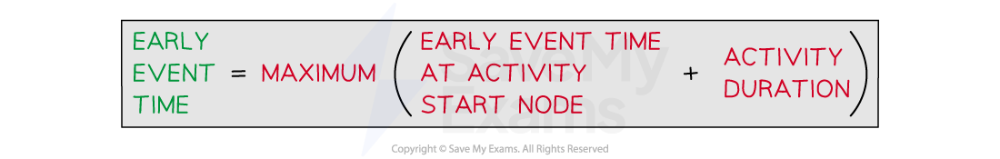
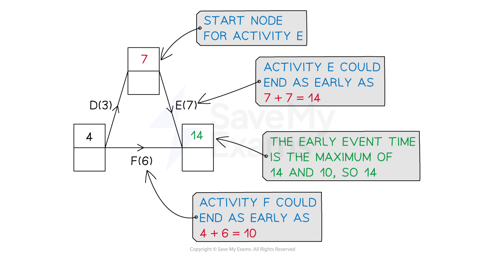
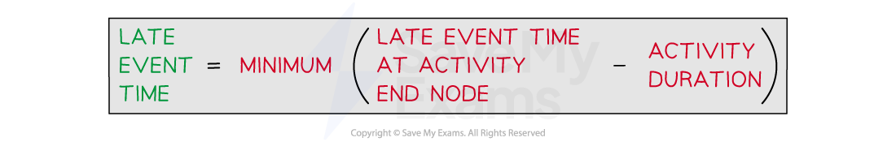
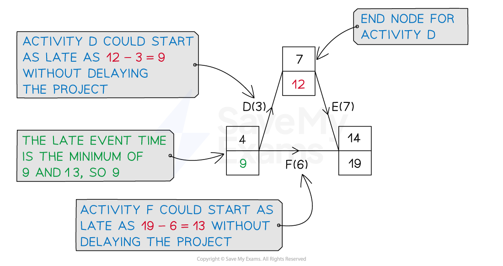
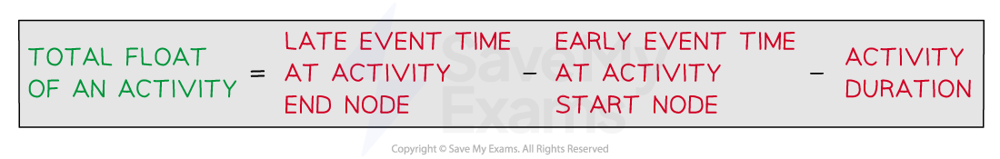

# Critical Paths

## Introduction to Critical Path Analysis

> **Spec point** — `spcpt_HKKqTh4c83HbRhck`

## Introduction to Critical Path Analysis

### What is critical path analysis?

- **Critical path analysis** (CPA) is the use of an **activity network** for a **project** that determines

  - The **minimum duration** of the entire project
  - The **critical activities**
  
    - These are the activities that **must** start and finish at the **earliest** possible time so that the project can be completed in its **minimum duration**
  - The **critical path**
  
    - The path from the **source** node to the **sink** node that encompasses all the **critical activities**
    - In harder problems there may be more than one critical path
  - Any possible delay to starting non-critical activities
  
    - The **total float** of an activity is the time it can be delayed by as to not affect the minimum project duration

## Earliest Event Times

> **Spec point** — `spcpt_dhRm2dQ87WyZp6J8`

## Earliest Event Times

### What are earliest (or early) event times?

- The **earliest event time** is the **earliest** time at which an activity can commence from its **starting event**

  - This will determine the **minimum project duration**
- On an **activity network,** each **event (node)** will have **two boxes** that require completing

  - Sometimes the boxes will **replace** the circled event (node) number
  - Sometimes the boxes will be drawn **next** to the circled event (node) number
  - The top box will be the **earliest event time**
  - The bottom box is for the latest event time (see the next section of this revision note)
  
    - The **earliest event times** must be completed **before** the latest event times

### How do I work out early event times?

- Starting at the **source node,** this will be 0

  - This is the starting point of the project, i.e. time zero
- **Working forwards** from the **source node**, look at each of the **activities** (arcs) leading **to** an **event **(node)

  - For **each preceding activity **of an event (node)
  
    - Add the **early event time** from that activity's** start node** to its **duration**
  - The **earliest event time** is then the **maximum** of these times
  
    - This is the **earliest time** an **event** can be moved on from

- Completing the **earliest event times** is sometimes referred to as a **forwards pass** (through the activity network)

> **Exam Hint**
> - An **'early** event time' is the **'latest** time' leading to a node !
> - Ensure you check all arcs leading to a node
> 
>   - Be particularly careful with dummies (they still count) as these are unlabelled with a duration of 0

> **Worked Example**
> Complete the early event times for the activity network given below.
> 
> 
> 
> **Answer:**
> 
> > *Early event times go in the top box at each node*
> 
> > *Three of the earliest times are completed, so we just need to work along the top of the diagram*
> 
> > *Start at the source node with early event time 0*
> *Only activity A leads to the event (node) at the end of activity A*
> 
> $0+5=5$
> 
> > *Similarly for activity C*
> *(The earliest event time at the start of C is 5)*
> 
> $5+7=12$
> 
> > *A dummy activity has a duration of 0, so the early event time at the end of the after C will also be 12*
> 
> > *Activities G and H lead to the same event*
> 
> `table row cell 12 plus 6 end cell equals 18 row cell 12 plus 4 end cell equals 16 end table`
> 
> `Maximum space open parentheses 18 comma space 16 close parentheses space equals space 18`
> 
> > *Finally both activities I and J lead to the sink node*
> 
> `table row cell 18 plus 5 end cell equals 23 row cell 14 plus 4 end cell equals 18 end table`
> 
> `Maximum space open parentheses 23 comma space 18 close parentheses equals 23`
> 
> > *Complete the early event times on the network*
> 
> 

## Latest Event Times

> **Spec point** — `spcpt_Xhz9tPKq3b3J9HWM`

## Latest Event Times

### What are latest (or late) event times?

- The **latest event time** is the **latest time** at which an activity can commence from its **starting event**

  - without affecting the **minimum project duration**
- On an **activity network,** each **event/node** will have **two boxes** that require completing

  - Sometimes the boxes will **replace** the circled event/node number
  - Sometimes the boxes will be drawn near to the circled event/node number
  - The bottom box will be the **latest event time**

- The top box is for the earliest event time (see the previous section of this revision note)

  - The earliest event times must have been completed **before** the latest event times

### How do I work out late event times?

- Starting at the **sink node,** this will be the same as the early event time

  - This is the **minimum duration** of the **project**
  
    - I.e. The shortest time in which **all activities** can be completed
- **Working backwards** from the **sink node,** look at each of the **activities** (arcs) leading* ***back** to an event (node)

  - For **each activity after **an event (node)
  
    - **Subtract **that activity's** duration** from the latest event time at its **end node**
  - The **latest event time** is then the **minimum** of these times
  
    - This is the **latest time** an **event** can be moved on from such that **all activities** can be completed in the **minimum duration** of the project

- Completing the **latest event times** is sometimes referred to as a **backwards pass** (through the activity network)

> **Worked Example**
> Complete the late event times for the activity network given below.
> 
> 
> 
> **Answer:**
> 
> > *Late event times go in the bottom box at each node*
> 
> > *Three of the latest times are completed, so we just need to work along the top of the diagram*
> 
> > *Start at the sink node*
> *Its latest time will be the same as its earliest time, 23*
> 
> > *Only activity I leads back to the event/node at the start of activity I*
> 
> $23-5=18$
> 
> > *Similarly for activity H*
> *(The latest event time at the end of H is 18)*
> 
> $18-4=14$
> 
> > *Activities G and a dummy lead back to an event*
> 
> `table row cell 18 minus 6 end cell equals 12 row cell 14 minus 0 end cell equals 14 end table`
> 
> `Minimum space open parentheses 12 comma space 14 close parentheses space equals space 12`
> 
> > *Activities C and a dummy lead back to an event*
> 
> `table attributes columnalign right center left columnspacing 0px end attributes row cell 12 minus 7 end cell equals 5 row cell 12 minus 0 end cell equals 12 end table`
> 
> `Minimum space open parentheses 5 comma space 12 close parentheses equals 5`
> 
> > *Finally the source node*
> 
> `table attributes columnalign right center left columnspacing 0px end attributes row cell 5 minus 5 end cell equals 0 row cell 9 minus 4 end cell equals 5 end table`
> 
> `Minimum space open parentheses 0 comma space 5 close parentheses equals 0`
> 
> > *Complete the late event times on the network*
> 
> 

## Total Float of an Activity

> **Spec point** — `spcpt_fN2rrfqvt7NDGwsB`

## Total Float of an Activity

### What is the total float of an activity?

- The **total float** of an activity is the time the start of an activity can be delayed

  - without **affecting** the **minimum project duration**
- ***Critical activities*** will have zero float

### How do I work out the total float of an activity?

- For **non-critical** activ**i**ties the total float can be calculated

  - Consider the earliest time it can commence and the latest time it can finish
- In words

- Formally, you may see this written as

  - The total float, `F open parentheses i comma space j close parentheses`, of activity `open parentheses i comma space j close parentheses`, is defined to be `F open parentheses i comma space j close parentheses equals l subscript j minus e subscript i minus duration open parentheses i comma space j close parentheses`
  
    - where $e_{i}$ is the earliest time for event $i$ and $l_{j}$ is the latest time for event $j$

- Do not be put off by the word **'total'**

  - The **total float** of an activity is one value for one activity!

> **Exam Hint**
> - In many cases, the total float can just be 'seen' or thought about by considering the activity network
> 
>   - Where things are complicated or busy, it is best to think about the formal way of calculating them

> **Worked Example**
> The activity network below shows the duration of activities A-J and the early and late times at each event.
> 
> 
> 
> Find the total float for activities B, D, E, F and J.
> 
> **Answer:**
> 
> > *For activity B, the late event time at its end node is 9, the early event time at its start node is 0, its duration is 4*
> 
> *Total float of B = 9 - 0 - 4 = 5*
> 
> > *Activity D has late event time 12 at its end node, early event time 4 at its start node and duration 3*
> 
> *Total float of D = 12 - 4 - 3 = 5*
> 
> > *Similarly for activities E, F and J*
> 
> *Total float of E = 19 - 7 - 7 = 5*
> 
> *Total float of F = 19 - 4 - 6 = 9*
> 
> *Total float of J = 23 - 14 - 4 = 5*
> 
> **Final answer:** **The total floats are B:5, D:5, E:5, F:9, J:5**

## Critical Path & Critical Activities

> **Spec point** — `spcpt_kdsfyGCHBSPwhMQK`

## Critical Path & Critical Activities

### What are the critical activities?

- **Critical activities**

  - have a **total float** of zero
  - must commence at their **earliest event time** in order for the **minimum project duration** to be achieved
- A **critical event** is an event where the **earliest start time is equal to the latest finish time**
- To find the **critical activities** look for the **critical events**

  - If an **activity is critical** then the start and finish events **must** be critical
  - However the converse is **not true**
  
    - It is possible for a **non-critical activity** to be between **two critical events **
- Critical activities should be stated as a list

  - E.g.  the critical activities are A, C, D and G

### What is a critical path?

- A **critical path** through an activity network runs from the **source node** to the **sink node**

  - The activities along the path have a **total float** of zero
  - Each activity in a critical path will be **critical**
- The critical path would be given in terms of the activities/arcs along the path

  - E.g. a critical path encompassing activities A, C, E, F and G would be written A - C - E - F - G
- It is possible that there is **more than one** critical path through an activity network

  - E.g. A-C-D-G and A-C-E-F-G could both be critical paths
  
    - In this case the critical activities would be A, C, D, E, F, G

### How do I find the minimum project duration?

- The **minimum project duration** is the **quickest** time in which **all** activities in a project can be **completed**
- It is found by completing the **early event times** for each node in an activity network

  - The early event time for the sink node is the **minimum project duration**

> **Exam Hint**
> - Be clear about the difference between **critical path** and **critical activities**
> 
>   - Practically, these are found at the same time when analysing an activity network
>   - Make sure you write both as would be expected
>   
>     - The critical path is a **sequence** of activities (sometimes written with '-' in between each)
>     e.g.  A - B - D - F - G
>     - Critical activities would be a **list,** with a comma between each activity
>     E.g.  A, B, D, F, G
> - Some problems may state that all activities have the same duration (without specify how long)
> 
>   - The critical path and critical activities can then be found by looking for the path from source node to sink node that has the fewest edges
>   - Alternatively, pick any number (>0) for the duration of every activity and proceed as usual
>   
>     - 1 is the most obvious choice of duration
>     - This method would take far longer

> **Worked Example**
> The activity network below shows the duration (in days) of the activities needed to complete a project and the early and late times for each event.
> 
> 
> 
> Find the critical path, the critical activities and state the minimum project duration.
> 
> **Answer:**
> 
> > *Start by looking at the nodes where the early and late event times are equal*
> 
> *Possible critical activities are A, C, G, I*
> 
> > *Determine whether these activities have a total float of zero*
> 
> *Total float of A = 5 - 0 - 5 = 0*
> *Total float of C = 12 - 5 - 7 = 0*
> *Total float of G = 18 - 12 - 6 = 0*
> *Total float of I = 23 - 18 - 5 = 0*
> 
> **Final answer:** **Critical path is A-C-G-I**
> 
> > *The critical activities are those that have a float of zero and lie along the critical path*
> 
> **Final answer:** **Critical activities are A, C, G and I**
> 
> > *The minimum project duration is the early (and late) event time at the sink node*
> 
> **Final answer:** **Minimum project duration is 23 days**
