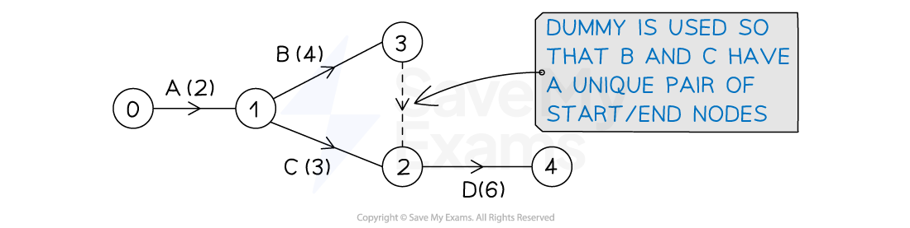
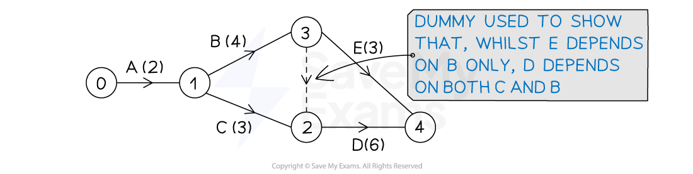

# Dummy Activities

## Dummies

> **Spec point** — `spcpt_JcFRspDf7gjktJNn`

## Dummies

### What is a dummy activity?

- A **dummy activity** is an activity that has a **weight** of **zero**

  - **Dummies** are **not** assigned names (letters)
  - **Dummies** are represented by **dotted lines**
- Dummies are only used to show **precedences** in more complicated activity networks

### When and where are dummies used in an activity network?

- **Two** situations can lead to the need for a **dummy activity**
- The **first** situation is to ensure each activity (arc) has a **unique pair** of **start** and **end nodes**

  - E.g.  In the activity network below, activity D has **immediate predecessors** B and C
  
    - B and C cannot **both** start at event (node) 1 and end at event (node) 2 (this would not be a unique pair)
    - a dummy activity is used so that B has start/end pair (1, 3) and C has start/end pair (1, 2)

- Note that the dummy could also go from event 2 to event 3 with activity D commencing from event 3
- The **second** situation that requires a dummy is when there is a split of **immediate predecessors**

  - E.g.  In the activity network below, activity D has immediate predecessors B and C
  
    - Activity E only has B as an immediate predecessor
    - A dummy activity is used to show that D depends on both B and C

> **Exam Hint**
> - Exam questions will not always require you to draw the whole activity network
> 
>   - A diagram of part of the network may be given
> - Exam questions are often specific about the number of dummies you should use
> 
>   - If you think you need more, go back to see if you can make improvements
>   - It is generally expected that an activity network is as concise/efficient as possible with the minimum use of dummies

> **Worked Example**
> The activities involved in a project are listed in the precedence table below.
> 
> | **Activity** | **Immediately preceding activities** | **Duration (days)** |
> |---|---|---|
> | A | - | 5 |
> | B | - | 4 |
> | C | A | 7 |
> | D | B | 3 |
> | E | A, D | 7 |
> | F | B | 6 |
> | G | C | 6 |
> | H | C | 4 |
> | I | G, H | 5 |
> | J | E, F | 4 |
> 
> The project is also represented on the partially completed activity network below.
> 
> 
> 
> Using exactly two dummy activities, complete the activity network by adding activities D, E, G, H, I and J.
> 
> **Answer:**
> 
> > *Activity D is dependent on activity B so draw an arc from event/node 2 for D*
> 
> > *Looking ahead, activity E is dependent on both A **and** D, whereas activity C is dependent on just A*
> *This is the second situation ('split predecessors') for the use of a dummy activity*
> 
> > *Also from looking ahead activity J depends on both E and F - so the arcs for E and F will need to meet*
> 
> 
> 
> > *Activities G and H are both dependent on C, and activity I is dependent on both G and H*
> *This could lead to G and H having the same start/end node pair*
> *This is the first situation ('unique start/end node pair') for the use of a dummy activity*
> 
> > *No activities depend on I so its arc can be drawn to the end of the project (sink node)*
> 
> 
> 
> > *The activity network can now be completed with activity J and the sink node*
> 
> 
