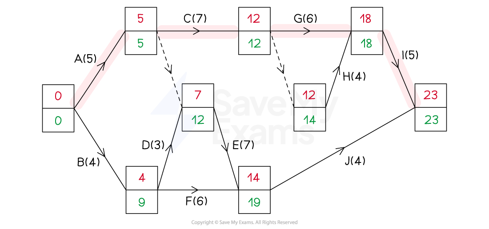
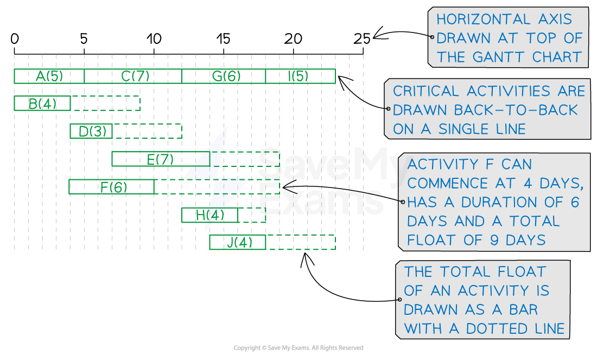

# Gantt (Cascade) Charts

## Gantt Charts

> **Spec point** — `spcpt_d6KFycyQksKQ2HGD`

## Gantt Charts

### What is a Gantt (cascade) chart?

- A **Gantt chart** is a graphical display of the **activities** making up a **project**

  - A Gantt chart shows
  
    - the **critical activities**
    - the **total float** for **non-critical** activities
    - the **minimum project duration**
- Gantt charts can be used in **scheduling** problems

  - A Gantt chart assumes **one worker per activity**
- A Gantt chart is also known as a** cascade chart**

### How do I draw a Gantt (cascade) chart?

- A **horizontal axis** is drawn for time
- **Activities** are then drawn as a series of **bars** (rectangles) underneath

  - Each **activity** is assumed to **commence** at its **earliest event time**
  
    - The earliest start time is the early event time of its start node
  - Each activity is assumed to occur in a **single block of time**
  
    - There are no breaks in an activity
    - E.g. an activity of duration 5 and early event time 4 would be drawn as a bar starting at 4 and ending at 9
- ***Critical activities*** are all drawn in the same horizontal line

  - These have a **total float** of **zero **so are drawn **back-to-back**
- Each** non-critical activities** is drawn on a separate line

  - Their **total float** is indicated by a bar drawn with a dotted line
  
    - The dotted float bar can be seen as the room that the activity bar can slide back and forth along
  - The **start **and **end times** of a non-critical activity are **flexible**
  - E.g. An activity of duration 4, early event time 7 and total float 3 would be drawn as
  
    - a (solid) bar starting at 4 and ending at 11 with a dotted bar starting at 11 and ending at 14
- Bars are labelled with their activity name and duration

  - Floats are not labelled
- For the activity network below

  - The **critical activities** are highlighted and are A, C, G and I
  
    - The critical path is A-C-G-I
  - The **minimum project duration** is 23 (days)

- The **Gantt chart** for the project would be constructed with the following

  - A** horizontal axis** running from 0 to (at least) 23
  
    - 0 to 25 keeps things nice!
  - **Critical activities** A, C, G and I drawn back-to-back on a single line underneath
  - Activities B, D, E, F, H and J each drawn on a **separate** line
  
    - E.g. Activity D will be drawn as a solid bar from 4 to 7 with a dotted bar from 7 to 12

> **Exam Hint**
> - An exam question is likely to provide a grid and the axes for you to draw a Gantt chart on
