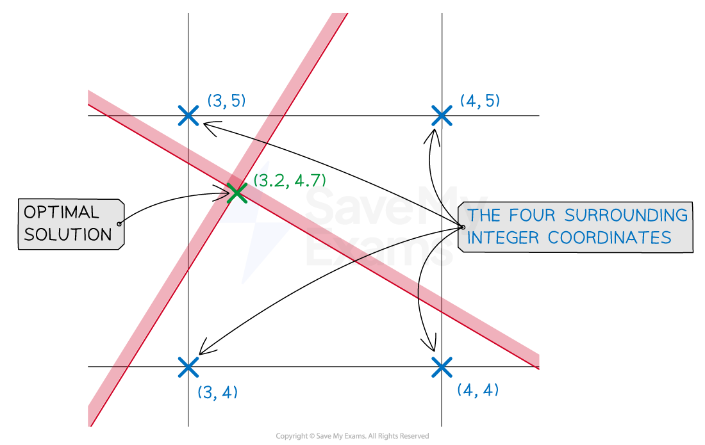

# Finding the Optimal Integer Solution

## Integer Solutions

> **Spec point** — `spcpt_jCNdmDdvzTfzSCF8`

## Integer Solutions

### What is meant by integer solutions?

- The **optimal solution** to a linear programming problem lies on a vertex of the feasible region

  - The values of the **decision variables** at this vertex may **not** take **integer** values
- Sometimes the **context **of the problem may demand that the decision variables take integer values

  - Decision variables are often a 'number of things'
  
    - Is it possible for the furniture manufacturer to make 3.65 chairs per day?
    - For public health reasons, it would not be appropriate for a food factory to leave a tin of beans partially produced overnight!
- This is what is meant by the phrase **integer solutions**

### How do I find the integer solutions to a linear programming problem?

- Find the **optimal solution** of the linear programming problem as usual

  - Use the objective line or vertex method
- Consider the four points with** integer coordinates** that **surround the optimal solution**

  - E.g.
  - For an optimal solution of $x=3.2,y=4.7$, the four surrounding points would be
  (3, 4), (3, 5), (4, 5) and (4, 4)

- Check whether each of these four points satisfies all of the **constraints**

  - It may be obvious that one (or more) do not but they should still be mentioned
- For those coordinates that **do **satisfy all the constraints

  - Evaluate the objective function ($P$) at each of the coordinates
  - The integer solution will be the point that maximises or minimises the objective function as required
- The **integer solution** may not be the **optimal solution**

  - Depending on the exact nature (gradient) of the objective line
  
    - The objective line 'moves away' from the boundary of the feasible region when an integer solution is found
    - So there could be another integer solution inside (or on the boundary of) the feasible region some way from the optimal solution
    - This other integer solution may be closer to the boundary of the feasible region than the one just found
  - You will not be expected to find this other integer solution
  
    - Just recognise that the integer solution found using the above process is not necessarily optimal

> **Exam Hint**
> - Questions won't necessarily indicate if integer solutions are required
> 
>   - Use common sense and think carefully about the context of the problem

> **Worked Example**
> The linear programming problem formulated as
> 
> Maximise
> 
> $P=5x+10y$
> 
> subject to
> 
> `table row cell 13 x plus 22 y end cell less or equal than 145 row cell 10 x minus 20 y end cell less or equal than 3 row cell 13 x minus 8 y end cell greater or equal than 4 row cell 6 x plus 5 y end cell less or equal than 50 row cell x comma space y end cell greater or equal than 0 end table`
> 
> has optimal solution `x equals 3.2 comma space y equals 4.7 space open parentheses P equals 63 close parentheses`.
> 
> However, the decision variables may only take integer values.
> Find the solution closest to the optimal solution, stating the values of the decision variables and the resulting value of $P$.
> 
> **Answer:**
> 
> > *The four surrounding integer coordinates to (3.2, 4.7) are*
> 
> *(3, 4), (3, 5), (4, 5), (4, 4)*
> 
> > *Check that these satisfy all the constraints and if so, evaluate *$P$
> *Once a point fails to satisfy an inequality we do not need to make any further checks*
> 
> 
> 
> **Final answer:** **The integer solution closest to the optimal solution is **$x=4,y=4$** and **$P=60$
