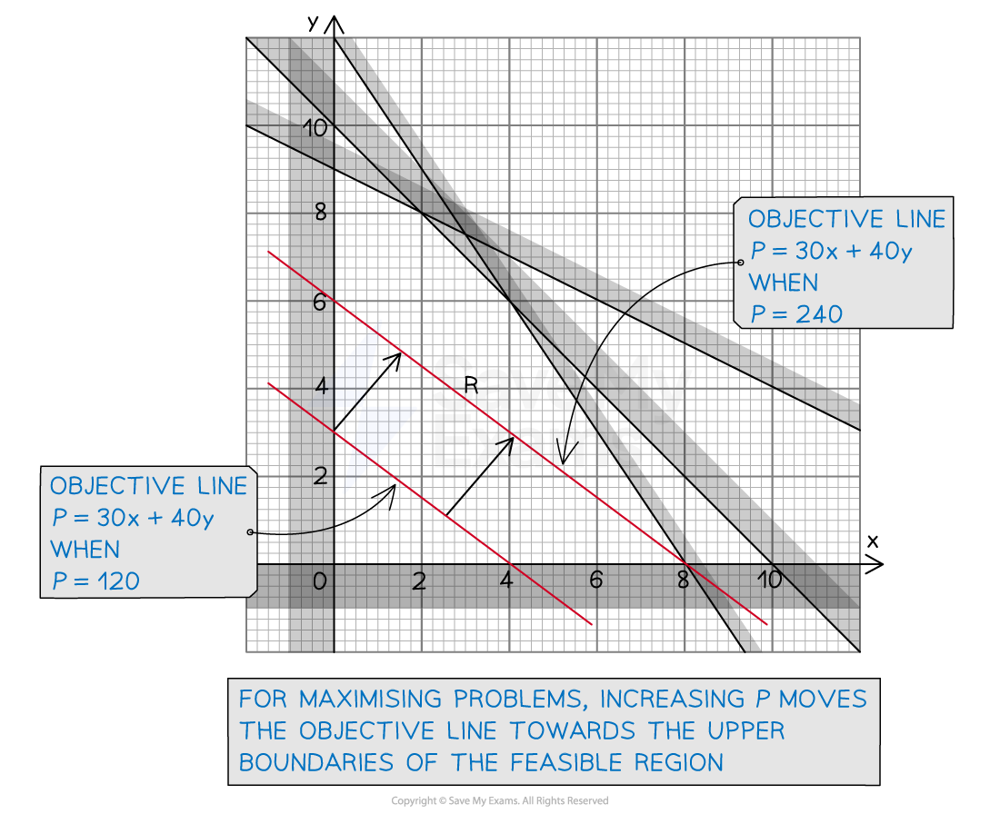
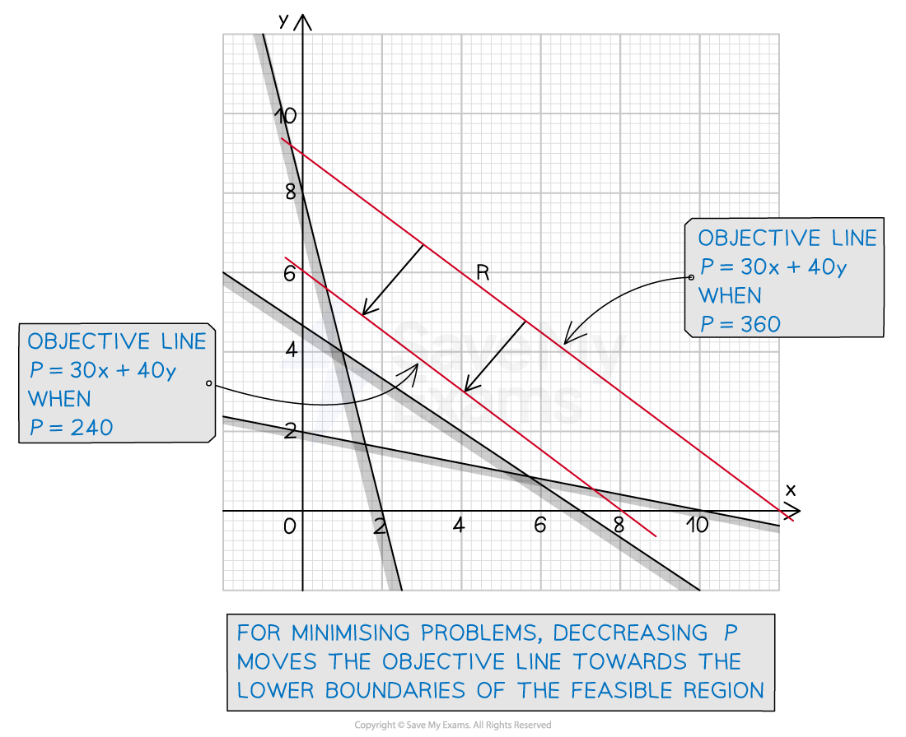

# Finding the Optimal Solution

## Objective Line

> **Spec point** — `spcpt_r9mzkqH5CfKCjppT`

## Objective Line

### What is the objective line?

- The **objective function** (for an LP problem with two decision variables) is of the form $P=ax+by$

  - Rearranged, this is of the form '$y=mx+c$'
  - So for a particular value of $P$, there is a straight line graph
  
    - This is the **objective line**

### How does an objective line indicate where the optimal solution is?

- In a linear programming problem, $P$ is usually **unknown**

  - It is the quantity that is to be **maximised** or **minimised**
- In **maximisation** problems, **increasing** the value of $P$

  - 'moves' the **objective line away** from the **origin**
  - and towards the **upper boundaries** of the **feasible region**

- In **minimisation** problems, **decreasing** the value of $P$

  - 'moves' the **objective line closer** to the **origin**
  - and towards the **lower boundaries** of the **feasible region**

- Therefore, the **optimal solution** to a linear programming problem occurs

  - when an objective line passes through a **vertex** of the **feasible region**
- The **vertex** at which this occurs will depend on the ***gradient*** of the objective line

### How do I find the optimal solution to a linear programming problem using an objective line?

- Whether maximising or minimising, for the objective function $P=ax+by$

  - Choose a value of $P$ that is a multiple of $a$ and $b$
  - Plot the objective line $P=ax+by$
  
    - This is usually easiest by considering the two points where $x=0$ and where $y=0$
  - Using your ruler, keep it **parallel** to the **objective line** just drawn
  
    - Move it **away** from the origin for a **maximisation** problem
    - Move it **towards** the origin for a **minimisation** problem
  - The **last** vertex of the feasible region that your ruler passes through will be the **optimal solution** to the problem

> **Exam Hint**
> - To show your working (and understanding) draw an objective line each time your ruler passes through a vertex of the feasible region

> **Worked Example**
> The constraints of a linear programming problem and the feasible region (labelled $R$) are shown in the graph below.
> 
> 
> 
> The objective function, $P=30x+40y$ is to be maximised.
> 
> Showing your method clearly, use the objective line method to determine the optimal solution to the problem.
> 
> **Answer:**
> 
> > *To get started, choose a value of *$P$* that is both a multiple of 30 and 40, e.g. 120*
> *Now plot the objective line with equation *$120=30x+40y$
> *Rearrange if you prefer, but by choosing a multiple of 30 and 40, it is easy to see this line will pass through the points (0, 3) and (4, 0)*
> 
> 
> 
> > *After plotting an initial line, slide your ruler parallel and 'up' the graph away from the origin (maximising problem)*
> *Draw an objective line when your ruler passes through a vertex of the feasible region - (8, 0), (4, 6) and (2, 8)*
> 
> 
> 
> > *The optimal solution is the last vertex the objective line passes through - which in this case is (2, 8)*
> 
> **Final answer:** **The optimal solution is **$x=2,y=8$** and **$P$** is maximised at **$P=30\times2+40\times8=380$

## Vertex Method

> **Spec point** — `spcpt_QNpRGQHvyfTQgDXj`

## Vertex Method

### What is the vertex method?

- The vertex method is a way to find the **optimal solution** to a linear programming problem
- The optimal solution to a linear programming problem lies on a vertex of the **feasible region**
- By finding the coordinates of these vertices, the **decision variables** values can be deduced
- The **maximum** or **minimum** objective function can be determined

  - by substituting each of these sets of decision variables into the **objective function**

### How do I find the optimal solution from the vertex method?

- **STEP 1**
Find the coordinates of each **vertex** of the **feasible region**

  - If the plot of the region is accurate, these may be able to be read directly from the graph
  - On less accurate diagrams, some vertices may be obvious
  
    - such as the **origin** or any vertices along an axis
  - Otherwise find the vertices by solving each **pair** of the **inequalities** as **simultaneous equations**
  
    - E.g. For the **inequalities** $x+y\leq8$ and $x+4y\leq17$
    - Solve the **simultaneous equations** $x+y=8$ and $x+4y=17$

- **STEP 2**
Substitute the coordinates of each vertex into the **objective function** and **evaluate** it

- **STEP 3**
Determine which set of decision variables lead to the **maximum** or **minimum** objective function as required by the problem

  - This will be the **optimal solution**

> **Exam Hint**
> - In maximising problems where the origin is a vertex of the feasible region
> 
>   - It is usually obvious that the origin will not be the optimal solution
>   
>     - It is still a vertex of the feasible region however, so should be included in your list of vertices

> **Worked Example**
> The graph below shows the feasible region, labelled $R$, of a linear programming problem where the objective function is to maximise $P=2x+5y$ subject to the constraints shown on the graph.
> 
> 
> 
> Use the vertex method to solve the linear programming problem.
> 
> **Answer:**
> 
> - *STEP 1*
> *Find the coordinates of each vertex of the feasible region*
> *Three of them should be obvious to spot!*
> 
> $x=0,y=0\,(0,0)$
> 
> $x=0,y-2x=2\,(0,2)$
> 
> $x+y=8,y=0\,(8,0)$
> 
> > *For the two vertices that are not obvious, solve the appropriate simultaneous equations*
> *(Your calculator may have a simultaneous equation solver that you can use)*
> 
> `bold italic y bold minus bold 2 bold italic x bold equals bold 2 bold comma bold space bold italic x bold plus bold 4 bold italic y bold equals bold 17
> y equals 2 plus 2 x
> x plus 4 open parentheses 2 plus 2 x close parentheses equals 17
> 9 x equals 9
> x equals 1 comma space y equals 2 plus 2 open parentheses 1 close parentheses equals 4
> stretchy left parenthesis 1 comma space 4 stretchy right parenthesis`
> 
> $x+4y=17,x+y=8\,x=8-y\,8-y+4y=17\,3y=9\,y=3,x=8-3=5\,(5,3)$
> 
> - *STEP 2*
> *Find *$P=2x+5y$* for each pair of *$x$* and *$y$* values*
> *Writing them out in a table can help keep track and make the optimal solution stand out*
> 
> | $x$ | $y$ | $P=2x+5y$ |
> |---|---|---|
> | *0* | *0* | *0* |
> | *0* | *2* | *5 × 2 = 10* |
> | *8* | *0* | *2 × 8 = 16* |
> | *1* | *4* | *2 × 1 + 5 × 4 = 22* |
> | *5* | *3* | *2 × 5 + 5 × 3 = 25* |
> 
> - *STEP 3*
> *The maximum value is 25, which occurs when *$x=5$* and *$y=3$
> 
> **Final answer:** **The optimal solution is **$x=5,y=3$** giving a maximum value of **$P=25$
