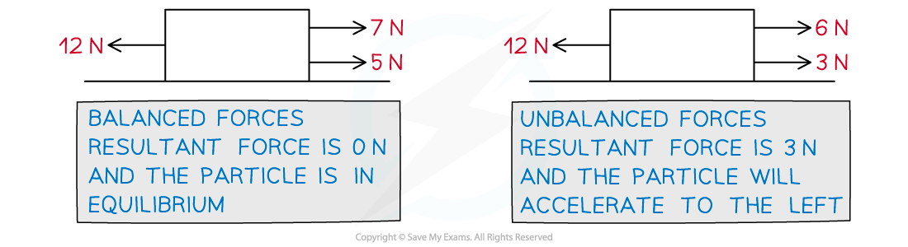

# Equilibrium in 1D

## Equilibrium in 1D

> **Spec point** — `spcpt_8FsF3KSbZ4GDtqcY`

## Equilibrium in 1D

### What is Newton’s first law of motion?

- An object at rest will stay at rest, and an object moving with constant ***velocity***** **will continue to move with constant velocity, unless an unbalanced force acts on the object.

### What is the resultant force and an unbalanced force?

- The **resultant** **force** is the **sum** **of** **forces** acting on a particle – consider it as a **single** **force** that achieves the **same** **result** as **all** the forces **combined**
- An **unbalanced** **force** is a force acting on a particle that is **not** cancelled by another force acting in the opposite direction
- So a **non**-**zero** resultant force will be unbalanced (hence the wording in Newton’s First Law of Motion) and the particle will **accelerate**

### What does equilibrium mean?

- A **particle** is in **equilibrium** if the **resultant** **force** acting on it is **zero**

  - In other words when the **sum** **of** **the** **forces** acting on a particle is zero
  - For example, in the **horizontal** direction, any **forces** acting to move the particle to the **left** will be **balanced** by any **forces** acting to move the particle to the **right**.
  - There does not need to be the same number of forces in both directions – two forces could be acting to move the particle to the left but are cancelled out by only one force acting to move the particle to the right.

> **Worked Example**
> A rectangular shop sign, of mass (4x — 8) kg is held in equilibrium by two light inextensible strings as shown in the diagram below. The tensions in the two strings are (20*x* + 9) N and (10*x* + 11) N.
> 
> 
> 
> The sign is modelled as a particle.
> Taking the acceleration due to gravity (*g*) as 10 m s-2, find the value of *x*.
> 
> **Answer:**
> 
> 

> **Exam Hint**
> - It is unlikely you will get an exam question that only deals with one dimension at AS and A level.  However two-dimensional problems can often be broken down into two one-dimensional problems so the principles in this note are important to understand.
