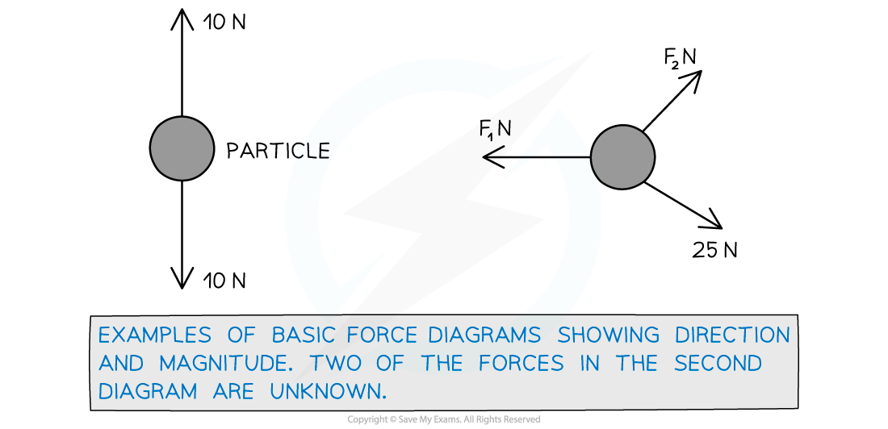
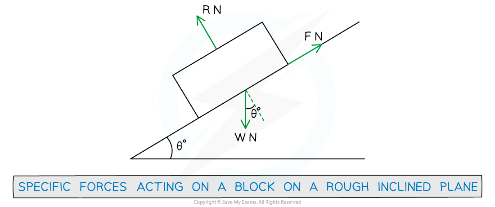

# Force Diagrams

## Force Diagrams

> **Spec point** — `spcpt_QmKTzfXFGF6nwbsQ`

## Force diagrams

### Why do we need force diagrams?

- **Force** **diagrams** are used to help understand a given scenario and show which **forces** are acting on which **particles** and in which **direction** they are acting
- In diagrams an **arrow** is used to represent a **force** acting on a **particle** which shows the **direction** in which the force is acting
- The ***magnitude***** **of the **force** is normally written next to its arrow

### What types of forces could be involved?

- Specific **types of force** encountered (which may not be mentioned in the question nor labelled on a given diagram) are: **weight (*****W***** N)**, **tension (*****T***** N)**, **thrust (*****T***** N), friction (*****F***** N)** and **normal** **reaction (*****R *****N)**

- Remember that the diagram is drawn to help understand the scenario - cars, blocks, etc are **modelled** as particles occupying a **single** **point** in space and so all **forces** acting on the car, block, etc act at that same **single** **point**
- The main forces that you will see are:

  - **tension** (a “pulling” force) acts away from a particle, **thrust** (a “pushing” force) acts towards it
  - **weight** is *W = mg *where *m* kg  is the **mass** of the particle and *g* is the **acceleration** due to **gravity** – usually g = 9.8 m s-2
  - **friction** acts **parallel** to the surface in the **opposite** direction to **motion**
  - the **normal** **reaction** acts **perpendicular** to the surface (and **friction**)

> **Worked Example**
> The diagram below shows a block, of weight 52 N, at rest on a rough plane that is inclined at $θ^{\circ}$ to the horizontal. The block is connected to a mass, *m* kg, via a light inextensible string that passes over a smooth pulley. The particle hangs at rest vertically below the pulley.
> 
> 
> 
> Add all forces (known and unknown) to the diagram that are acting on the block and the mass. Also indicate the direction of acceleration of any subsequent motion. (You may assume the block is heavier than the mass and so any subsequent motion would see the block slide down the plane.)
> 
> **Answer:**
> 
> 

> **Exam Hint**
> - Always draw a force diagram if appropriate.
> - If a diagram is already given then add to it as you progress through the question.
> - If a diagram is too small or it gets too complicated then draw a new diagram.
> - You may be able to manage with just drawing the section of the diagram you are dealing with in any particular question part.
