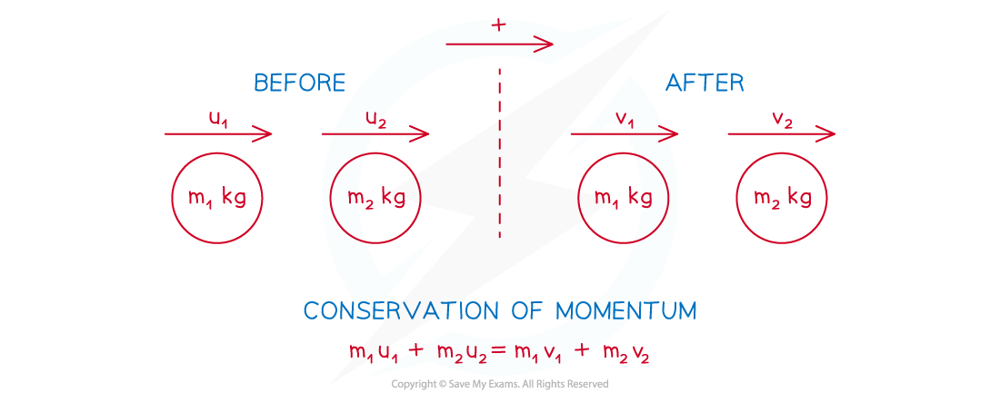

# Direct Collisions

## Collisions

> **Spec point** — `spcpt_HKGykwT46zGnYKzK`

## Collisions

### What is a direct collision?

- A **direct collision** is when two objects are travelling along the **same straight line** when they collide
- **Before** the collision:

  - **One** of the objects could be ***stationary***
  - The two objects could be travelling in the **same direction** with the faster object behind the slower one
  - The two objects could be travelling in **opposite directions** towards each other
- **After** the collision:

  - **One or both** of the objects could be **stationary**
  - The two objects could be travelling in the **same direction** with the faster object in front of the slower one
  - The two objects could be travelling in **opposite directions** away from each other
  - The two objects could **coalesce** (merge to form one object) and travel in either direction
- **Explosions** work like direct collisions and are when an object **separates** into two objects travelling along the same straight line

  - An example of this is a **bullet being fired from a gun**, the bullet moves forwards and the gun recoils backwards
  - For an explosion it is possible that the object is **initially** **stationary **and then splits into two objects **moving in opposite direction**

## Conservation of Momentum

> **Spec point** — `spcpt_XFW9FFKtQHckyhBB`

## Conservation of Momentum

### What is meant by conservation of momentum?

- The **principle of conservation of momentum** states that when two objects collide the **total momentum is unchanged**

  - **Total** momentum **before** collision = **Total** momentum **after** collision
  - This only works if there are **no external forces** acting on the objects
- If an object changes direction after a collision then its velocity changes between positive and negative

  - It is important to be clear about which direction is positive
- It can be written as: $m_{1}u_{1}+m_{2}u_{2}=m_{1}v_{1}+m_{2}v_{2}$

  - One object has mass $m_{1}$kg, velocity $u_{1}ms^{-1}$ before the collision and $v_{1}ms^{-1}$   after the collision
  - The other object has mass $m_{2}$kg, velocity $u_{2}ms^{-1}$   before the collision and  $v_{2}ms^{-1}$  after the collision

#### How do I use conservation of momentum to solve collision problems?

- **STEP 1**: Choose the **positive direction**
- **STEP 2**: Draw a **before/after diagram**

  - Clearly show the mass, speeds and directions
  - If a direction is unknown, then choose any direction and if you get a negative value for its velocity it means it is travelling in the opposite direction
  - If the two objects coalesce then you can either consider them as two particles moving in the same direction with the same speed or consider them as one particle and add together their masses
- **STEP 3**: Form an **equation** using the **conservation of momentum**

  - Be careful with negatives
  - If an arrow is in the opposite direction to the positive direction, then its velocity is negative
- **STEP 4**: **Solve** and give answer in **context**

  - You might need to find the speed and/or direction after a collision

> **Worked Example**
> Two particles $P$ and $Q$, with masses 3 kg and 5 kg respectively, are travelling in opposite directions towards each other along the same straight line on a smooth horizontal table when they collide directly. Immediately before the collision the speeds of $P$ and $Q$ are 4 m s-1 and 2 m s-1 respectively.  Immediately after the collision the direction of motion of $P$ is reversed and its speed is 1 m s-1.
> 
> (a) Find the speed of ***Q*** immediately after the collision.
> 
> (b) State whether the direction of motion of ***Q ***is changed by the collision.
> 
> **Answer:**
> 
> 

> **Exam Hint**
> - Always draw clear diagrams with arrows!
> - When considering directions, use common sense - if two particles are travelling in the same direction then they will not collide if the faster one is in front. Two particles can't go through each other (at least not at this level of mathematics…) so if two objects are travelling towards each other, then at least one of them must change direction after the collision.
