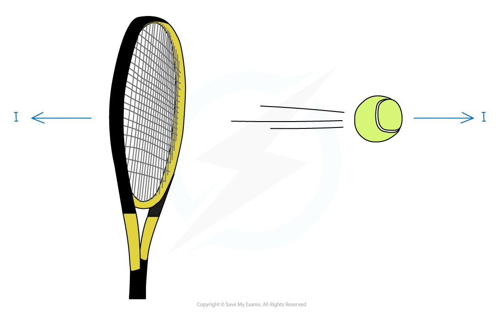

# Momentum & Impulse

## Momentum

> **Spec point** — `spcpt_BHyY3DyqGJ7QHDV4`

## Momentum

#### What is momentum?

- Any object that has mass and is moving has **momentum**
- **Momentum **measures the quantity of motion that an object has
- The **momentum **of a particle is defined as the **product** of its **mass (** $m$**kg)** and its **velocity (**$vms^{-1}$**)**

  - Momentum **=*****mv***
- The SI unit for momentum is $\mathrm{kg}ms^{-1}$
- Momentum is a **vector** quantity - so it has a **magnitude** and **direction**

  - The **direction of the momentum** of a particle is the **same** as the **direction of motion** of the particle
  - The **momentum is negative** if the **velocity is negative**

> **Worked Example**
> A dog of mass  15 kg is running with speed $6ms^{-1}$.
> 
> Find the momentum of the dog.
> 
> **Answer:**
> 
> 

## Impulse

> **Spec point** — `spcpt_scnKHWsvNrzBTT5K`

## Impulse

#### What is impulse?

- **Impulse** measures the effect of a force acting on a particle over time
- If a **constant force (**$FN$ **)** acts on a particle for $t$ **seconds** then the **impulse (**$I$**)** of the force is defined to be the **product** of the **force **and** time**

  - $I=Ft$
- The SI unit for impulse is **N s**(newton seconds) which is equivalent to $\mathrm{kg}ms^{-1}$

  - This is the same as the units for momentum
- Impulse is a **vector** quantity – so it has magnitude and direction

  - The **direction of the impulse** of a force is the same as the **direction of the force**
- The **Impulse-Momentum Principle** states that impulse is equal to the **change in momentum**

  - $I=mv-mu$
  - where *m* is the mass, *u* is the initial velocity and  *v *is the final velocity

#### What happens when two objects are in contact?

- If two objects are in contact with each other then by **Newton’s Third Law **there will be **equal** and **opposite** reaction forces
- This means there will be **equal and opposite impulses**
- For example, consider hitting a tennis ball with a racket, there will be

  - an impulse exerted **by the racket** **on the ball** which propels the ball forward
  - an impulse exerted **by the ball on the racket** which reduces the velocity of the racket
  - The **magnitudes** of these impulses are **equal** but they are in **opposite** directions

> **Worked Example**
> A car with mass 1200 kg is driving to the right along a smooth horizontal road with speed 16 m s-1 . The driver applied a constant braking force of magnitude 1800 N for 5 seconds.
> 
> (a) Find the magnitude of the impulse of the braking force.
> 
> (b)State the direction of the impulse.
> 
> (c) Find the speed of the car 5 seconds after the braking force was applied.
> 
> **Answers:**
> 
> (a) Find the magnitude of the impulse of the braking force.
> 
> 
> 
> (b) State the direction of the impulse.
> 
> 
> 
> (c) Find the speed of the car 5 seconds after the braking force was applied.
> 
> 

> **Exam Hint**
> - Always define a positive direction and be careful with negatives. Use common sense to see if your answer makes sense - would you expect the velocity to have increased or decreased?
