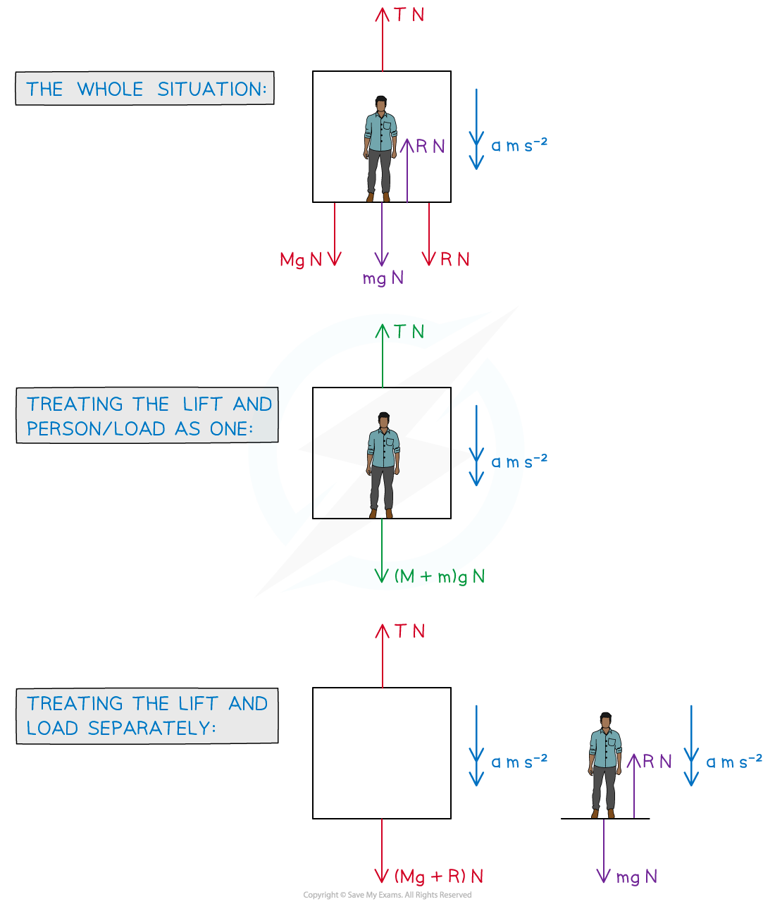

# Connected Bodies (Lifts)

## Connected Bodies - The Lift Problem

> **Spec point** — `spcpt_SM682SSGxcbrNGn5`

## Connected bodies (lifts)

### What is a lift problem?

- A **lift** **problem** involves objects (particles) that are **directly** in **contact** with each other – typically a **person** or **crate** in a **lift**
- If it is not a person in the lift the object is often referred to as a **load**
- There may be **more** than **two** **objects** involved – for example **two** **crates** stacked on top of each other on a lift floor
- **Vertical** motion is involved so use g m s-2, the **acceleration** **due** to **gravity**, where appropriate

  - Gravity always acts **vertically** **downwards**
  - Depending on the **positive** direction chosen – and which other forces are acting vertically – **acceleration** (a m s-2) may be **positive** or **negative**
- Remember that **acceleration** links *F= ma* (**N2L**) and the ‘*suvat*’ equations

### How do I solve 'lift problem' questions?

- Lift problems will only consider motion in the **vertical **direction
- As motion is involved **Newton’s** **Laws** **of** **Motion** apply so use “*F = ma*” (N2L)
- The steps for solving lift problems are the same as for solving **rope problems**
- As **both** the **lift** and **load** are travelling in the **same** direction the system can be **treated as one** particle (as well as separate particles)

  - There is no **reaction** **force** acting on the **lift** or **load** when treating the particle as one - mathematically they cancel each other out
  - You can think of the upward force as counteracting the person’s weight **and** moving the load upwards; N3L applies so there must be an equal force acting in the opposite direction; - you can think of this as the force keeping the person in contact with the lift floor whilst it is moving
- For **constant** **acceleration** the ‘*suvat*’ equations could be involved

### How do I find equations for problems involving lifts?

- Form the equations as follows:

  - Treating the lift and person/load as one
  - (↓) *(M + m)g - T = (M + m)a*
  - Treating the lift and person/load separately Lift: (↓) (*Mg + R) - T = Ma*
  - Person/load: (↓) *mg - R = ma*
- You do not necessarily need all equations but if in doubt attempt all and it may help you make progress

> **Worked Example**
> A lift of mass 800 kg is moving vertically downwards with acceleration 0.3 m s -2. A load of mass *m* kg lies on the floor of the lift. The reaction force exerted on the load by the lift is 399 N.
> 
> 
> 
> (a)  Briefly explain how the force of 800g N arises in this problem.
> 
> **Answer:**
> 
> 
> 
> 
> 
> (b)  Find the mass of the load, *m* kg .
> 
> **Answer:**
> 
> 
> 
> (c)  Find the tension,*T *N, in the cable of the lift.
> 
> **Answer:**
> 
> 

> **Exam Hint**
> - Sketch diagrams or add to any diagrams given in a question.
> - If in doubt of how to start a problem, draw **all** diagrams and try writing an equation for each.  This may help you make progress as well as picking up some marks.
> - Watch out for “hidden lift” problems – we’re not strictly talking elevators here!  For example, a load being raised by a crane; the “lift” would be a platform (such as a pallet) and the “lift cable” would be the cable connecting the crane to the load. Another common alternative is a fast rising (or falling) fairground ride.
