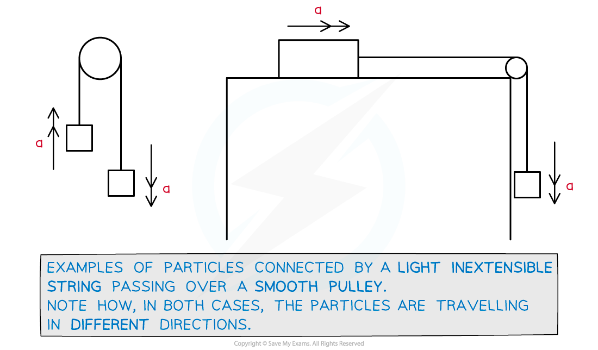

# Connected Bodies (Pulleys)

## Connected Bodies - Pulleys

> **Spec point** — `spcpt_hjSmwQJkMPWJFWm9`

## Connected bodies (pulleys)

### What is a pulley?

- A **pulley** is a wheel like device that rotates as a string passes over it allowing motion of any particles attached to the string
- Pulleys allow a (*inextensible*) **string** to change its **orientation**
- In A level mathematical models, pulleys will always be **smooth** and **light**, so there is no friction involved at the pulley and its mass is negligible
- A **peg** is similar to a pulley but is a fixed point that a particle can be suspended from (like a nail in a wall)

### How do I solve pulley questions?

- In all pulley questions the particles are moving in **different** directions so are considered **separately** rather than the system being treated as one
- If a particle is in **motion** in the direction being considered then **Newton’s** **Laws** **of** **Motion** apply so use “*F = ma*” (N2L)
- For **constant acceleration** the ‘*suvat*’ equations could be involved
- Step 1. Draw a series of diagrams 

  - Label the forces and the positive direction of motion for each particle.
  - Colour coding forces acting on each particle may help
- Step 2. Write equations of motion, using “*F = ma*”

  - **Equations 1 **and** 2**: Treating each particle separately

(↑) T - m1g = m1a

(↓) m2g - T = m2a

- Step 3. Solve the relevant equation(s) and answer the question

  - Some trickier problems may lead to simultaneous equations

> **Worked Example**
> A block of mass 25 kg lies on a smooth horizontal table. A light, inextensible string passes over a smooth pulley attached to the edge of the table. The string connects the 25 kg block to another, of mass 60 kg, that hangs freely as shown in the diagram below.
> 
> The system is released from rest.
> 
> 
> 
> Find the tension, *T *N , in the string and the acceleration, a m s-2 ,of the system.
> 
> **Answer:**
> 
> 
> 
> 

> **Exam Hint**
> - Sketch a diagram or add to a diagram given in a question.
> - All pulleys are smooth and light; in many questions the pulley itself can be ignored.
> - In pulley questions the particles will be moving in different directions - so each particle needs to be considered separately.
> - If one particle is on a horizontal surface (such as a desk or table) then the weight only need be considered if friction is involved (since F = μR and R is related to weight).
