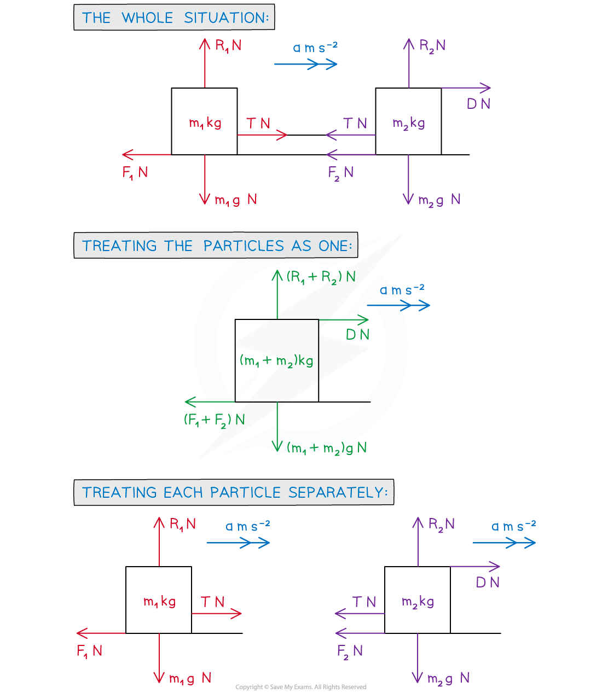

# Connected Bodies (Ropes & Tow Bars)

## Connected Bodies - Ropes & Tow Bars

> **Spec point** — `spcpt_cF9jDPQ2vYxD2nYf`

## Connected bodies (ropes & tow bars)

### What are connected bodies/particles?

- The phrase **connected** **particles** refers to situations where **two** (or more) bodies (objects) are connected in some way.
- Common examples include:

  - a car towing a caravan or trailer
  - a load being raised by a lift (**3.2.3**)
  - two bodies connected by a rope that passes over a pulley (**3.2.4**)
- Problems may involve the particles being stationary (in **equilibrium**) or in **motion** – in the latter case **Newton’s** **Laws** **of** **Motion** will be involved.

### What are Newton’s laws of motion?

- Full details of Newton’s Laws of Motion can be found in **3.2.1 F = ma** but <u>**Newton’s Third Law of Motion**</u> (N3L) is particularly relevant for the problems covered in this note

  - For two bodies, the force exerted on the second body by the first is equal in magnitude but opposite in direction to the force exerted on the first body by the second

### How are ropes modelled?

- A **rope** is typically used to connect two inanimate objects such as blocks, crates, containers, etc
- A **rope** would be **modelled** as a **light** **inextensible** **string** 

  - The modelling assumption **light** means the rope’s mass is so small relative that it can be ignored
  
    - Mathematically this means that the **tension** in the string is constant throughout its length (i.e. **tension** is **equal** on **both** **sides** of the string)
  - The modelling assumption **inextensible** means the rope cannot be extended/shortened in length
  
    - Mathematically this means that both connected particles will have the same **acceleration**
  - A **string** would only be in **tension** (not **thrust** – see tow bars for thrust)
  - A **string** can go **slack** – for example if one particle is disconnected – in which case the model being used would no longer apply and a new scenario would ensue with no tension involved

### What are tow bars and how are they modelled?

- A **tow** **bar** is a mechanism by which a car (or similar vehicle) can be connected to a caravan, trailer (or similar)
- A **tow** **bar** is modelled as a **light** (inextensible) **rod**

  - A **rod** can either be in **tension** or **thrust** (compression) 
  
    - For a car towing a caravan by a light rod, the rod would be in **tension** when the car is **accelerating**, **thrust** when it is **decelerating**

### What is a coupling?

- A **coupling** is a general term referring to the connection between two objects - usually a relatively complex system, such as how two train carriages are connected - but for **modelling** purposes is simplified to a **string** or **rod**

### How do I solve problems involving tow bars and ropes?

- If a particle is in **motion** in the direction being considered, then **Newton’s** **Laws** **of** **Motion** apply so use “***F = ma***” (N2L)
- If a particle is **not** in motion in the direction being considered then “***F = 0***” can be used, although
- “***F = ma***” with “***a = 0***” will also work
- Step 1.Draw a series of diagrams,

  - Label the forces and the positive direction of motion.
  - Colour coding forces acting on each particle may help.
- Step 2. Write equations of motion, using “F = ma ” (or if no motion “***F = 0***”)
- Step 3. Solve the relevant equation(s) and answer the question

  - Some trickier problems may lead to simultaneous equations
- If **both** particles are travelling in the **same** **direction** the **system** can be treated as **one** particle (as well as separate particles)

  - There is **no** **tension** at either side of the string when the system is treated as one - mathematically they cancel each other out
- For **constant** **acceleration** the ‘*suvat*’ equations could be involved

- a m s-2 is the acceleration of the system
- m1 kg and m2 kg  are the masses of the two bodies
- m1 g N and m2 g N are the weights of the two bodies
- T N is the tension in the string
- D N is the driving force of the system
- F1 N and F2 N are the resistive forces acting on the two bodies
- R1 N and R2 N  are the normal reaction forces of the two bodies
- * You do not necessarily need all diagrams but if in doubt draw all as they may help you to understand the problem more clearly **

### How do I find equations for problems involving tow bars and ropes?

- Form the equations as follows:
- **Treating the particles as one**

  - Horizontally (→) D - (F1 + F2) = (m1 + m2)a
  - There is no vertical motion so use “F = 0”
  - (↑) (R1 + R2) - (m1 + m2)g = 0
  - (*F= ma* with *a =0 * will lead to the same equation)
- **Treating each particle separately**

  - Particle 1:  Horizontally (→) T - F1 = m1a
  - Vertically(↑) R1 -m1g = 0 (No motion)
  - Particle 2:  Horizontally (→) D - T- F2 = m2a
  - Vertically(↑) R2 - m2g = 0  (No motion)
- You do not necessarily need all equations but if in doubt attempt all and it may help you make progress

> **Worked Example**
> A small plane, of mass 1250 kg, is towing a glider, of mass 300 kg, along a runway prior to take-off and accelerates from rest at a constant 1.5 m s-2.
> During the take-off period the plane experiences resistive forces of 580 N, whilst the glider experiences resistive forces of 255 N.
> The plane and glider are coupled by a tow rope which is modelled as a light inextensible string.
> 
> (a)  Find the engine force from the plane.
> 
> **Answer:**
> 
> 
> 
> 
> 
> 
> 
> (b)  Find the tension in the tow rope.
> 
> **Answer:**
> 
> 

> **Exam Hint**
> - Sketch diagrams or add to any diagrams given in a question.
> - If in doubt of how to start a problem, draw **all** diagrams and try writing an equation for each.  This may help you make progress as well as picking up some marks.
> - Do not dismiss an equation in a direction because there is no motion – use “*F = 0*” to write an equation for that direction and you may be able to find one of the unknowns in a problem.
