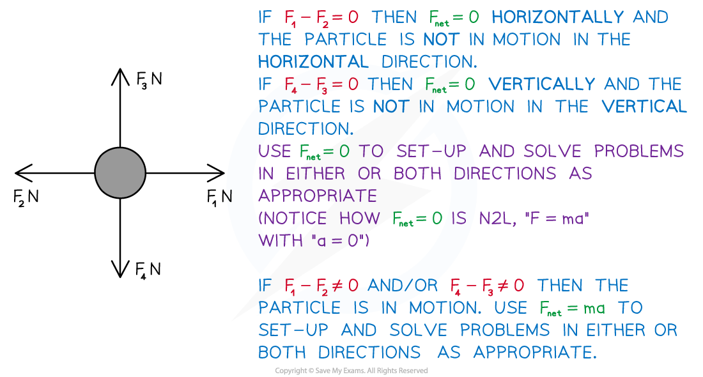

# F = ma

## F = ma

> **Spec point** — `spcpt_7Jz27DTGFkMV4YQH`

## F = ma

### What is Newton’s first law of motion?

- An object at rest will stay at rest, and an object moving with constant ***velocity*** will continue to move with constant velocity, unless an unbalanced force acts on the object
- This law is explored more in **3.1.1 Equilibrium in 1D** and **3.1.2 Equilibrium in 2D** but has been included here for completeness

### What is Newton’s second law of motion (N2L)?

- The **resultant** **force** (Fnet) acting on a body is equal to the product of the **mass** of the body and its **acceleration**

  - ***F = ma***
  
    - *F* is the resultant force (N)
    - *m* is the mass (kg)
    - a is the acceleration (m s-2)
- This will probably be the most familiar of Newton’s Laws of Motion as it has an equation (*F = ma*) that you will use frequently in mechanics problems.

### What is Newton’s third law of motion?

- For two bodies, the force exerted on the second by the first is equal in magnitude but opposite in direction to the force exerted on the first body by the second
- This is sometimes loosely referred to as “for every action there is an opposite and equal reaction”

### When do I use F = ma?

- Use it to **set** **up** and **solve** equations when **motion** is involved
- Some related equations may come from the **constant** **acceleration** **equations** (‘*suvat*’) but** *****F= ma**** *is needed when **force(s)** and **mass** are mentioned or involved (neither force nor mass are involved in the ‘*suvat*’ equations)
- If not asked directly in a question it will be implied by the information given – **motion** and **acceleration** will be involved and the **mass** of the particle will be relevant too

### How do I solve problems using F = ma and suvat equations?

- *F= ma *can be used in conjunction with the ‘*suvat*’ equations – the linking connection is **acceleration** (a)
- ‘suvat’ only questions will not involve **mass** or (**resultant**) **force**
- Step 1. **Draw** a **diagram** and label all forces acting on the particle(s)

  - label the positive direction and any other useful information
  - If a diagram is given, add anything missing to it
- Step 2. Use N2L, *F = ma* , or an appropriate ‘*suvat*’ equation.

  - If there is more than one particle involved you may have to do this for each
- Step 3. Solve the equation

  - In harder problems simultaneous equations may arise.

### How do I deal with forces acting in different directions on a moving particle?

- At **AS** level, if **forces** are acting in different directions, those directions will be **perpendicular** to one another

  - Thus nearly all questions at AS level involve forces acting horizontally (*x*-direction) and/or vertically (*y*-direction)
- In such cases we apply N2L (*F = ma*) and ‘*suvat*’ equations separately to both directions

### How do I use F = ma in problems involving weight?

- **Weight** is a **force** 

  - W = mg N where g m s-2 is the **acceleration** due to **gravity**
  - Weight always acts **vertically** **downwards** (towards earth)
  - If **upwards** is the **positive** **direction** (and assuming no other vertical forces are involved) then **acceleration** would be negative, a = -9.8 m s-2

> **Worked Example**
> A train engine of mass 5 tonnes is moving along a straight track with constant acceleration. In an eight second period, it covers a distance of 250 m at which point it has velocity 35 m s-1
> 
> (a)  Find the acceleration of the train engine.
> 
> **Answer:**
> 
> 
> 
> (b)  Find the resultant force acting on the train engine.
> 
> **Answer:**
> 
> 
> 
> (c)  Given that the (only) driving force is 6250 N, find the total of any resistive forces acting on the train engine.
> 
> **Answer:**
> 
> 

> **Exam Hint**
> - Sketching, or adding to given, diagrams can help to understand problems and can help you decide which direction to take as positive.
> - Remember that *F *(in N2L) is the resultant force, sometimes seen as  Fnet- be careful not to get it muddled with any other forces that are, or could be, denoted by *F*.  To avoid confusion, use quote marks around “*F = ma"*  to show that the quoted *F, m*  do not necessarily correspond to a  mentioned in the question.
> - Depending on which direction is taken as positive, the resultant force, *F N* , may be negative and/or acceleration, a m s-2, may be negative (this is particularly relevant for vertical motion)
> - Write a list of the quantities that are given in a question and another list of those you are asked to find.  This will help you decide which equation(s) to use.
> - A third list of the quantities you are not concerned can help as these may be used to find intermediate results.
