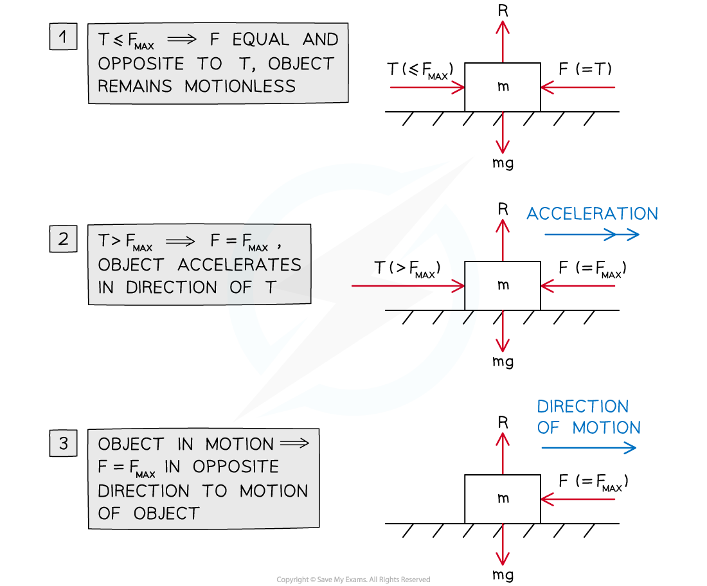

# Coefficient of Friction

## Coefficient of Friction

> **Spec point** — `spcpt_v9Gry3JdfWgRKDrw`

## Coefficient of friction

### What is friction?

- Friction is a **force** between a surface and an object that acts to resist motion of the object across the surface
- On a horizontal surface with no forces acting on a stationary object other than **gravity** and the surface's **normal reaction force**, there is no force of friction
- If an additional force acts on the object **parallel** to the surface then friction manifests as a force in the **opposite direction**

  - Friction always acts in a direction **parallel** to the **surface**
  - Friction acts in the **opposite direction** to the** resultant force **that would cause the object to move **parallel** to the surface
  - Up to a certain **limiting value** (see next section) the force of friction **prevents motion** entirely
  - Beyond that **limiting value** friction is a force of **constant magnitude** in the **opposite** direction to the motion of the object

### What is the coefficient of friction?

- The magnitude of the frictional force satisfies the inequality:

  - ***F***** ≤ *****μR***
  - where ***F*** is the force of friction
  - ***R*** is the normal reaction force between the object and the surface
  - and ***μ*** is the **coefficient of friction **between the object and the surface
  
    - If there is no friction then ***μ*****= 0 **and the **surface** is** smooth**
    - Otherwise ***μ *****> 0**

- The maximum possible frictional force is given by the equation

  - ***F*****MAX**** = *****μR***
  - where ***F*****MAX** is the maximum possible force of friction, and ***R*** and ***μ*** are as above
- ***F******MAX*** serves as a **limiting value** for mechanics problems involving friction

  - **If the object is stationary** and the resultant of other parallel forces to the surface is **less than or equal to *****F******MAX*** then
  
    - the object **remains stationary**
    - the frictional force is always **equal** and **opposite** to the resultant of the other horizontal forces
    - if the resultant of other horizontal forces is **equal **to** *****F*****MAX** then the object is said to be in **limiting equilibrium**
  - **If the object is stationary** and the resultant of other horizontal forces becomes **greater than *****F*****MAX** then
  
    - the object begins to **accelerate** in the direction of the resultant force
    - the frictional force is equal to ***F*****MAX** with a direction always opposite to that of the object's motion
  - **If the object is in motion parallel to the surface** then (regardless of any other forces) the frictional force will always be **equal** to ***F*****MAX** with a direction opposite to that of the object's motion

> **Worked Example**
> A box with a mass of 12 kg is at rest on a horizontal floor. The coefficient of friction between the box and the floor is 0.7. A horizontal force of 80 N is applied to the box.
> Describe the force of friction in this situation and determine whether or not the box will begin to move.
> 
> **Answer:**
> 
> 

> **Exam Hint**
> - Always draw a force diagram and label it clearly*.*
> - Look out for the words **smooth** and **rough** in mechanics problems involving an object moving (or potentially moving) along a surface:
> 
>   - If the surface is described as **smooth** then you can ignore friction in the problem (ie ***μ= 0***)
>   - If the surface is described as **rough** then you need to include the force of friction in solving the problem.
> - If a friction question states that an object is **on the point of moving** that means that the object is in **limiting equilibrium.**
