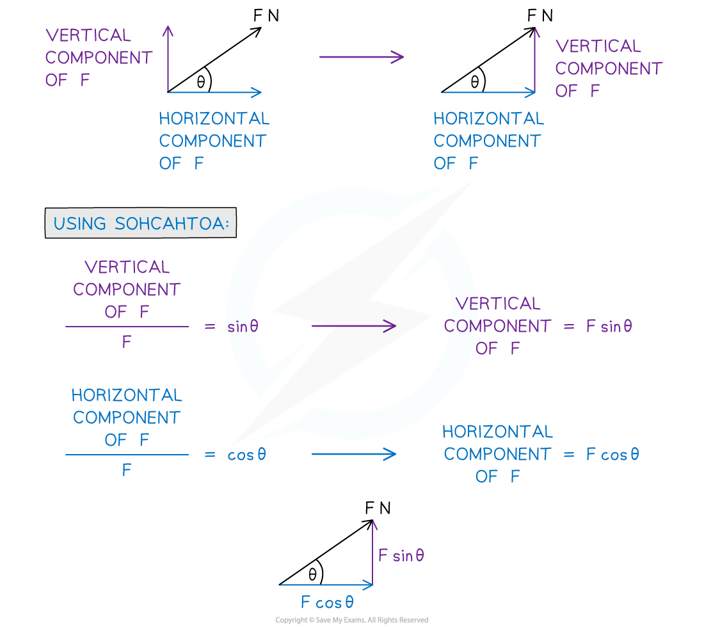
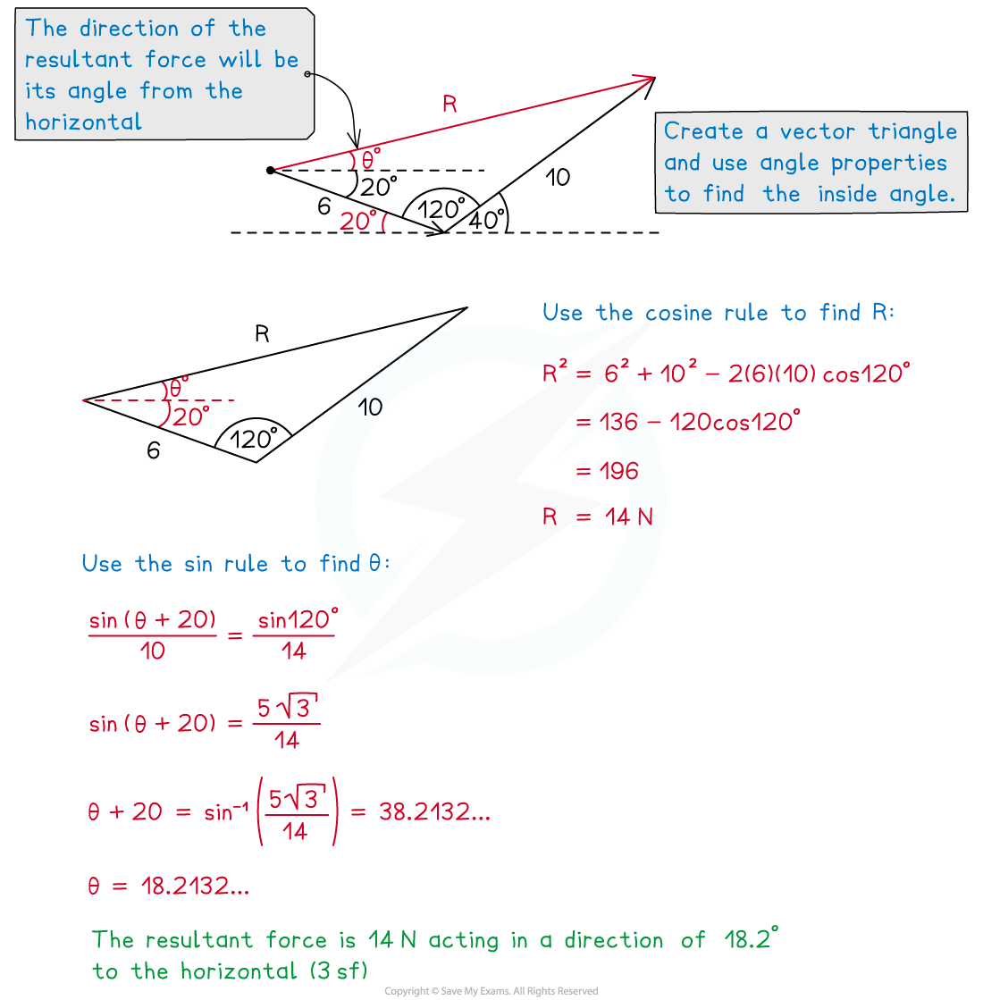

# Resolving Forces & Inclined Planes

## Forces Acting at an Angle

> **Spec point** — `spcpt_vjTCZ6QnYzDqNB87`

## Resolving forces

If a single force is applied at an angle to the **direction of motion** it will need to be **resolved** into **components** of the force that act **perpendicular **to each other.

### Why resolve a force acting at an angle?

- Resolving a force acting at an angle often helps to simplify a problem
- The components of a force parallel and perpendicular to the line of motion allows different types of problems to be solved

  - The **parallel** component of a force acting directly on a particle will be the component that causes an effect on the particle
  - The **perpendicular** component of a force acting directly on a particle will be the component that has no effect on the particle
- Finding the horizontal and vertical components of a force can help solve problems acting in the horizontal plane
- The two components of the force will have the same combined effect as the original force

### How do I resolve a force acting at an angle?

- Use **trigonometry** to resolve a force acting at an angle
- Draw a vector triangle of forces by decomposing the force into its horizontal and vertical components
- The original force will be the **hypotenuse** of the triangle and the two components will make up the **opposite** and **adjacent** sides

### How do I find the resultant force of two forces acting at different angles?

- Force is a **vector** quantity, so finding the **resultant** of two or more forces is the same as finding the resultant of two or more vectors
- It is possible to use geometry to find the resultant force without decomposing the forces into their horizontal and vertical components
- Use the **triangle law for vector addition** to calculate the **magnitude** and **direction** of a resultant force
- You will need to use **trigonometry** to find the missing side or angle in the triangle.

> **Worked Example**
> A child is pulling a box of mass 2 kg along a smooth horizontal surface using a force of 10 N at an angle of 30o to the horizontal, as shown in the diagram below.
> 
> 
> 
> (i) Find the vertical and horizontal components of the 10 N force.
> 
> (ii) Explain why the resultant force acting to move the box is 5$\sqrt{3}$ N.
> 
> (iii) Work out the acceleration of the box.
> 
> (iv) Calculate the magnitude of the normal reaction between the box and the floor.
> 
> **Answer:**
> 
> 
> 
> 

> **Exam Hint**
> - Always draw a diagram and decompose any angled forces into their horizontal and vertical components. Make sure you are confident with basic trigonometry and angle properties.

## Forces Acting on an Inclined Plane

> **Spec point** — `spcpt_MxRjp5mxrhytYQY8`

## Inclined planes

### How do I use F = ma on an inclined plane?

- Problems involving inclined planes will always be acting along the **line of greatest slope** of the plane

  - The line of greatest slope is the most direct route with which it is possible to move from the bottom to the top of the plane
  - A force said to be acting in the same **vertical plane** as the line of greatest slope will be acting in the same plane as this most direct route
- It is usually easier to resolve **parallel** and **perpendicular** to the plane
- The **normal reaction force** always acts perpendicular to the plane and will not need to be resolved
- **Weight (mg)** always acts vertically downwards and so it is easier to use when resolved into components perpendicular and parallel to the plane
- When an object is moving up or down the inclined plane, it has **acceleration** only in the parallel direction

  - The perpendicular forces will be equal in the positive and negative directions
  - Newton’s Second Law (**F = ma**) can be used in the parallel direction to determine acceleration or missing forces
- On an inclined plane **friction** will always act in the opposite direction to the direction the object is moving in or on the point of moving in

> **Worked Example**
> A box of mass 5 kg is being pushed up a smooth ramp inclined at 10o to the horizontal by a force of 12 N.
> 
> (i)  Find the magnitude of the reaction force acting on the box.
> 
> (ii)  Find the acceleration of the box up the slope.
> 
> **Answer:**
> 
> 

> **Exam Hint**
> - Use a triangle of components on your force diagrams to help you work out the components of the force but be careful not to count the components as two separate forces. Make sure you are confident with angle properties and always check you are using the correct angle between the force and the direction you are resolving in.
