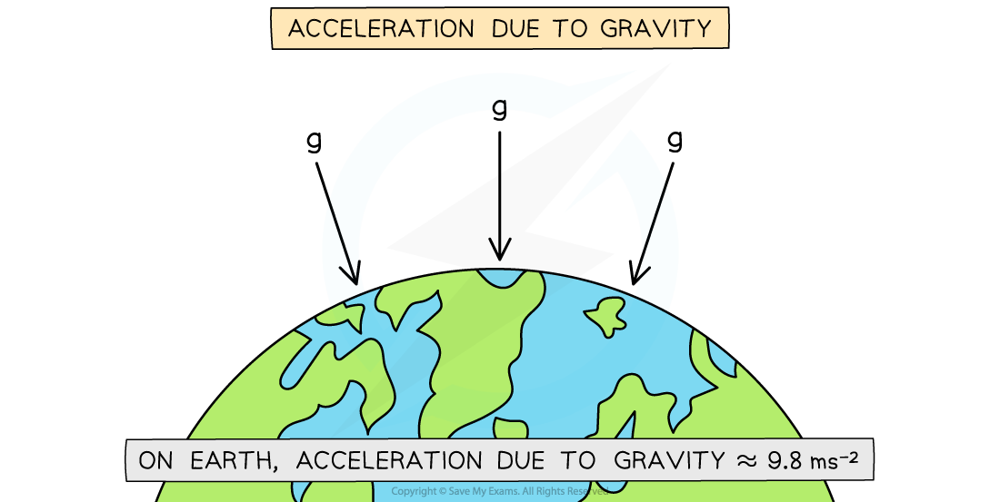

# Acceleration due to Gravity

## Acceleration due to Gravity

> **Spec point** — `spcpt_dqwxZZzNwVSbvb6S`

## Acceleration due to gravity

### What is acceleration due to gravity?

- If motion is vertical and no other forces are acting on a particle, the acceleration of the particle will be due to gravity

  - Acceleration due to gravity is denoted by the letter **g**
  - The value for gravity on Earth **varies** depending on location (the average value is 9.80665)
  - Take **g = 9.8** m s-2 unless told otherwise
  - It is often easier to leave working in terms of **g **as it sometimes cancels out or it can be calculated at the end
  - Some questions may ask for the answer to be left in terms of **g**
- Gravity will always act in the **downwards direction** towards the earth

  - If you decide **upwards** is the positive direction, then **a = -g**
  - If you decide **downwards** is the positive direction then **a = g**
  - It is important to be clear about which direction you have decided is positive

### What is vertical displacement and vertical distance?

- There is a difference between **displacement** and **distance**
- It is more pronounced in **vertical** motion problems

  - Particles typically travel in both directions (up and down)
  - What goes up must come down!
- Displacement, **s**, is a vector

  - It is the **position** of a particle (at time **t**) relative to its **starting** **position**
  - It only takes into account where the particle started and ended
  - If a particle has returned to its starting position then its displacement will be zero
- Distance could be …

  - … the distance from the **start**
  
    - in which case distance is the **magnitude** of displacement
  - … the distance **travelled**
  - … the distance from the **origin**
  
    - the origin is not necessarily the starting position
  - … the distance from another particle
- Read the question carefully to be clear about which of these you are finding

### How do I solve freefall questions using suvat equations?

- Virtually the same as suvat in 1D for **horizontal** motion

  - Follow the same steps and be careful with negatives
- You might have to spot that gravity is the acceleration by seeing the phrases:

  - "falling freely"
  - "projected"
  - "thrown/dropped"
- A **diagram** is important to help make clear …

  - … the **positive direction** of motion
  - … the way in which acceleration relates to the positive direction
  - … differences between displacement and distance
- Particles moving upwards will reach a **maximum** **height**

  - At the maximum height, velocity is instantaneously zero, **v = 0**
- If you use the value 9.8 for g then your **final answer** must be written as a **decimal** to **2 or 3** **significant figures**

  - You may **lose marks** if you leave your answer as **more than 3** significant figures

> **Worked Example**
> A toy rocket is projected vertically upwards from ground level with initial speed 18 m s-1
> 
> (a)  Find the maximum height the toy rocket reaches.
> 
> **Answer:**
> 
> 
> 
> (b)  Find the time taken from the instant the toy rocket is projected to the instant it returns to the ground.
> 
> **Answer:**
> 
> 

> **Exam Hint**
> - If you are asked to find how long it takes before a particle returns to the ground, you can simply use suvat with
> 
>   - *s = 0* if the particle started from the ground
>   - *s = -h* if the particle started a height of *h* m above the ground
> - A common mistake is thinking that the speed of the object when it hits the ground is zero. This is incorrect! The object will be travelling with a speed at the instant it hits the ground. It is the impact that causes the speed to go to zero. For an object travelling vertically under gravity, the only time the speed is zero is when it is at its maximum height.
