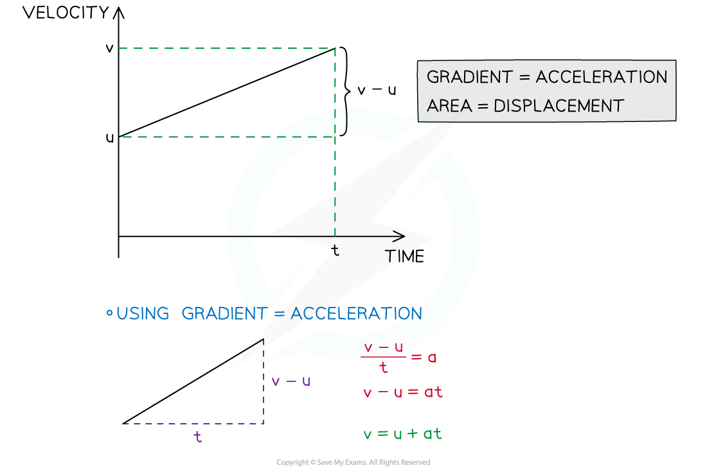
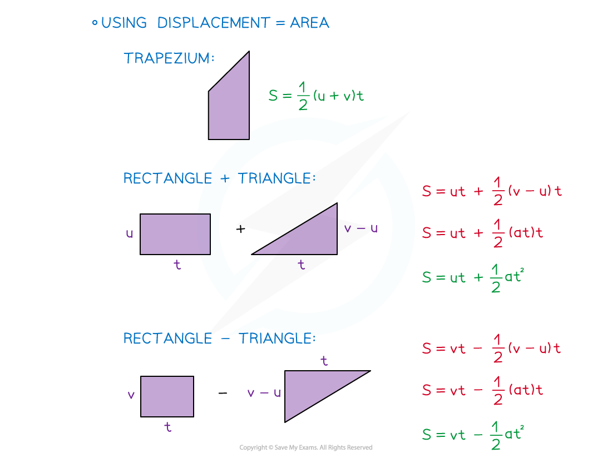

# Deriving the suvat Formulae

## Deriving the suvat Formulae

> **Spec point** — `spcpt_GT4R8B9y9q4RTZHF`

## Deriving the suvat Formulae

#### What is suvat?

- **suvat** is an acronym for the five quantities used when **modelling** **motion** in a **straight**-**line** with **constant** **acceleration**

  - **s** – displacement (from the starting point)
  - **u** – initial velocity
  - **v** – final velocity
  - **a** – acceleration
  - **t** – time
- All except time are **vector** quantities and can be **negative**

  - time is a **scalar** quantity

#### What are the suvat (constant acceleration) equations?

- The **five** equations for motion in a **straight line** are:

$v=u+at\,v^{2}=u^{2}+2as\,s=\frac{1}{2}(u+v)t\,s=ut+\frac{1}{2}at^{2}\,s=vt-\frac{1}{2}at^{2}$

- The equations can **only be used** when the motion has **constant** **acceleration**
- All equations connect four of the five quantities

  - Knowing any **three** allows a **fourth **to be found
- The equations are **not** **provided** in the exam so you need to memorise them

#### How do I derive the suvat equations?

- The** four** equations that involve time can be derived from a **velocity-time** graph

  - The velocity-time graph will be a** straight line** as the **acceleration** is **constant**
  - The fifth equation can be found by choosing any two of the equations and eliminating the t variable (see the worked example)

> **Worked Example**
> Use the constant acceleration equations
> 
> s = $\frac{1}{2}$(u+v)t  and  v = u + at
> 
> to show that
> 
> v2 = u2 + 2as.
> 
> **Answer:**
> 
> 

> **Exam Hint**
> - If asked to derive any of the formulae there may be a velocity-time graph provided. Make sure you show each step and state any reasons such as the gradient of the graph being the acceleration.
> - If the question does not ask you to derive the formulae then you can use them freely without proof.
