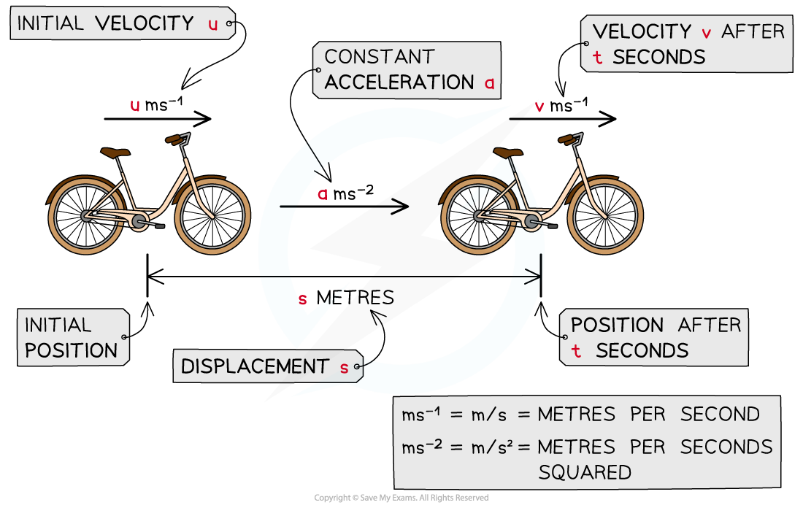

# suvat in 1D

## suvat in 1D

> **Spec point** — `spcpt_f2XM2XNHqVGhXsnk`

## suvat in 1D

### What are the suvat equations (constant acceleration formulae)?

- For constant acceleration there are **five** **suvat formulae:**

$v=u+at$ 
$v^{2}=u^{2}+2as$
 $s=\frac{1}{2}(u+v)t$ 
$s=ut+\frac{1}{2}at^{2}$
 $s=vt-\frac{1}{2}at^{2}$

### How do I find suvat values from a question?

- ** **Common phrases for **displacement**:

  - "…returns to its starting position …" is a way of saying **s = 0**
- Common phrases for **velocity**:

  - “… initially at rest …”, “… stationary …” are ways of saying **u = 0**
  - “… comes to rest …” is a way of saying** v = 0**
- Common phrases for **acceleration**:

  - “… falls freely …” is a way of saying** a = ± g **(see the gravity section)
- Sometimes you will need to use other techniques (such as **Newton's Laws of Motion**) to find the **acceleration**

### How do I solve problems involving constant acceleration?

- **Step 1**: **Sketch** (or add to) a **diagram**

  - Use key information in the question to include all relevant values
  - Make sure you clearly show which direction you are choosing to be **positive**
  
    - Choose the positive direction wisely, try to choose the direction which will result in fewer negative values needed
    - You could choose the initial direction of motion to be positive or you could choose the direction of acceleration to be positive.
- **Step 2**: Write down what you **know** and what you are trying to **find**

  - You should know 3 of the variables and need to find a 4th
  - It’s a good idea to go through each of the letters in the word **suvat** and make a note of the ones you know and which one you are trying to find
- **Step 3**: Select the **appropriate equation(s)**
- **Step 4**: **Solve** the equation(s) and problem

  - Include **units** in your answer and give your answer in **context** if appropriate

### Can I use the suvat equations for vertical motion?

- The suvat equations also apply to vertical motion (provided the **acceleration** is **constant**)

  - The positive direction is particularly important
- Acceleration will often be related to **gravity**

### How can suvat questions be made harder?

- Some problems involve splitting the motion into more than one part

  - For example if acceleration has changed (but is constant for each part)
  - A key feature of these problems is that **v** (**final velocity**) for the **first part** of the motion will be **u** (**initial velocity**) for the **second part** of the motion
- Some problems do not appear to give you enough information

  - You may have to form **two equations** using the suvat formulae and solve them **simultaneously**
  - There may be more than one particle or multiple stages to the motion

> **Worked Example**
> A car is driving along a straight horizontal road with speed 9 m s-1 when it begins to accelerate uniformly. The car accelerates at 1.5 m s-2 for 216 m. The driver then applies the brakes which causes it to decelerate at a constant rate. The car comes to rest after decelerating for 4 seconds.
> 
> (a)  Find the speed at the instant that the brakes are applied.
> 
> **Answer:**
> 
> 
> 
> (b)  Find the deceleration of the car after the brakes have been applied.
> 
> **Answer:**
> 
> 

> **Exam Hint**
> - If an object is decelerating then its acceleration in that direction is negative. If you are asked to find the deceleration then you do not need to include the negative sign as this is implied by the word deceleration.
> - If you need to use the answer from one part of a question in subsequent parts then use the full answer rather than the rounded answer, this avoids loss of accuracy.
