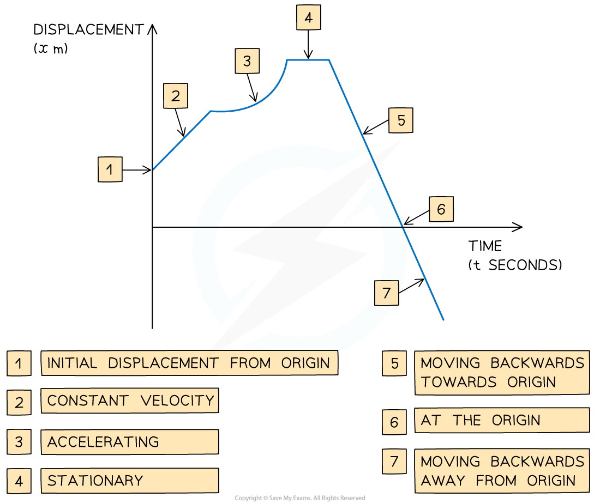

# Displacement-Time Graphs

## Displacement-Time Graphs

> **Spec point** — `spcpt_w6WvWNXxQmC65FFg`

## Displacement-time graphs

### What is a displacement-time graph?

- **Displacement-time** graphs show the *displacement* of an object from a **fixed origin** as it moves in a **straight line**
- They show **displacement **(on the vertical axis) against **time** (on the horizontal axis)
- Displacement-time graphs can go **below the horizontal axis** whereas **distance-time graphs** can not

  - Distance can **not** be negative whereas displacement can be

### What are the key features of a displacement-time graph?

- The **gradient** of the graph equals the *velocity*** **of the object

  - A **positive gradient** means the object is travelling** forwards**
  - A** negative gradient** means that the object is travelling **backwards**
  - The **steeper** the line, the **greater** the **speed**
- A **straight line** shows that the object is moving at a **constant velocity**
- A **curved line** shows that the object is **accelerating** or **decelerating**
- A **horizontal line** shows that the object is** stationary**
- If the graph **touches** the **x-axis,** then the object is **at the origin** at that time

### How do I find the average speed and the average velocity of a journey?

$\mathrm{Average} \mathrm{speed}=\frac{\mathrm{Total} \mathrm{distance} \mathrm{travelled}}{\mathrm{Time} \mathrm{taken}}$

- The average speed can **not** be **negative **as speed is a **scalar** quantity and can only take a positive value

$\mathrm{Average} \mathrm{velocity}=\frac{\mathrm{Displacement} \mathrm{from} \mathrm{starting} \mathrm{point}}{\mathrm{Time} \mathrm{taken}}$

- The average velocity is a **vector** quantity and can be **positive**, **zero** or **negative**

> **Worked Example**
> An athlete is training by jogging in a straight line.
> 
> The displacement-time graph below shows the displacement of the athlete from her starting point throughout her motion.
> 
> 
> 
> (a)   Calculate the velocity of the athlete during the first 2 seconds.
> 
> **Answer:**
> 
> 
> 
> (b)    Describe the motion of the athlete between the times of 2 seconds and 5 seconds.
> 
> **Answer:**
> 
> 
> 
> (c)   Calculate the velocity of the athlete at 10 seconds.
> 
> **Answer:**
> 
> 
> 
> (d)   Find the total distance travelled by the athlete during the 14 seconds.
> 
> **Answer:**
> 
> 

> **Exam Hint**
> - Be careful to spot if you are working with a **displacement-time graph** or a **velocity-time graph**.
> - Be careful to spot if you are working with a displacement-time graph or a distance-time graph
> - Check where the graph starts from on the y-axis, the object does not have to start at 0. For example, if the graph starts at 100, the scenario could be a student on a walk starting 100 m from their house.
> - Distance is a scalar so it can **not** be negative whereas displacement from a starting point can be.
> - Think about the units when calculating, make sure they are consistent.
