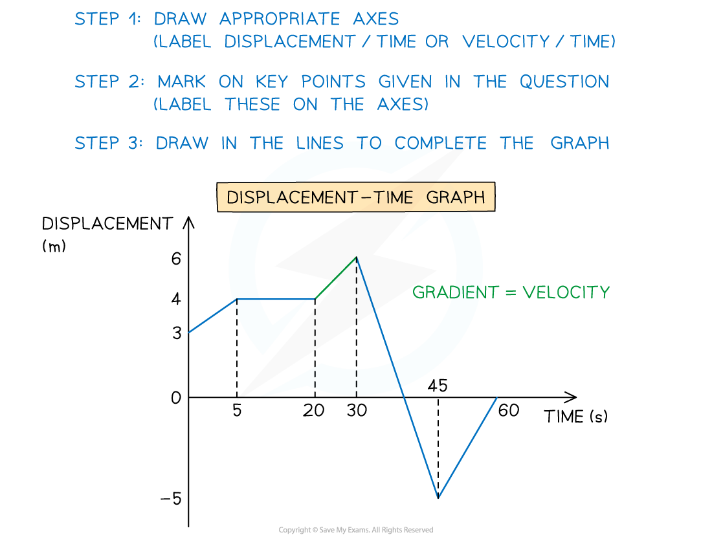
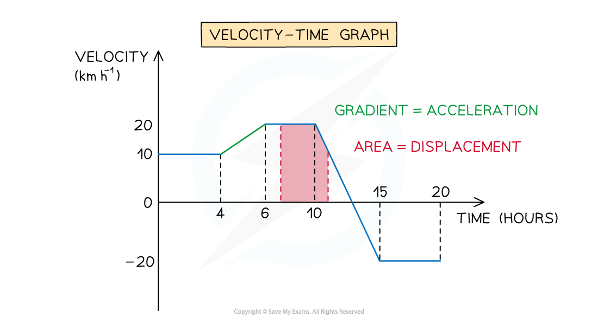

# Drawing Travel Graphs

## Drawing Travel Graphs

> **Spec point** — `spcpt_mQPxYj9fb5nn6Bkv`

## Drawing Travel Graphs

#### How do I draw a displacement-time graph or a velocity-time graph?

- You may be asked to draw a **displacement-time **graph or a **velocity-time **graph
- You will be given information about different sections of a journey and must draw each section and **label** the **points** on the axes
- Remember that time will always be on the x-axis
- Always remember to include **units **when you label the axis
- Use appropriate facts about the **gradient** and **area **under the graph to work backwards and find relevant or missing information

  - The **gradient** of a **displacement-time** graph is the **velocity** and the **gradient** of a **velocity-time** graph is the **acceleration**
  - The **area** between a **velocity-time** graph and the x-axis is the **displacement**

#### How do I draw an acceleration-time graph?

- Most of the time the acceleration will be **constant** so you have to draw **horizontal** lines
- There will be ***discontinuities*** in the graph if the object instantaneously changes from **acceleration at a constant rate** to moving with **constant velocity**
- The **area** between an acceleration-time graph and the x-axis is the **change in velocity**
- You might not be given the acceleration but instead expected to calculate it

  - Remember acceleration is the **rate of change of velocity**
  - If **acceleration is constant** then:
  
    - $\mathrm{Acceleration}=\frac{\mathrm{Change} \mathrm{in} \mathrm{velocity}}{\mathrm{Time}}$

> **Worked Example**
> The driver of a train, travelling at 40 m s-1 on a straight horizontal track, is informed of debris on the track 0.74 km ahead and immediately applies the brakes.
> The train decelerates uniformly for 20 seconds to a speed of 12 m s-1.
> The train then maintains this speed for another 8 seconds.
> The driver reapplies the brakes to slow down the train at a constant rate and bring it to a complete stop 10 m before the debris.
> 
> (a)  Sketch a velocity-time graph to show the motion of the train.
> 
> **Answer:**
> 
> 
> 
> (b)  Find the deceleration of the train from the moment the brakes were first applied to the moment its speed first reached 12 m s-1.
> 
> **Answer:**
> 
> 
> 
> (c)  Calculate the total time from the moment the brakes were first applied to the moment the train came to rest.
> 
> **Answer:**
> 
> 

> **Exam Hint**
> - As in the worked example, examiners can use other words, such as uniformly, to mean constant.
> - Remember that displacement and velocity can be negative whereas distance and speed can **not** be negative.
> - Take care when a velocity-time graph is below the x-axis, if it has a negative gradient then it is speeding up and moving backwards. If it has a positive gradient below the x-axis then it is still moving backwards but it is slowing down.
