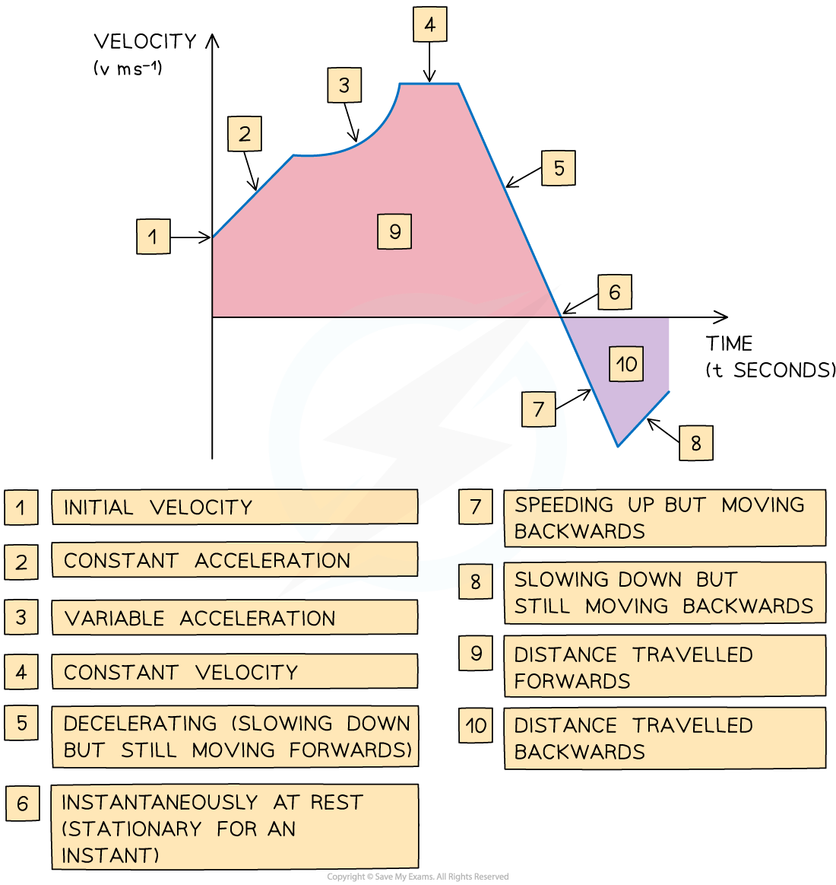

# Velocity-Time Graphs

## Velocity-Time Graphs

> **Spec point** — `spcpt_qjrGSfMRNrHFKFX5`

## Velocity-time graphs

### What is a velocity-time graph?

- **Velocity- time** graphs show the ***velocity***** **of an object as it moves in a **straight line**
- They show **velocity** (on the vertical axis) against **time** (on the horizontal axis)
- Velocity-time graphs can go **below the horizontal axis** whereas **speed-time graphs** can not

### What are the key features of a velocity-time graph?

- The **gradient** of the graph equals the ***acceleration*** ** **of an object
- A **straight line** shows that the object is **accelerating** at a **constant rate**
- A **horizontal** line shows that the object is moving at a **constant velocity**
- The **area **between the graph and the x-axis tells us the **change in** ***displacement***** **of the object

  - Graph **above** the x-axis means the object is moving** forwards**
  - Graph **below** the x-axis means the object is moving** backwards**
- The** total displacement **of the object from its starting point is the sum of the **areas above** the x-axis **minus** the sum of the **areas below** the x-axis
- The** total distance travelled **by the object is the sum of **all** the **areas**
- If the graph **touches** the **x-axis** then the object is** *****stationary***** **at that time
- If the graph is **above** the **x-axis** then the object has positive velocity and is **travelling forwards**
- If the graph is **below** the **x-axis** then the object has negative velocity and is **travelling backwards**

> **Worked Example**
> The motion of a bird travelling in a straight line is tracked for 60 seconds.
> 
> This information is displayed in the velocity-time graph below.
> 
> 
> 
> (a) Calculate the acceleration of the bird at 20 seconds.
> 
> **Answer:**
> 
> 
> 
> (b) Calculate the distance travelled in the first 28 seconds.
> 
> **Answer:**
> 
> 
> 
> (c) Calculate the displacement of the bird from its starting point after 60 seconds.
> 
> **Answer:**
> 
> 

> **Exam Hint**
> - Be careful to spot if you are working with a distance-time graph or a velocity-time graph.
> - Be careful to spot if you are working with a speed-time graph or a velocity-time graph.
> - Check where the graph starts from on the y-axis, the velocity does not have to start at 0. For example, the scenario could be a car driving at a constant speed and the driver sees a hazard.
> - Be extra vigilant when working with negative gradients or with graphs under the x-axis, it is easy to make mistakes with these.
> - Speed is a scalar so it can **not** be negative whereas velocity can be. Make sure your units are consistent.
