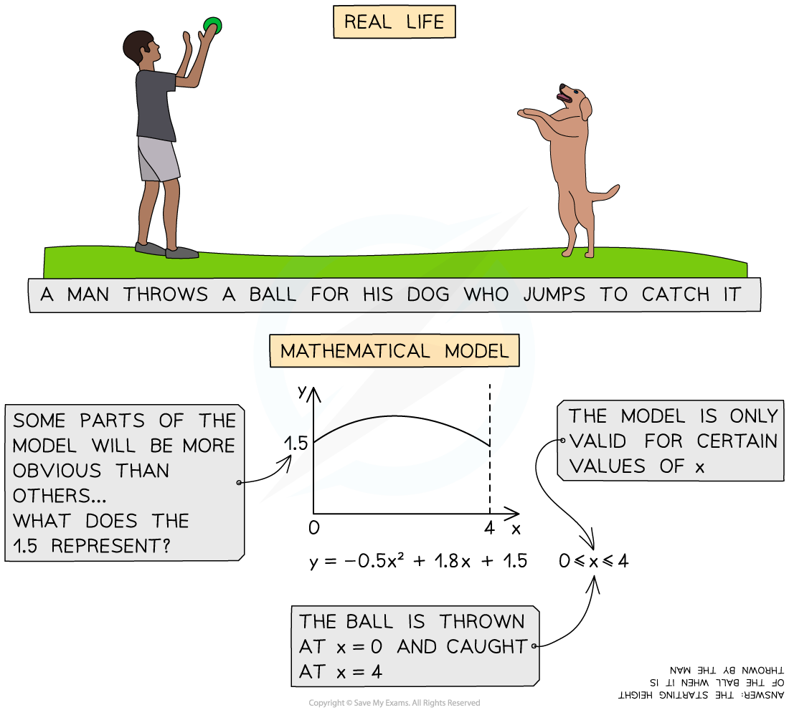

# Modelling Assumptions

## Modelling Assumptions

> **Spec point** — `spcpt_4VhGxyfft9FmqFKq`

## Modelling Assumptions

#### What is modelling in Mechanics?

- Mechanics uses **modelling** to solve problems in real life situations
- We use **assumptions** to simplify real life problems in order to turn them into equations or graphs that can be solved
- We will sometimes need to **criticise** or **refine our assumptions** to improve the model

#### What types of modelling assumptions are there?

- **Gravity **is constant and vertical ***Air resistance***** **is usually modelled as ***negligible*** and can be ignored
- A **smooth **surface has no **friction**
- A **rough** surface has a **frictional force** between the surface and any object that makes contact with it
- A **particle **has **negligible **dimensions, therefore forces will all act on a particle at the same point
- A **rod **or a **beam **should be treated as a long, rigid particle
- A **uniform **object’s **mass** is distributed evenly
- A **light **object has zero **mass**
- An **inextensible **object cannot be stretched

> **Worked Example**
> Two blocks, A and B are attached by means of a light inextensible string running over a smooth pulley. Block A has mass 0.7 kg and is accelerating along a smooth horizontal surface, block B has a mass 0.2 kg. Both A and B are modelled as particles. State how the following modelling assumptions can be used in your calculations:
> 
> a) A and B are both particles.
> 
> b) The string is light.
> 
> c) The string is inextensible.
> 
> d) The pulley is smooth.
> 
> e) The surface A is moving along is smooth.
> 
> **Answer:**
> 
> 

> **Exam Hint**
> Make sure you fully understand the definitions of all the words in this section so that you can be clear about what your exam question is asking of you.
