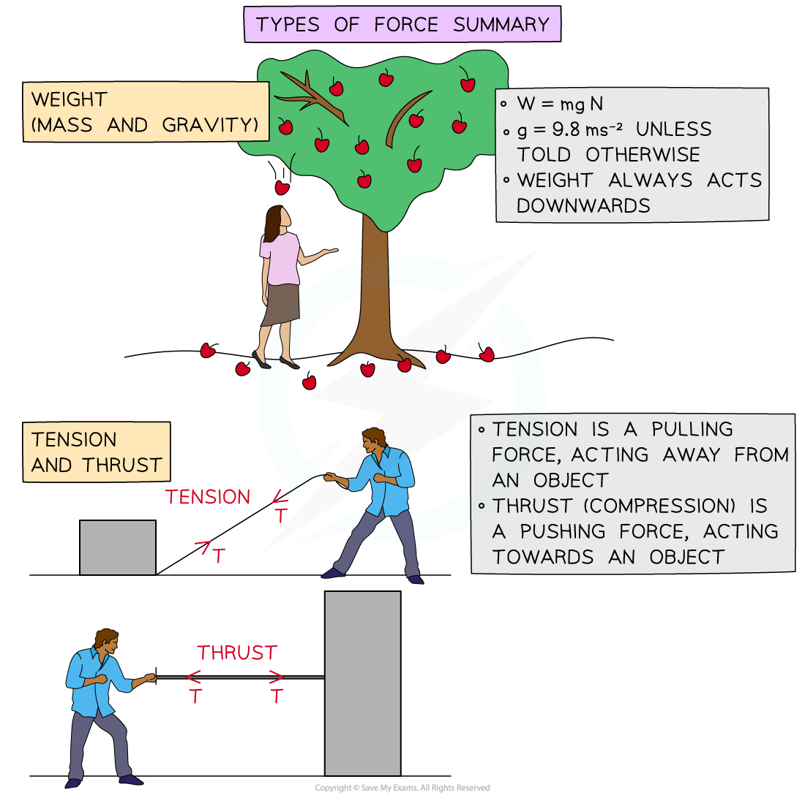
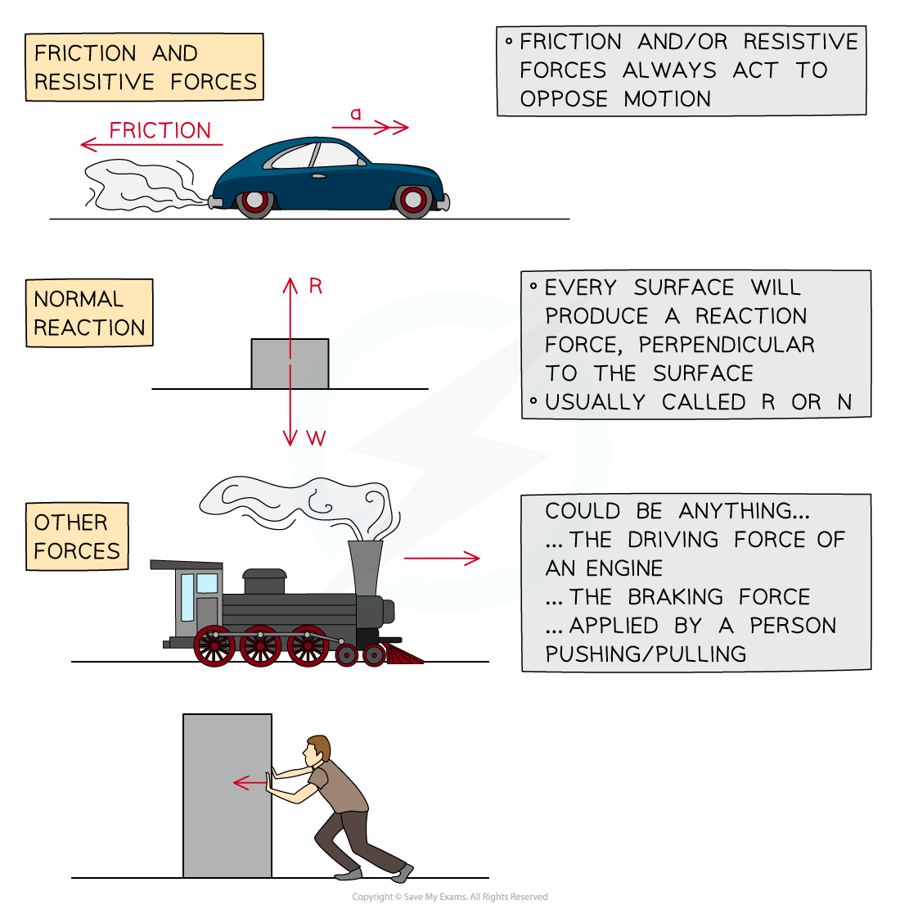

# Types of Force

## Types of Force

> **Spec point** — `spcpt_XMcYznXv3R7vqWcX`

## Types of Force

#### What is a force?

- A force is a **vector **quantity, it has both **magnitude **and **direction**
- A force is a push or a pull on an object
- A force is measured in **Newtons**
- In A level mathematical models, forces act at a **single** **point** called a **particle** which occupies a single point in space

#### What types of force are used in mechanics?

- **Weight **is the effect of** mass **and** gravity, **it always acts downwards
- **Tension **is a pulling force, it always acts away from an object
- **Thrust **is a pushing force, it always acts towards an object
- **Friction** is a resistive force, it acts to oppose the motion of an object
- Every surface will produce a **reaction force**, it will always act **perpendicular** to the surface

#### Mass, Gravity and Weight

- **Mass** is a measure of the amount of matter in an object

  - **Mass **is a **scalar** quantity, measured in **kilograms**, **kg**
  - **Mass** is universal, it does not change based on location
- **Gravity** is the force by which a body (usually a planet or a star) pulls objects towards its centre

  - **g **is the **acceleration** due to **gravity, measured in m s ****-2**
  - On Earth, **g **is approximately **9.8** **m s ****-2** , although its exact value varies with location
  - **g **is different elsewhere in the universe
- **Weight** is the product of **mass** and **gravity**, it is a** force **measured in** Newtons**

  - **Weight **is a **vector **quantity
  - **Weight **varies with location
  - **Weight **always acts vertically downwards towards the ground

> **Worked Example**
> The diagram below shows a car towing a trailer by a light inextensible string.
> 
> Forces *D,R ,F* and *T* N act on the car and caravan as shown.
> 
> Write a brief description of which each force represents.
> 
> **Answer:**
> 
> 
> 
> 
> 
> 

> **Exam Hint**
> - There are many phrases/words that can be used implying the types of force
> 
>   - Braking – suggests **thrust**
>   - **Air resistance** – suggests a resistive force
> - Always sketch a diagram and mark the forces on the diagram clearly
> 
>   - It will help you understand the problem
>   - Add more things to the diagram as you progress through the question
>   - You may not even need all the forces from your diagram
> - You should always round your answers to three significant figures, however if using **g = 9.8 m s****-2** within a calculation, use two significant figures.
