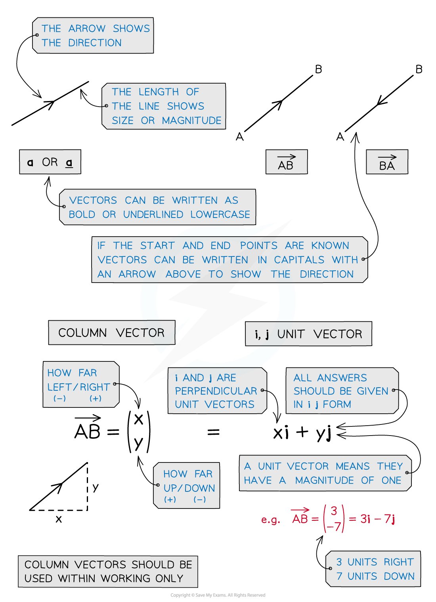
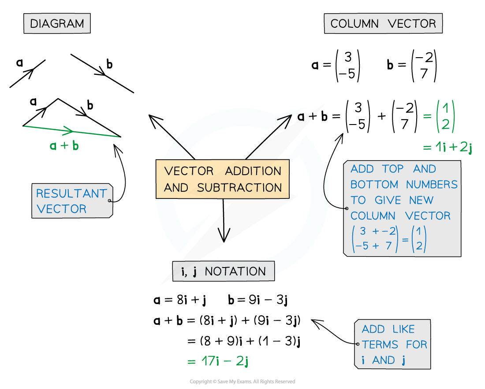
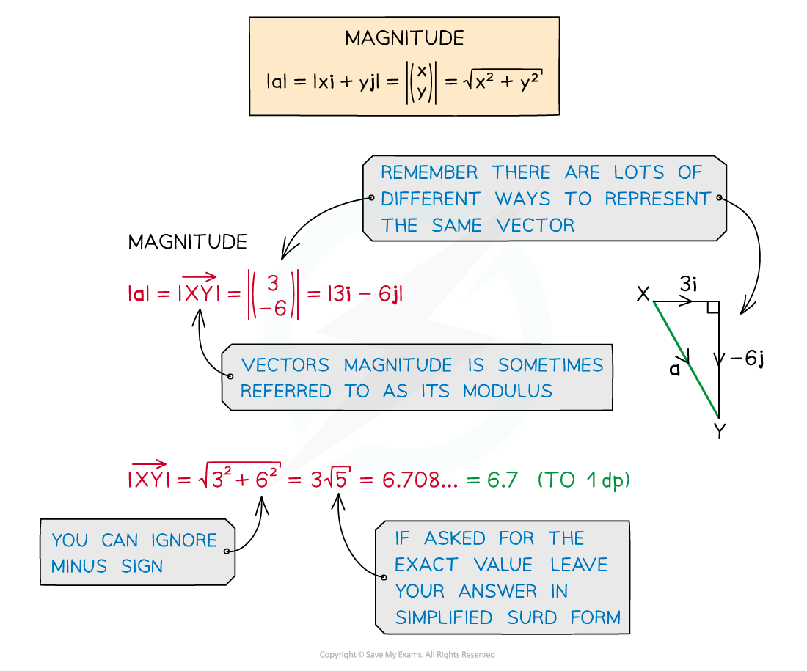

# Working with Vectors

## Working with Vectors

> **Spec point** — `spcpt_8W98SQjTkSpr2kMQ`

## Working with Vectors

**Vectors** represent a movement of a certain **magnitude** (size) in a given **direction. **They are used throughout mechanics to describe forces and motion

#### How are Vectors used in Mechanics?

- **Vector** questions are often embedded in a Mechanics context
- Vectors will most commonly represent ***forces*** , ***accelerations*** or ***velocities***, they can also represent displacement
- Newton’s Second Law ***F***** = *****ma*** is essential When a particle is in **equilibrium**, the vector sum of the forces on it is equal to zero

  - Remember that ***F*** and ***a*** (force and acceleration) are **vectors**, while m (mass) is a **scalar**

#### What is vector notation?

- There are **two** **vector** **notations** used in A level mathematics:

  - **i** and **j** notation: **i** and **j** are **unit** **vectors** (they have **magnitude 1**) in the positive horizontal and positive vertical directions respectively
  e.g. The vector (-4**i** + 3**j**) would mean **4 units** in the **negative** **horizontal** (*x*) direction (i.e. **left**) and **3 units** in the **positive** **vertical** (*y*) direction (i.e. **up**)
  - **Column** **vectors**: This is one number written above the other enclosed in brackets,

e.g. The (column) vector meaning **3 units** in the **positive** **horizontal** (*x*) direction (i.e., **right**) and **2 units** in the **negative** **vertical** (*y* ) direction (i.e., **down**) can be written as:

`open parentheses table row 3 row cell negative 2 end cell end table close parentheses`

- In Edexcel International A Level Mechanics you must give your **final answer** using the **i** and **j** notation form

  - You may use column vectors within your working to make calculations easier
  - Remember to convert your final answer back to the correct form

- As they are vectors, **i** and **j** are displayed **bold** in textbooks and online but in handwriting they would be <u>underlined</u> (<u>i</u> and j)

#### Calculating Resultant Vectors:

- **Adding** vectors together gives the **resultant vector**
- The vectors can be placed nose to tail for a diagram of the resultant vector
- Both **column vectors **and **i, j notation** can be used for calculating **resultant vectors**

  - Remember to give final answer using** i, j **notation
- This is the same when adding force vectors; the **resultant force **is simply the force vectors added together
- Forces in **equilibrium** have a resultant force equal to **zero**

#### Calculating Magnitude and Direction:

- Pythagoras is used to find the ***magnitude*** of a vector**.**

  - The magnitude of a displacement vector is the distance
  - The magnitude of a velocity vector is the speed
- Trigonometry is used to find the **direction** of a vector

  - Always draw a diagram, the **i **and **j **components will be the opposite and adjacent sides of the right-angled triangle
  - The direction is given as the angle the vector makes with the horizontal
- You may be asked for the direction as a ***bearing*****. **The **unit vector** **j **can be used to represent north and the unit vector** i **can** **be used to represent east.

  - A unit vector has a magnitude of one
  - In the case where *k* > 0

- If a particle is moving north then its velocity will have a vector of *k***j**
- if a particle *A *is due south of another particle *B* then the displacement vector from *B* to *A* will have the form -*k***j**
- If a particle is moving east then its velocity will have a vector of *k***i**
- if a particle *A* is due west of another particle *B *then the displacement vector from *B* to *A* will have the form -*k***i**

- If the position vectors of two particles have the same **j **component, then the particle with the greater **i** component will be positioned due east of the other
- If the position vector of a particle has equal **i **and **j** components then it is positioned due north - east of the origin

  - if a particle *A *is north – east of another particle *B *then the displacement vector from *B* to *A* will have equal **i **and **j** components

#### Resolving Vectors:

- A single** vector **can be broken** **down into its parts, or components, that will be perpendicular to each other
- **Resolving** a vector means writing it in **component** form (as **i** and **j** components)
- Given the **magnitude** and **direction** of a vector you can work out its components and vice versa

> **Worked Example**
> Two forces **F****1**, **F****2** act on a particle P.  **F****1** = -7**i **+ 3**j **and **F****2**  = 4**i **+ 6**j**.
> 
> a)  Find the magnitude of the resultant force **R** acting on the particle.
> 
> Leaving your answer as a simplified surd.
> 
> **Answer:**
> 
> 
> 
> b)  Find the bearing of the resultant force **R**.
> 
> Give your answer to the nearest degree.
> 
> **Answer:**
> 
> 
> 
> A third force **F****3** = s**i** – t**j** brings the particle into equilibrium.
> 
> c)   Find s and t and state the force for **F****3** in terms of **i** and **j**.
> 
> **Answer:**
> 
> 

> **Exam Hint**
> - When working with vectors pay attention to accuracy, leaving magnitude in surd form or correct to 3.s.f.
> - In your exam you can’t write in **bold **so should <u>underline</u> your vector notation
