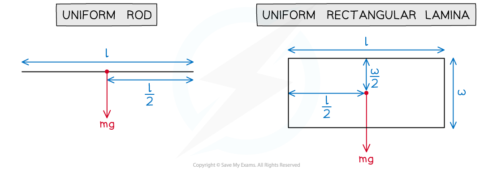

# Centres of Mass

## Uniform Rods & Laminae

> **Spec point** — `spcpt_n4CMFvkrTVx7QjVc`

## Uniform rods & laminae

### What is the centre of mass of an object?

- The centre of mass of an object is **the point at which the weight of the object may be considered to act**
- For a ***uniform object*** the centre of mass is at the centre of the object where the lines of symmetry intersect

  - For a **uniform *****rod*** this will be at its midpoint
  - For a **uniform rectangular *****lamina*** this will be where the diagonals intersect
- For a **non-uniform** object the centre of mass is not necessarily at the centre of the object

### Where is the centre of mass of a uniform rod?

- If you are told that a **rod is uniform** then you can draw the weight at the **midpoint of the rod**
- If a rod lies on a **support or peg** then there will be a **normal reaction force** which acts **perpendicular to the rod **at that point
- If the rod is **suspended **by** strings **or** cables** then there will be **tensions** in the strings which keep the **rod in place**

> **Worked Example**
> A uniform rod AB of mass 20 kg and length 1.4 m rests in equilibrium on two supports at points C and D. AC = 0.3 m and BD = 0.1 m.
> 
> 
> 
> Find the magnitudes of the normal reaction forces at C and D.
> 
> **Answer:**
> 
> 

> **Exam Hint**
> - If there are two supports with unknown reaction forces then choosing the pivot to be at one of the supports will help to find the force at the other support. The same method works with strings too.

## Non-uniform Rods

> **Spec point** — `spcpt_v8hNWGT7NpzTRr5F`

## Non-uniform rods

### How do I find the centre of mass of a non-uniform rod in equilibrium?

- **Step 1**: Label the weight of the rod at a random point on the rod
- **Step 2**: **Call** the perpendicular **distance** between the pivot and the weight *x*

  - Or any letter of your choice
- **Step 3**: **Form** a **moment equation** using the fact that the rod is in **equilibrium**
- **Step 4**: **Solve** the equation to find *x*

> **Worked Example**
> A non-uniform rod AB of mass 10 kg and length 4 m is suspended by two strings at points A and C with AC = 2.5 m. When the tension in the string at A is 3g N the rod hangs horizontally in equilibrium as shown in the diagram.
> 
> 
> 
> Find the distance of the centre of mass of the rod from B.
> 
> **Answer:**
> 
> 

> **Exam Hint**
> - Make sure you read carefully which distance you are asked to find.
